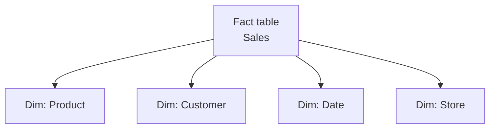
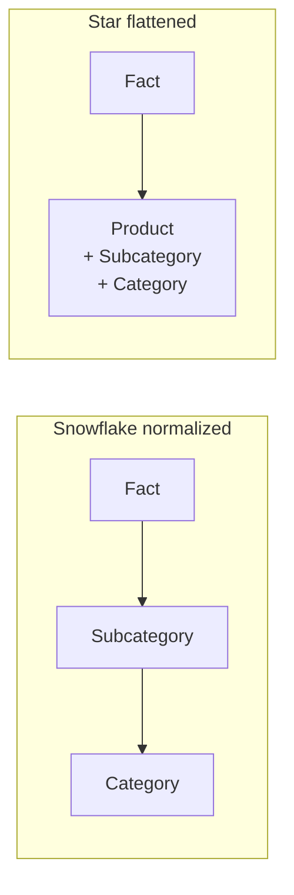

# Unit 3 — Design star schema for semantic models

> [!quote] Source
> Microsoft Learn · Module 2 · Unit 3 · "Design star schema for semantic models"
> <https://learn.microsoft.com/en-us/training/modules/design-semantic-models-scale/3-implement-star-schema>

## 🎯 Purpose

You chose how data flows into the model. Now design the **star schema that organizes it for clear, performant queries**. A star schema connects fact tables to dimension tables through relationships, creating the filter paths that reports and AI consumption depend on. This unit focuses on the relationship design decisions that matter when models grow in complexity and scale.

## 🔑 Star schema in a semantic model

- **Fact tables** store **measurable business events** (sales transactions, order lines, web visits).
- **Dimension tables** provide **descriptive context** (product details, customer info, date attributes).
- Dimension tables filter fact tables through relationships — users can slice metrics by any descriptive attribute.

> [!info] Why star schema matters for AI
> A well-organized star schema gives Copilot and data agents clear paths to the right data. **Ambiguous or circular relationships confuse both report consumers and AI tools.** Cleaner schema → better AI answers.

### Star schema shape



## 🔑 How storage mode affects relationships

### Direct Lake relationships

The engine reads relationships directly from **Delta table metadata**. Best performance when:
- Dimension key columns have **low cardinality** relative to fact table rows.
- **Referential integrity is maintained** in the source — engine uses INNER joins instead of LEFT OUTER joins, improving query performance.
- Columns used in relationships are **indexed** in the underlying Delta tables.

> [!warning] Fallback shifts behavior
> If a query causes the model to exceed memory or use unsupported operations, Direct Lake falls back to DirectQuery, and relationship behavior changes to match DirectQuery semantics.

### Cross-source relationships

Fabric semantic models can connect tables from **different data stores** — a fact table from a lakehouse can relate to a dimension table from a warehouse, or to a table accessed through a SQL analytics endpoint. These use **composite model capabilities**.

When tables come from different sources, the storage mode for each table determines how the relationship works at query time. The engine resolves each side independently and joins the results.

## 🔑 Relationship types

### One-to-many (most common)

One unique value in a dimension table relates to many rows in a fact table. Example: one product row in the Product dimension matches thousands of order rows in Sales.

Configure with **filter direction flowing from the dimension (one side) to the fact table (many side)** — the standard star schema filter pattern.

### Many-to-many (via bridge table)

Required when **neither table has unique values** for the relationship column. A **bridge table** sits between the two tables and holds unique combinations of the keys from each side.

Example: a customer can have multiple accounts and an account can belong to multiple customers → a Customer-Account bridge table resolves the relationship. The bridge table has one-to-many relationships to both Customer and Account.

### Filter direction

| Pattern | When to use |
|---|---|
| **Single-direction** (dimension → fact) | Standard star schema — predictable filter propagation, no ambiguity. |
| **Bi-directional** | Sparingly — for many-to-many or when dimensions need to be filtered by fact values. Degrades performance and creates unexpected behavior. |

### Referential integrity

The **Assume referential integrity** setting tells the engine to use **INNER joins** rather than LEFT OUTER joins. In Direct Lake and DirectQuery, this can significantly improve performance by reducing rows processed.

> [!warning] Enable only when safe
> Enable this setting when you're confident that **every foreign key value in the fact table has a matching value in the dimension table**. If referential integrity is violated, rows with unmatched keys **silently disappear** from query results.

## 🔑 Inactive relationships and `USERELATIONSHIP`

Only **one active relationship** can exist between two tables at a time. When you need multiple relationship paths (e.g., order date and ship date both relating to the same Date dimension), make one relationship active and the others **inactive**.

Use the `USERELATIONSHIP` function in DAX to activate an inactive relationship within a calculation:

```dax
Shipped Amount =
CALCULATE(
    SUM(Sales[Amount]),
    USERELATIONSHIP(Sales[ShipDate], 'Date'[Date])
)
```

This pattern keeps the model clean while supporting multiple analytical perspectives on the same data.

## 🔑 Handle snowflake schema in semantic models

Source data often arrives in a **normalized snowflake schema** — dimensions split into multiple related tables (e.g., Product → Subcategory → Category). In a semantic model you have two options: **flatten into a star** or **preserve the snowflake**.

### Flatten into star schema

Combine the normalized dimension tables into a single denormalized dimension table. The Product table includes Subcategory and Category columns directly, eliminating extra tables and relationships.

**Flatten when:**
- The combined dimension is still small relative to the fact table (almost always for dimensions).
- You want **simpler filter paths** — each filter travels through one relationship instead of a chain.
- **AI consumption is a priority** — fewer tables and simpler relationships give Copilot and data agents clearer paths.

**How to flatten:** during data preparation in lakehouses or dataflows, **before** the data reaches the semantic model. Use Power Query merges, SQL joins, or notebook transformations.

### Preserve the snowflake structure

Keep the normalized structure when:
- The dimension hierarchy has **multiple levels** and flattening would create dozens of redundant columns.
- **Multiple fact tables share subdimension tables** (e.g., a shared Category table used by both Sales and Inventory) — denormalization would create inconsistent copies.
- **Row-level security** needs to be applied at a specific level in the hierarchy.

When preserving, configure relationships carefully — **single-direction filtering** from the outermost table toward the fact table so filters propagate correctly.

> [!tip] Default choice
> In most semantic model scenarios, **flattening dimensions into a star schema is the better choice**. Fewer tables → fewer relationships, simpler DAX, faster queries, better AI consumption. Preserve the snowflake only when there's a strong reason to keep it.

### Snowflake vs. star — visual



## 🔑 Composite models for cross-source scenarios

Use composite models when your star schema spans multiple Fabric data stores or includes external sources:

- Fact tables in a lakehouse with dimension tables maintained in a warehouse.
- Real-time streaming data from an eventhouse combined with historical data in a lakehouse.
- Reference data from an external source (Import) combined with Fabric-native fact tables (Direct Lake).

In these scenarios, configure the storage mode for each table independently and verify that cross-source relationships perform acceptably at your expected data volumes.

## 🧭 Next

→ [[Unit-4-Calculation-Patterns]]
← [[Unit-2-Storage-Modes]]
↑ [[_MOC]]
