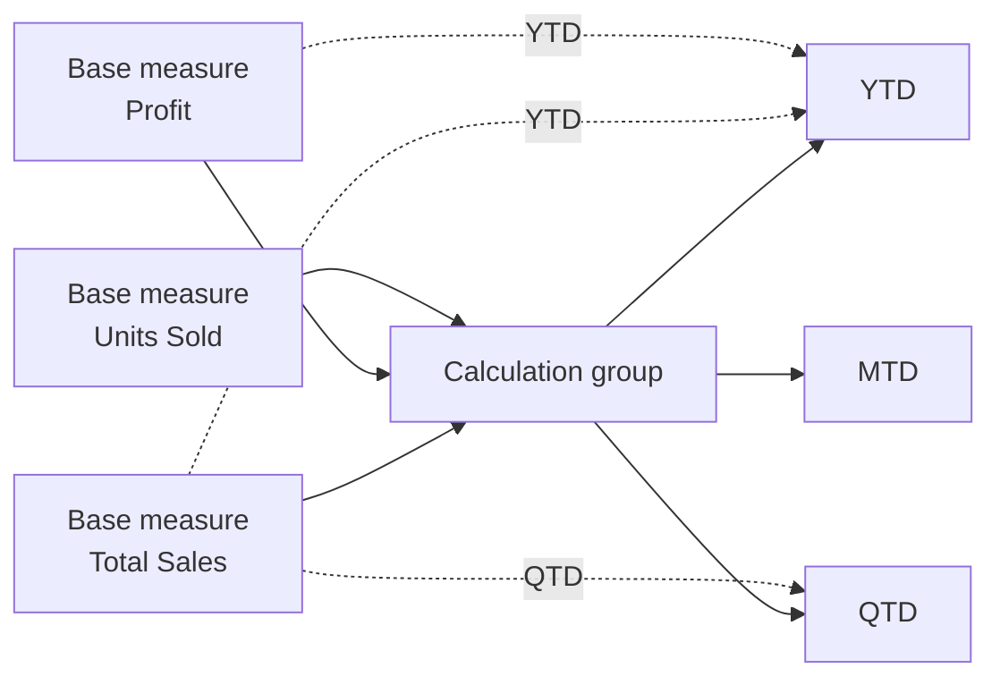
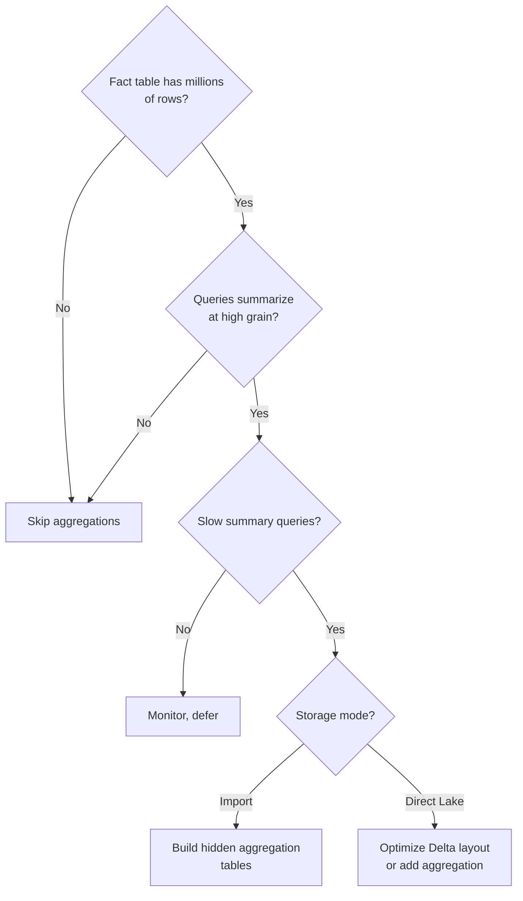

# Unit 4 — Design scalable calculations

> [!quote] Source
> Microsoft Learn · Module 2 · Unit 4 · "Design scalable calculations"
> <https://learn.microsoft.com/en-us/training/modules/design-semantic-models-scale/4-calculation-patterns>

## 🎯 Purpose

Your model is structured. Now design calculations that keep it **performant and maintainable** as data and team grow. At small scale, a model with duplicated measures and inconsistent naming still works. At scale, it breaks. This unit covers three patterns:

1. **Calculation groups** for reducing measure proliferation.
2. **DAX readability discipline** for team maintainability.
3. **Aggregations** for query performance on large fact tables.

## 🔑 Calculation groups

Calculation groups are **model objects that apply the same calculation pattern across multiple measures**. Instead of creating separate measures for each variation, you define the pattern once and apply it dynamically.

### The problem calculation groups solve

Consider an organization with **50 base measures** (Total Sales, Total Cost, Profit, Units Sold). Each needs YTD, QTD, and MTD calculations:

- Without calculation groups: **50 × 3 = 150 extra measures**. Add prior year comparisons → **250+ measures** to maintain.
- With calculation groups: one group with calculation items for each time intelligence pattern. Items apply to any measure automatically.

### How calculation groups work

A calculation group contains **calculation items**, each defining a DAX expression that modifies the current measure using `SELECTEDMEASURE()`. Example time intelligence group:

```dax
// Year-to-Date
CALCULATE(
    SELECTEDMEASURE(),
    DATESYTD('Date'[Date])
)
```

```dax
// Quarter-to-Date
CALCULATE(
    SELECTEDMEASURE(),
    DATESQTD('Date'[Date])
)
```

```dax
// Month-to-Date
CALCULATE(
    SELECTEDMEASURE(),
    DATESMTD('Date'[Date])
)
```

When a user adds the calculation group to a visual, they can **switch between YTD, QTD, and MTD for any measure** without separate measures for each combination.

### Dynamic format strings

**Dynamic format strings** change the display format based on the calculation item context. A percentage calculation displays as percentage, currency displays as currency, even when applied to the same base measure.

```dax
// In the format string expression for a YoY % calculation item:
"0.0%"
```

Dynamic format strings reduce the need for separate formatted measures and keep formatting consistent across the model.

> [!tip] When to use
> Use calculation groups when you have **three or more measures** that need the same calculation pattern applied. Common use cases: **time intelligence** (YTD, QTD, MTD), **currency conversion**, **variance calculations** (actual vs. budget).

### Calculation group in action



## 🔑 DAX readability discipline

At scale with a team maintaining 200+ measures, readability is a **design decision**, not a personal preference.

### Variables

Variables store intermediate results, improve readability, and prevent the engine from evaluating the same expression multiple times:

```dax
Profit Margin =
VAR TotalRevenue = SUM(Sales[Revenue])
VAR TotalCost = SUM(Sales[Cost])
VAR ProfitAmount = TotalRevenue - TotalCost
RETURN
    DIVIDE(ProfitAmount, TotalRevenue)
```

Without variables, the same `SUM(Sales[Revenue])` might appear three times in a complex measure. Variables evaluate once and reuse.

> [!tip] Variables → performance + readability
> See [using variables to improve DAX formulas](https://learn.microsoft.com/en-us/power-bi/guidance/dax-variables).

### Naming conventions

Consistent naming is critical when models have hundreds of measures maintained by multiple people. Establish conventions for:

| Asset | Convention |
|---|---|
| **Measure names** | Clear, descriptive — "Total Sales", "YoY Revenue Growth". Avoid author-only abbreviations. |
| **Variable names** | Descriptive of the intermediate value — `TotalRevenue` rather than `x` or `temp`. |
| **Calculation group items** | Name them by **what they do** — "Year-to-Date" rather than "DATESYTD Wrapper". |

> [!important] Naming matters for AI
> When Copilot or a data agent queries your model, it uses **measure names and descriptions** to determine which calculations to include. A measure named "YoY Revenue Growth" produces **better AI results** than "Calc7_v2".

> [!tip] Copilot assistance
> Copilot in Power BI can help write and explain DAX formulas. Use it to suggest improvements or explain existing logic on complex measures.

### Iterators vs. aggregation functions

| Function type | Example | Cost |
|---|---|---|
| **Aggregation** | `SUM`, `AVERAGE`, `MAX` | Single-column. Fast — engine uses prebuilt data structures. |
| **Iterator** | `SUMX`, `AVERAGEX`, `MAXX` | Row-by-row expression. Slower on large fact tables. |

**Use aggregation when:** summarizing a single column.
**Use iterators when:** the calculation requires a row-level expression (e.g., `Quantity × UnitPrice` per row).

> [!warning] Performance impact
> Iterators process **every row**, which can affect performance on large fact tables.

### Information functions for defensive patterns

Functions like `ISBLANK`, `HASONEVALUE`, and `ISINSCOPE` create defensive patterns for measures consumed by multiple reports with different filter contexts:

```dax
Sales per Customer =
IF(
    HASONEVALUE(Customer[CustomerID]),
    DIVIDE(SUM(Sales[Amount]), 1),
    DIVIDE(SUM(Sales[Amount]), DISTINCTCOUNT(Sales[CustomerID]))
)
```

These patterns prevent unexpected results when measures are used in contexts the original author didn't anticipate.

## 🔑 Aggregations

Aggregations are **summary tables that store precalculated totals at a higher grain** than the detail data. Queries hit these tables first, improving performance on large fact tables. When a query matches an aggregation, the engine returns results from the smaller summary table rather than scanning millions of detail rows.

### Aggregations as a design decision

Deciding **when** to add aggregations and **at what granularity** is a design decision. Performance monitoring and tuning are operational concerns, but the structural choice is made during model design.

**Consider aggregations when:**
- Fact tables exceed millions of rows and commonly used queries summarize at a higher grain (e.g., monthly totals by region).
- Users experience slow query response times on summary-level visuals.
- Most report interactions don't need row-level detail.

### How aggregation behavior differs by storage mode

| Storage mode | Aggregation behavior |
|---|---|
| **Import** | Aggregations are stored as separate hidden tables. Engine automatically routes matching queries to the aggregation table. |
| **Direct Lake** | The Delta tables themselves can serve as aggregation sources. Because Direct Lake reads columnar Parquet files, the engine can handle larger data volumes **without aggregations** in many scenarios. Add aggregations only when query patterns confirm the need. |

### Aggregation decision flow



## 🧭 Next

→ [[Unit-5-Scale-Settings]]
← [[Unit-3-Star-Schema]]
↑ [[_MOC]]
