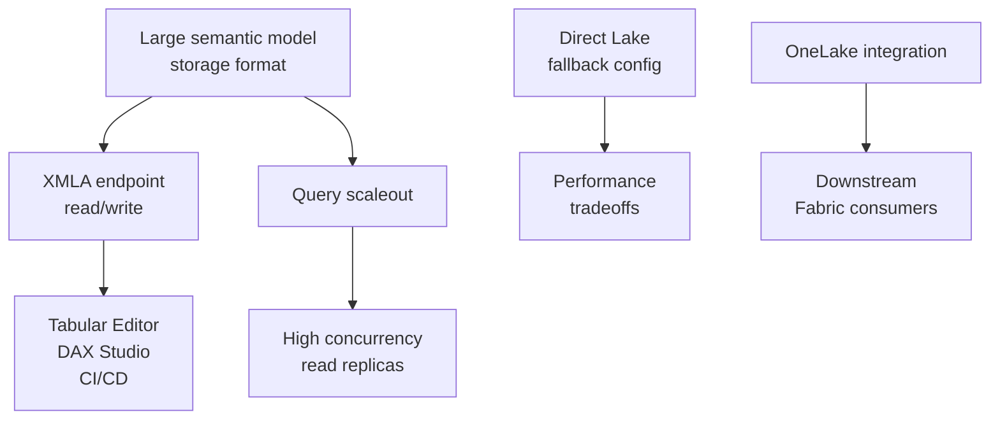

# Unit 5 — Configure settings for scale

> [!quote] Source
> Microsoft Learn · Module 2 · Unit 5 · "Configure settings for scale"
> <https://learn.microsoft.com/en-us/training/modules/design-semantic-models-scale/5-enterprise-settings>

## 🎯 Purpose

The model is designed. Now configure the **settings that control how it handles large datasets, concurrent queries, and external tool access**. These settings determine whether the model can keep up as data volumes grow and more users and tools consume it.

## 🔑 Large semantic model storage format

Changes how the model **stores and compresses data**. By default, Power BI limits model uploads to **10 GB**. With this setting enabled, models can grow beyond that limit on refresh. The maximum size equals the Fabric capacity size or the limit set by the capacity administrator.

- **Direct Lake models automatically enable this setting** — no manual configuration needed.
- **Import/DirectQuery models** must enable it explicitly.
- This is a **prerequisite** for both **XMLA endpoint read/write** and **query scaleout**.

**Enable when:**
- Data volumes require models that grow beyond the 10-GB upload limit.
- You need XMLA endpoint access for external tools.
- You plan to use query scaleout for high concurrency.
- You plan to use **incremental refresh with partitioned tables**.

## 🔑 XMLA endpoint read/write access

The **XMLA endpoint** lets external tools connect to your semantic model. Tools like **Tabular Editor**, **DAX Studio**, and **ALM Toolkit** use this endpoint for development, debugging, and deployment operations not available in the Fabric service interface.

Once both large model storage format and XMLA read/write are enabled, you can:

- Use **Tabular Editor** for model development and source control integration.
- Use **DAX Studio** for query analysis and performance tuning.
- Deploy models through **CI/CD pipelines** using the Analysis Services client libraries.

> [!tip] Why this matters at scale
> At scale, these external tools become essential. Manual edits through the service interface don't support the level of model development that large, team-maintained models require.

## 🔑 Query scaleout

Query scaleout **distributes read queries across read-only replicas** of your semantic model. When hundreds of users access the same model simultaneously, a single instance can become a bottleneck. Query scaleout adds replicas that share the query load.

- When enabled, **read replicas use a separate copy** of the model.
- This copy synchronizes **after each refresh** — there can be a brief delay between the primary finishing a refresh and replicas reflecting the updated data.
- Requires **large semantic model storage format** as a prerequisite.

**Enable when:**
- The model serves **hundreds of concurrent users**.
- Query performance degrades during peak usage periods.
- The model is backed by a **Fabric capacity that supports replicas**.

## 🔑 Direct Lake fallback configuration

Direct Lake reads Delta tables directly from OneLake into memory. Some queries can cause the model to **fall back to DirectQuery** mode, which changes performance characteristics.

| Setting | Behavior |
|---|---|
| **Allow fallback** (default) | Failing queries fall back to DirectQuery automatically. Users get results, but performance might decrease. |
| **Disallow fallback** | Failing queries return an error. Enforces consistent performance but requires all queries stay within Direct Lake capabilities. |

> [!tip] Operational approach
> For models at scale, start with **fallback allowed**. Monitor which queries trigger it, then optimize those queries or data structures to reduce fallback frequency. **Disallow fallback** only when all query patterns stay within Direct Lake limits and you need guaranteed performance consistency.

## 🔑 OneLake integration

OneLake integration makes your semantic model data **accessible as Delta tables in OneLake**. When enabled, downstream Fabric items like notebooks, pipelines, and other services can read data directly from the semantic model without rebuilding it from source.

This extends the model's reach beyond reports — a semantic model with well-structured star schema and calculation logic becomes a curated data source for the broader analytics platform.

**Enable when:**
- Data engineers or data scientists need to consume semantic model data in notebooks or other Fabric items.
- You want to use the semantic model as a **shared data source** across Fabric.
- Downstream consumers need access to **curated, business-logic-enriched data** without rebuilding it from raw sources.

> [!warning] Import-only export
> OneLake integration currently **exports Import mode tables only**. Direct Lake tables, DirectQuery tables, measures, and calculation group tables can't be exported. If your model uses Direct Lake exclusively, the underlying Delta tables in OneLake are already accessible to other Fabric items directly.

## 🔑 Settings decision framework

| Setting | Default | Enable when |
|---|---|---|
| **Large semantic model storage format** | Off | Data volumes exceed 10 GB, or you need XMLA endpoint access or query scaleout |
| **XMLA endpoint read/write** | Read-only | External tools need to modify the model for development or deployment |
| **Query scaleout** | Off | High concurrency degrades query performance (requires large semantic model storage format) |
| **Direct Lake fallback** | Allowed | Change to disallowed only when all queries stay within Direct Lake limits |
| **OneLake integration** | Off | Downstream Fabric items need to consume semantic model data |

## 🔑 Setting dependencies

> [!tip] Other settings
> These settings address scale and consumption. **Other settings** such as endorsement, Copilot approval, and data preparation for AI consumption are covered in separate modules. For a complete reference, see [semantic model settings in the Fabric service](https://learn.microsoft.com/en-us/power-bi/connect-data/service-datasets-admin-across-workspaces).

## 🧭 Next

→ [[Unit-6-Exercise]]
← [[Unit-4-Calculation-Patterns]]
↑ [[_MOC]]
