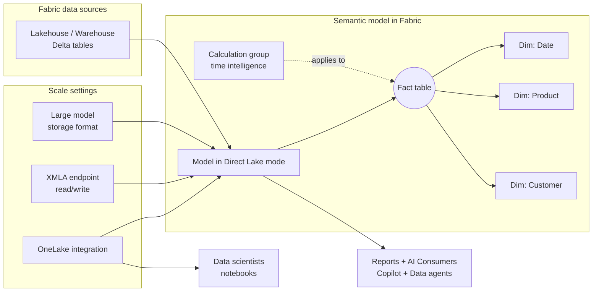

# Unit 6 — Exercise: Design a semantic model for scale in Fabric

> [!quote] Source
> Microsoft Learn · Module 2 · Unit 6 · "Exercise: Design a semantic model for scale in Fabric"
> <https://learn.microsoft.com/en-us/training/modules/design-semantic-models-scale/6-exercise>

## 🎯 Purpose

A **30-minute hands-on lab** that puts units [[Unit-2-Storage-Modes]], [[Unit-3-Star-Schema]], [[Unit-4-Calculation-Patterns]], and [[Unit-5-Scale-Settings]] into practice. You design a semantic model for scale in Microsoft Fabric by completing the full workflow — storage mode, star schema, calculation groups, and scale settings.

> [!warning] Prerequisites
> You need a **Microsoft Fabric-enabled workspace** to complete this exercise. See [Getting started with Fabric](https://learn.microsoft.com/en-us/fabric/get-started/fabric-trial) to enable a Fabric trial license.

## 🔬 What the lab does

The exercise walks you through the end-to-end workflow of standing up a scale-ready semantic model in Fabric:

1. **Connect to Fabric data sources using Direct Lake** — establish the storage mode foundation.
2. **Build a star schema** — define fact and dimension tables with appropriate keys and grain.
3. **Configure relationships** — set filter direction appropriate for star-schema propagation.
4. **Create a calculation group** — apply time intelligence across multiple measures using `SELECTEDMEASURE()`.
5. **Configure settings for scale** — enable the large semantic model storage format, configure XMLA endpoint access, and enable OneLake integration.
6. **Verify model behavior** — confirm Direct Lake mode is active and review the fallback configuration.

> [!info] Format note
> Per the task specification, this unit is a **summary of what the lab does, not the lab itself**. The full step-by-step lab lives behind the [launch exercise link](https://go.microsoft.com/fwlink/?linkid=2295527) on the Microsoft Learn page.

## 🔑 Skills practiced

| Skill | From unit |
|---|---|
| Choose the right storage mode (Direct Lake default) | [[Unit-2-Storage-Modes]] |
| Connect a semantic model to OneLake / SQL analytics endpoint | [[Unit-2-Storage-Modes]] |
| Build a star schema with fact and dimension tables | [[Unit-3-Star-Schema]] |
| Configure relationships with appropriate filter direction | [[Unit-3-Star-Schema]] |
| Create a calculation group for time intelligence across measures | [[Unit-4-Calculation-Patterns]] |
| Enable the large semantic model storage format | [[Unit-5-Scale-Settings]] |
| Configure XMLA endpoint access for external tools | [[Unit-5-Scale-Settings]] |
| Enable OneLake integration for downstream consumption | [[Unit-5-Scale-Settings]] |
| Verify Direct Lake mode and fallback configuration | [[Unit-2-Storage-Modes]] |

## 🧠 Visual — what you'll build

## 🔗 Launch the exercise

> [!success] Launch
> [Launch the exercise on Microsoft Learn →](https://go.microsoft.com/fwlink/?linkid=2295527)

## 🧭 Next

→ [[Unit-7-Knowledge-Check]]
← [[Unit-5-Scale-Settings]]
↑ [[_MOC]]
