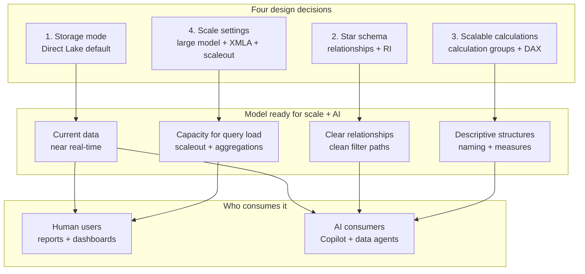

# Unit 8 — Summary

> [!quote] Source
> Microsoft Learn · Module 2 · Unit 8 · "Summary"
> <https://learn.microsoft.com/en-us/training/modules/design-semantic-models-scale/8-summary>

## 📝 Verbatim recap

> In this module, you explored what changes when semantic models need to handle larger datasets, more concurrent users, and broader consumption patterns in Microsoft Fabric. The challenge was clear: models built for small teams in Power BI Desktop don't automatically handle what comes with scale.
>
> You learned to make four critical design decisions. First, you chose **Direct Lake** as the default storage mode and understood when Import, DirectQuery, or composite models are the better choice. Then you designed **star schema relationships** for clarity and performance, including referential integrity, inactive relationships, and cross-source connections. Next, you designed **scalable calculations** using calculation groups to reduce measure proliferation, variables and naming conventions to support team maintainability, and aggregations to handle large data volumes. Finally, you configured **settings** that control how the model handles large datasets, concurrent queries, and external tool access.
>
> Together, these decisions prepare a semantic model for scale. They also prepare it for AI consumption, because AI demands the same things from a model that scale does: current data, clear relationships, descriptive structures, and capacity.

## 🧠 Key takeaway diagram

## 🔑 One-paragraph synthesis

A semantic model ready for scale in Microsoft Fabric rests on **four design decisions**. **First**, choose the **storage mode**: Direct Lake is the default (reads Delta tables from OneLake, no scheduled refresh, near real-time), with Import, DirectQuery, and Composite available when scenarios require them — and configure **fallback** to balance performance consistency with query flexibility. **Second**, design a **star schema** with fact tables holding measurable events and dimension tables providing descriptive context — single-direction filtering from dimensions to facts, referential integrity assumed when safe, `USERELATIONSHIP` for inactive relationships, and flattened snowflake dimensions to keep filter paths simple. **Third**, build **scalable calculations** — **calculation groups** with `SELECTEDMEASURE()` to avoid measure proliferation, **DAX variables** and **descriptive naming** for team maintainability, and **aggregations** for summary queries on large fact tables. **Fourth**, configure **scale settings** — large semantic model storage format (the prerequisite for everything else), XMLA endpoint read/write for external tools (Tabular Editor, DAX Studio, CI/CD), query scaleout for high concurrency, and OneLake integration to expose the model as a shared data source. Together, these decisions produce a model that serves both human reporting and AI consumers well.

## 📚 Learn more (Microsoft docs)

- [Direct Lake overview](https://learn.microsoft.com/en-us/fabric/fundamentals/direct-lake-overview)
- [Create calculation groups in Power BI](https://learn.microsoft.com/en-us/power-bi/transform-model/calculation-groups)
- [Large semantic model storage format](https://learn.microsoft.com/en-us/fabric/enterprise/powerbi/service-premium-large-models)
- [Query scaleout for semantic models](https://learn.microsoft.com/en-us/fabric/enterprise/powerbi/service-premium-scale-out)
- [XMLA endpoint connectivity](https://learn.microsoft.com/en-us/power-bi/enterprise/service-premium-connect-tools)
- [Star schema guidance (Power BI)](https://learn.microsoft.com/en-us/power-bi/guidance/star-schema)

## 🧭 Done with Module 2

← [[Unit-7-Knowledge-Check]]
↑ [[_MOC]]

**Suggested next module:** continue along Learning Path 3 to deepen Fabric analytics engineering skills (semantic model lifecycle, performance tuning, or downstream consumption patterns).
