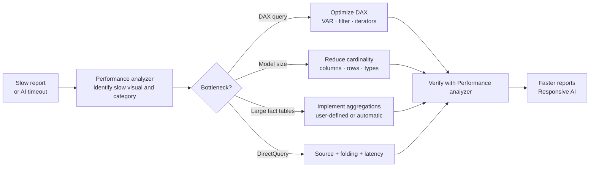

# Unit 1 — Introduction

> [!quote] Source
> Microsoft Learn · Path 3 · Module 3 · Unit 1 · "Introduction"
> <https://learn.microsoft.com/en-us/training/modules/optimize-semantic-model-performance/1-introduction>

## 🎯 Purpose

A short framing unit that explains **why semantic-model performance matters in Microsoft Fabric** and **what you'll learn** to find and fix slow reports. The scenario: a retail analytics organization that migrated to Fabric, where executive dashboards take 30+ seconds to load and Copilot chat responses time out.

## 🔑 Key takeaways

- Semantic models underpin reports, dashboards, and AI experiences in Microsoft Fabric and Power BI.
- **Poor performance** means slow report loads, lost user trust, and AI workflows that time out or return incomplete answers.
- Performance issues can come from:
  - An **expensive DAX calculation**.
  - A table with **millions of unique values in a single column** (high cardinality).
  - A visual that **requests too much data** at once.
- The hard part isn't knowing _something_ is slow — it's knowing **where the bottleneck is** and **how to fix it**.

> [!quote] Scenario
> A retail analytics team migrated reporting to Microsoft Fabric. Within weeks of launch, dashboards take 30+ seconds to load, executive users notice that Copilot chat responses time out, and reports work but are too slow. The fix requires a **systematic approach** covering DAX optimization, data-model efficiency, and aggregation strategies.

## 🧠 What this module covers

1. **Performance analyzer** — diagnose slow visuals and identify the root cause.
2. **DAX optimization techniques** — variables, filter patterns, iterators, expensive patterns.
3. **Cardinality reduction** — shrink model size and speed up queries.
4. **Aggregations** — user-defined and automatic; Direct Lake considerations.
5. **Systematic troubleshooting** — a structured workflow for real-world performance problems.

> [!info] Outcome
> By the end of this module you can diagnose performance issues in a semantic model and apply targeted fixes that improve query speed for both **human users** and **AI-powered experiences** (Copilot, IQ data agents).

## 🧠 Visual — the performance-fix loop

## ⚖️ Where performance lives

| Layer | Symptom | First tool |
|---|---|---|
| **Visual rendering** | Visual display time high | Simplify visual / fewer data points |
| **DAX engine** | DAX query time high | Performance analyzer → DAX query view → DAX Studio |
| **Model size / cardinality** | Refresh slow, queries heavy | VertiPaq stats, BPA, Memory Analyzer |
| **External source (DirectQuery)** | Direct query time high | Query folding, source indexes |
| **Composite (Import + DirectQuery)** | Mix of above | Aggregation hit-rate via Azure Log Analytics |

## 🧭 Next

→ [[Unit-2-Performance-Analyzer]]
↑ [[_MOC]]