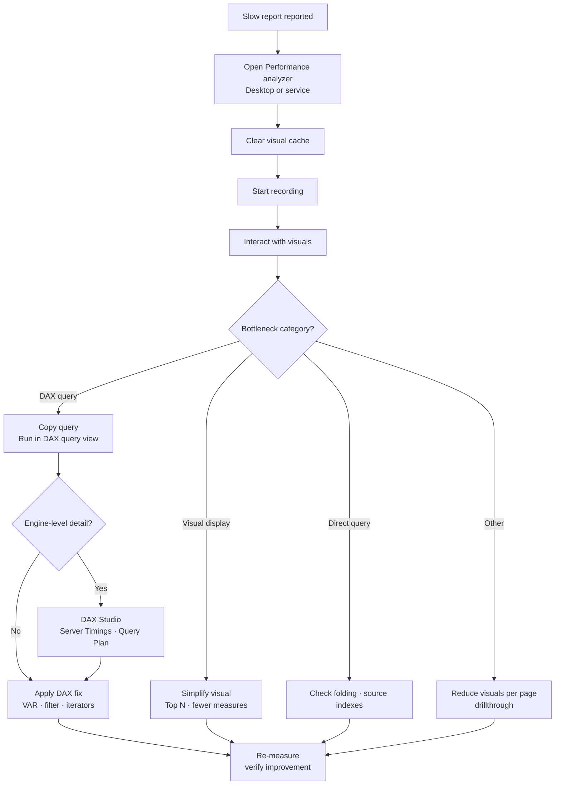

# Unit 2 — Use Performance analyzer to diagnose issues

> [!quote] Source
> Microsoft Learn · Path 3 · Module 3 · Unit 2 · "Use Performance analyzer to diagnose issues"
> <https://learn.microsoft.com/en-us/training/modules/optimize-semantic-model-performance/2-performance-analyzer>

## 🎯 Purpose

Walk through the **primary diagnostic tool built into Power BI** — Performance analyzer. Learn how to open it, record timings, interpret the four timing categories, export the underlying DAX query for analysis, and escalate to DAX Studio when you need engine-level diagnostics.

## 🛠️ Open Performance analyzer

| Where | How |
|---|---|
| **Power BI Desktop** | **Optimize** ribbon → **Performance analyzer** |
| **Power BI service** | Open a report in edit mode → **View** menu → **Performance analyzer** |

> [!tip] Same engine, two surfaces
> The timing breakdowns and the **Copy query** feature work identically in Desktop and the service. Only the **Run in DAX query view** button is Desktop-only.

## 📼 Record and measure performance

1. Select **Start recording** in the Performance analyzer pane.
2. Interact with the report — refresh visuals, change slicers, navigate between pages.
3. Observe timing results appear in real time for each visual.
4. Select **Stop** when you have enough data.

Each interaction (slicer change, page refresh) becomes a **section** in the pane, with the individual visuals and their load times listed underneath.

> [!warning] Clear the cache before measuring
> Cached data can mask actual query performance. In Power BI Desktop, clear the visual cache from the Performance analyzer pane before each test so you measure **real execution time**.

You can also target a single visual: when Performance analyzer is recording, select the **Analyze this visual** icon in the top-right corner of any visual to refresh and capture that visual alone.

## ⏱️ Understand timing metrics

Performance analyzer breaks each visual's load time into four categories. The **Duration (ms)** value is the total time from start to end.

| Metric | What it measures | Typical bottleneck |
|---|---|---|
| **DAX query** | Time for the visual to send a query to the semantic model and receive results | Model or measure issue — **most common bottleneck** |
| **Visual display** | Time for the visual to render on screen (incl. web images, geocoding) | Too many data points, complex visual |
| **Direct query** | Time for queries to an external data source in DirectQuery mode | Source performance, query folding |
| **Other** | Background processing — waiting for other visuals, query prep, network | Many visuals queued on the single UI thread |

> [!info] Sequential UI thread
> Because most operations execute sequentially on a single UI thread, reported durations can include time **waiting in a queue** while other visuals finish. This is why "Other" can look large on busy pages.

### Strategy

When diagnosing a slow report, **focus on the largest contributor first**:

- DAX query dominates → problem is in the **model or the measure**.
- Visual display dominates → the **visual itself** is rendering too much data.
- Direct query dominates → the **external source or query folding** is the issue.

## 📤 Export and analyze DAX queries

One of the most valuable features is **extracting the exact DAX** a visual sends to the model, so you can analyze why the query is slow.

1. Expand a visual's entry in the Performance analyzer pane.
2. Select **Run in DAX query view** to open the query in a new tab, **or** select **Copy query** to put it on the clipboard.
3. In DAX query view, run the query and review the results.

The result grid shows the data the visual uses. You can inspect the query structure, identify expensive operations, and test optimizations directly.

> [!tip] Generated DAX is verbose
> The DAX a visual generates is often more verbose than a hand-written query — extra `VAR`s, `TOPN` wrappers, and column references that support visual type switching. If Copilot is available in DAX query view, try the prompt: **"Remove the VARs and TOPN and simplify this DAX query."**

> [!note] Power BI service difference
> In the service, **Run in DAX query view** is not available. Instead: copy the query, select **Open data model** to open the web modeling experience, then switch to DAX query view to paste and run it. **Queries in the web aren't saved** after you close the browser.

## 🧪 Use DAX Studio for deeper diagnostics

DAX Studio is a **free, open-source tool** that connects to your local semantic model or to a published semantic model through an XMLA endpoint. It provides capabilities beyond DAX query view:

- **Server Timings** — separates query execution into **formula engine (FE)** and **storage engine (SE)** time, showing exactly where the engine spends its effort.
- **Query Plan** — displays the logical and physical query plan; helps identify inefficient operations in complex measures.
- **Model metrics** — analyzes table and column sizes, cardinality, and compression statistics so you can identify the largest contributors to model size.

> [!tip] When to reach for DAX Studio
> Use it when you need **engine-level diagnostics** that Performance analyzer and DAX query view don't expose, or when Copilot isn't available for query simplification. The workflow is the same: copy a DAX query from Performance analyzer, paste it into DAX Studio, then read Server Timings and the Query Plan.

## 📊 Interpret results effectively

Raw numbers alone don't tell the full story. Effective diagnosis requires comparing results **in context**:

- **Compare relative timings across visuals.** If one visual takes 5,000 ms and all others take under 200 ms, that one visual is the focus area.
- **Identify the bottleneck category.** A visual with 4,800 ms in DAX query time and 200 ms in visual display has a **model or measure issue**, not a rendering issue.
- **Test with representative data.** Measurements on a 1,000-row dev dataset don't reflect production performance on 10-million-row data.
- **Repeat measurements.** A single run can be affected by caching, network variability, or background processes. Run several times and observe the pattern.

### 📋 Example — five-visual page

| Visual | DAX query (ms) | Visual display (ms) | Total (ms) |
|---|---:|---:|---:|
| Revenue by region (bar chart) | 120 | 80 | 200 |
| Monthly trend (line chart) | 150 | 90 | 240 |
| **Product detail (table)** | **4,500** | **300** | **4,800** |
| KPI card | 50 | 30 | 80 |
| Top customers (table) | 180 | 110 | 290 |

The product detail table is clearly the outlier. Its **4,500 ms DAX query time** signals an expensive measure or excessive data request. Next step: copy the query, analyze it in DAX query view, and determine whether the issue is a complex calculation, an inefficient filter pattern, or too much data being returned.

## ✅ Best practices for performance measurement

- **Clear the visual cache** before every test.
- **Isolate variables** — change one thing at a time, then measure again.
- **Test realistic scenarios** — production-sized data and typical filter selections.
- **Document baselines** — record timings before and after changes to quantify improvement.
- **Focus on user-impacting visuals** — the default landing page and commonly used report pages.

> [!success] Workflow position
> Performance analyzer is your **starting point**. It tells you _what_ is slow and _which category_ (DAX, visual, DirectQuery) contributes the most. The next step is the fix — starting with **DAX optimization** in [[Unit-3-Optimize-DAX]].

## 🧠 Visual — the diagnose loop

## 🧭 Next

→ [[Unit-3-Optimize-DAX]]
← [[Unit-1-Introduction]]
↑ [[_MOC]]