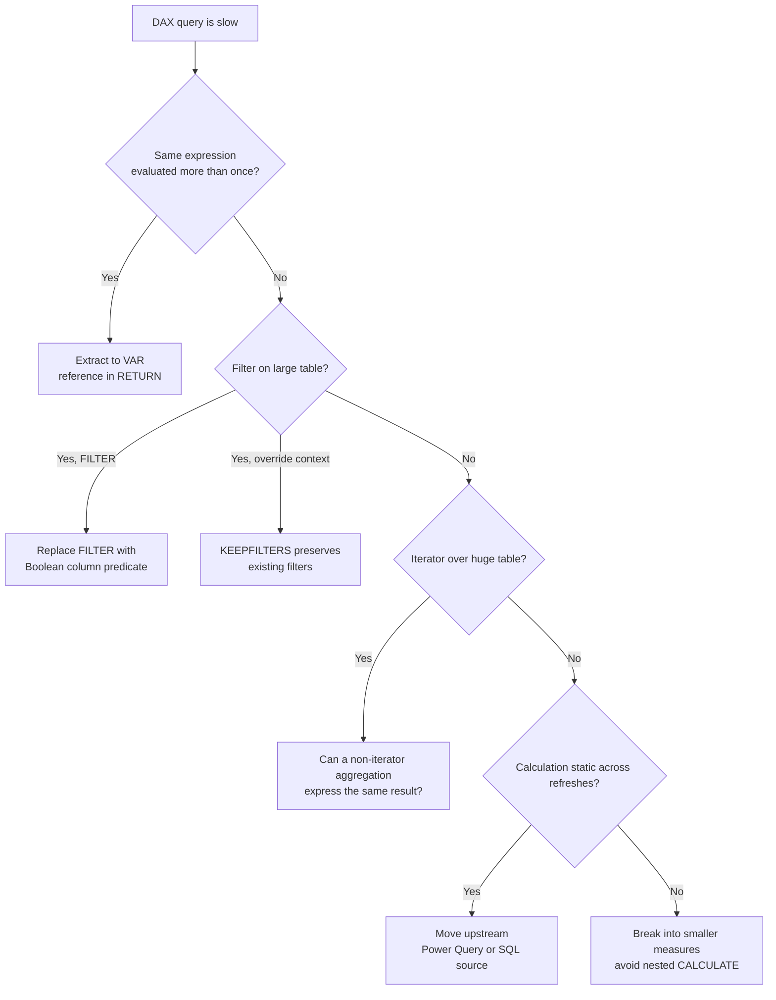

# Unit 3 — Optimize DAX calculations

> [!quote] Source
> Microsoft Learn · Path 3 · Module 3 · Unit 3 · "Optimize DAX calculations"
> <https://learn.microsoft.com/en-us/training/modules/optimize-semantic-model-performance/3-optimize-dax>

## 🎯 Purpose

When Performance analyzer identifies a slow DAX query, the next step is **optimizing the DAX itself**. Walk through the highest-impact patterns: variables, `FILTER` vs. column predicates, `KEEPFILTERS`, iterator function costs, expensive patterns to avoid, moving calculations upstream, and the AI-experience implications.

## 🔁 Use variables to eliminate repeated calculations

When a formula evaluates the same expression more than once, the engine recalculates it each time. **Variables (`VAR` / `RETURN`)** store the result once and reuse it — often cutting query time roughly in half for formulas with repeated subexpressions.

### ❌ Before — `PARALLELPERIOD` evaluated twice

```dax
Sales YoY Growth % =
DIVIDE(
    ([Sales] - CALCULATE([Sales], PARALLELPERIOD('Date'[Date], -12, MONTH))),
    CALCULATE([Sales], PARALLELPERIOD('Date'[Date], -12, MONTH))
)
```

### ✅ After — store in a `VAR`

```dax
Sales YoY Growth % =
VAR SalesPriorYear =
    CALCULATE([Sales], PARALLELPERIOD('Date'[Date], -12, MONTH))
RETURN
    DIVIDE(([Sales] - SalesPriorYear), SalesPriorYear)
```

The result is the same, but the engine evaluates `SalesPriorYear` only once. Variables also improve readability and **simplify debugging** — temporarily change the `RETURN` expression to output just the variable value and inspect intermediates without rewriting the whole formula.

## 🎛️ Understand FILTER vs. KEEPFILTERS

How you apply filter modifications directly affects performance. The `FILTER` function **iterates over a table row by row** to evaluate a condition — on a large table, that iteration is expensive.

### ❌ `FILTER` iterates the whole table

```dax
High Value Sales =
CALCULATE(
    [Total Sales],
    FILTER(Sales, Sales[Amount] > 1000)
)
```

### ✅ Boolean column predicate is cheaper

```dax
High Value Sales =
CALCULATE(
    [Total Sales],
    Sales[Amount] > 1000
)
```

> [!tip] Rule of thumb
> When the filter logic involves only a single column, a Boolean predicate is almost always cheaper than `FILTER(table, …)` because the engine can use column-level storage instead of a row-by-row iteration context.

### `KEEPFILTERS` preserves filter context

`KEEPFILTERS` serves a **different purpose**: it preserves existing filter context instead of replacing it. Use it when you want to **add** a filter condition without overriding what's already applied by slicers or other visuals.

```dax
Online Sales =
CALCULATE(
    [Total Sales],
    KEEPFILTERS(Sales[Channel] = "Online")
)
```

> [!warning] As table size grows
> The performance difference between `FILTER` and direct column predicates is most noticeable on **large tables**. Avoid `FILTER` on entire tables when a column-level predicate achieves the same result.

## 🌀 Manage iterator function costs

Iterator functions (`SUMX`, `AVERAGEX`, `MAXX`, `COUNTX`) evaluate an expression for each row in a table, then aggregate the results. They're powerful — and sometimes necessary — but expensive because **performance scales with table size**.

### ❌ Iterates every row

```dax
Weighted Average Price =
SUMX(
    Sales,
    Sales[Quantity] * Sales[UnitPrice]
) / SUM(Sales[Quantity])
```

If `Sales` has 50 million rows, `SUMX` evaluates the multiplication for every row.

### ✅ Non-iterator equivalent (when possible)

```dax
Total Revenue = SUM(Sales[LineTotal])
```

> [!info] Iterators aren't inherently bad
> They're the right choice when you need **row-level calculation logic that can't be expressed** with a simple aggregation. An iterator over 1,000 rows is fine; the same iterator over 100 million rows can become a bottleneck. **Know the cost; choose deliberately.**

## ⛔ Avoid expensive patterns

Some DAX patterns are known to cause performance problems. Recognizing them helps you write better formulas from the start.

### `COUNTROWS(FILTER(...))` on large tables

This pattern iterates an entire table to count rows matching a condition. Replace it with `CALCULATE` + `COUNTROWS` + a filter argument.

```dax
-- Expensive
Large Orders = COUNTROWS(FILTER(Sales, Sales[Amount] > 1000))

-- Better
Large Orders = CALCULATE(COUNTROWS(Sales), Sales[Amount] > 1000)
```

### Nested `CALCULATE` with complex filters

Each nested `CALCULATE` creates a new **filter context transition**. Deeply nested formulas with multiple context changes are hard to optimize. **Simplify** by breaking complex measures into smaller component measures that each handle a single filter modification.

### Mixing aggregation grains

Measures that combine data at different levels of granularity (for example, comparing a single row's value to a table-level total) require context transitions that can be expensive. Use variables to evaluate the total once and reuse it.

```dax
Pct of Total =
VAR TotalSales = CALCULATE([Total Sales], REMOVEFILTERS())
RETURN
    DIVIDE([Total Sales], TotalSales)
```

## ⬆️ Move calculations to the data layer

If a DAX measure computes the same result on every refresh and the underlying data doesn't change between refreshes, **materialize that calculation in the data layer** instead.

For example, a calculated column that concatenates first and last name runs during data refresh and stores the result — but the same logic as a measure would run on every query. For static transformations like this, you have two options:

- **Power Query computed columns** — define the transformation in M during data load. These columns compress more efficiently than DAX calculated columns because the **VertiPaq engine** can optimize storage during load.
- **Source-level calculations** — if the data source is a SQL database, add the calculation to the SQL view or query. This uses the database engine's optimization capabilities.

> [!important] Side benefit — faster refresh
> Moving calculations upstream doesn't just improve query performance — it also **reduces data refresh times**, because DAX calculated columns are evaluated **after** all Power Query tables finish loading.

Reserve DAX calculated columns for scenarios that require **DAX-specific functions**, such as evaluating measures or using time intelligence functions that depend on the semantic model's relationships.

## 🤖 Consider the AI experience

DAX performance directly affects **AI-powered experiences**. In Microsoft Fabric, IQ data agents and Copilot chat query your semantic model by generating DAX queries behind the scenes. A measure that takes five seconds for a human user takes the same five seconds for Copilot — and **AI interactions often have tighter timeout thresholds** than interactive reports.

> [!quote] Why this matters
> Optimizing DAX isn't just about faster reports — it's about making your data responsive enough to support **natural language queries, automated agents, and real-time analytics**.

## 🧠 Visual — DAX optimization decision tree



## 🧭 Next

→ [[Unit-4-Reduce-Cardinality]]
← [[Unit-2-Performance-Analyzer]]
↑ [[_MOC]]