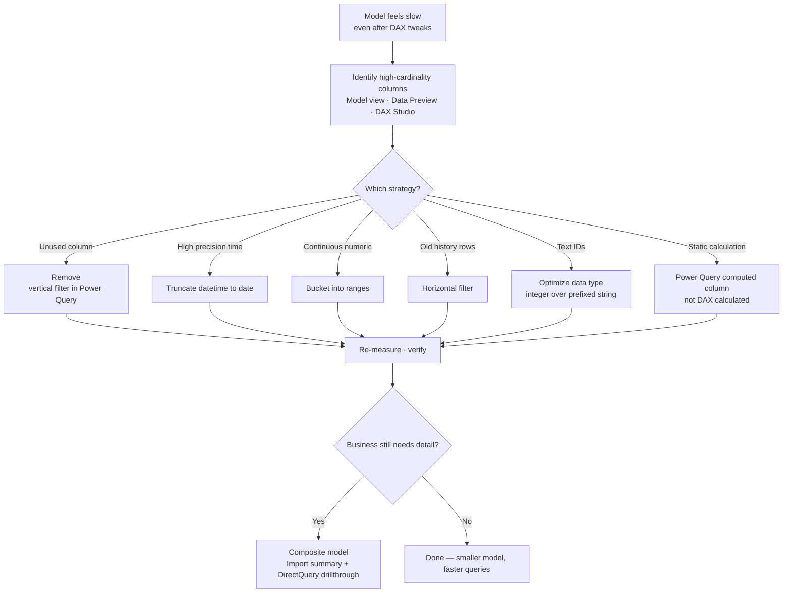

# Unit 4 — Reduce cardinality for better performance

> [!quote] Source
> Microsoft Learn · Path 3 · Module 3 · Unit 4 · "Reduce cardinality for better performance"
> <https://learn.microsoft.com/en-us/training/modules/optimize-semantic-model-performance/4-reduce-cardinality>

## 🎯 Purpose

Even with optimized DAX, a semantic model can be slow if it contains too much data. **Cardinality** — the number of unique values in a column — directly affects model size, memory consumption, and query performance. Reducing cardinality is one of the most effective ways to make a model faster.

## ⚙️ Understand how cardinality affects performance

Semantic models use an in-memory compression engine called **VertiPaq**, which compresses data **column by column**. Columns with fewer unique values compress better and query faster. A column with **10 unique values** compresses far more efficiently than a column with **10 million unique values**.

High-cardinality columns create two problems:

- **Larger model size** — more unique values require more storage, increasing memory usage and slowing data refresh.
- **Slower queries** — the engine processes more distinct values when filtering, grouping, or aggregating. High-cardinality columns in relationships also **increase the cost of joining tables**.

> [!quote] Intuition
> If your model is a dictionary, cardinality is the number of unique words. A dictionary with a million entries takes longer to search than one with a thousand.

## 🔎 Identify high-cardinality columns

Not all columns contribute equally to model size. Look for columns with these characteristics:

- **GUIDs or surrogate keys** that aren't used in relationships or reports — often loaded by default but serving no purpose.
- **Timestamps with high precision** — a `datetime` column at millisecond precision has far more unique values than a `date` column at day level.
- **Free-text or description columns** — transaction descriptions, comments — that compress poorly.
- **Unique identifiers** like order numbers, invoice numbers, session IDs that aren't needed for reporting.

> [!tip] Where to look
> In **Power BI Desktop**, examine column statistics in **Model view**. In **Power Query**, the **Data Preview** shows distinct value counts during transformation — a quick way to spot offenders before loading.

## 🛠️ Apply reduction strategies

Once you've identified high-cardinality columns, apply one or more of these strategies.

### Remove unused columns

If a column isn't used in **relationships, measures, visuals, or security roles**, don't import it. This is sometimes called **vertical filtering**. Review your model regularly to ensure every column serves a purpose.

### Reduce time precision

If reporting only requires daily granularity, **truncate datetime columns to date** in Power Query before loading. Going from `datetime` (millions of unique values) to `date` (a few thousand) dramatically reduces cardinality.

### Bucket continuous values

Group continuous numeric values into ranges. For example, instead of storing exact ages (0–120), create **age bands** like `"18-25"`, `"26-35"`, `"36-45"`. This reduces unique values while preserving analytical value.

### Remove unnecessary rows

Filter out historical data that's no longer needed for reporting. If users only analyze the **past two years**, don't load five years of data. This is **horizontal filtering**, and it reduces both cardinality and overall row count.

### Optimize column data types

The VertiPaq engine uses **value encoding** for numeric data (highly efficient) and **hash encoding** for text (less efficient). If a column like order number is stored as text with a prefix (e.g. `"SO123456"`), consider removing the prefix and storing it as a number.

> [!tip] Prefer Power Query computed columns
> Prefer creating computed columns in **Power Query** over **DAX calculated columns**. Power Query columns are processed during data load and benefit from better VertiPaq compression. DAX calculated columns are evaluated after load and typically compress less efficiently.

## ⚖️ Evaluate trade-offs

Cardinality reduction always involves a trade-off between **granularity** and **performance**. Rounding timestamps to the day level means you can't analyze intra-day patterns. Bucketing ages means you can't filter on exact ages. These decisions should be driven by **business requirements**.

Ask these questions before reducing cardinality:

- Does any report, slicer, or measure depend on this level of detail?
- Can users get the detail they need from a **drillthrough page** connected to a DirectQuery table?
- Is the column used in **row-level security** rules?

> [!success] Composite model pattern
> When the business requires both **summary-level performance** and **detail-level access**, a composite model approach helps:
> - **Import** storage mode for summarized data → fast queries.
> - **DirectQuery** for detail-level drillthrough → on-demand access to the source.

## 📋 Quick reference — offenders and fixes

| Offender | Example | Cardinality impact | Fix |
|---|---|---|---|
| Unused GUID / surrogate key | `CustomerGUID` not in any relationship | High | **Remove unused columns** |
| Millisecond-precision datetime | `OrderTimestamp` to ms | Very high | **Reduce time precision** to date |
| Free-text description | `TransactionNotes` | Very high (unique per row) | Remove or move detail to drillthrough |
| String-prefixed ID | `SO123456` as text | Medium-high | **Optimize data type** → integer |
| Continuous numeric | `Age` 0–120 | Medium (121 values) | **Bucket** into age bands |
| Old history rows | 5 years of sales when only 2 used | Row-count + cardinality | **Horizontal filtering** in Power Query |

## 🧠 Visual — cardinality reduction workflow

## 🧭 Next

→ [[Unit-5-Implement-Aggregations]]
← [[Unit-3-Optimize-DAX]]
↑ [[_MOC]]