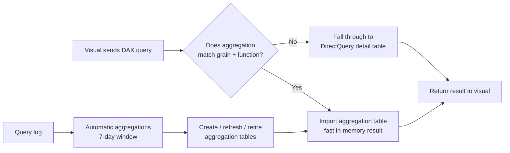

# Unit 5 — Implement aggregations

> [!quote] Source
> Microsoft Learn · Path 3 · Module 3 · Unit 5 · "Implement aggregations"
> <https://learn.microsoft.com/en-us/training/modules/optimize-semantic-model-performance/5-implement-aggregations>

## 🎯 Purpose

When a semantic model serves reports over **large fact tables** (hundreds of millions or billions of rows), even optimized DAX and reduced cardinality might not be enough. **Aggregations** pre-summarize data so common queries return results from a small, fast in-memory cache instead of scanning the entire detail table.

## 🤔 Understand when aggregations help

Aggregations are most valuable when **three conditions** exist:

- **Large fact tables** — hundreds of millions of rows that can't be efficiently loaded into memory in full.
- **Common query patterns** — users frequently query at a summary level (by month, region, product category) rather than at the individual transaction level.
- **DirectQuery or composite models** — the detail data lives in an external source and round-trip queries are slow.

> [!info] How aggregations work
> Aggregations store precomputed summary data in an **Import-mode table** that the query engine checks first. If the query can be answered from the aggregation, the result returns immediately from memory. If not, the query **falls through** to the detail table transparently.
>
> Think of it like an executive summary at the front of a long report. Most readers get what they need from the summary; only those who need full detail read the entire document.

## 🛠️ Work with user-defined aggregations

User-defined aggregations give you **full control** over what gets summarized and stored. Implementation steps:

1. **Create an aggregation table** — in Power Query, create a table that summarizes the fact table at the grain you want. For example, summarize **daily sales by product category and region** instead of individual transactions.
2. **Configure the aggregation mapping** — in Power BI Desktop's model view, select the aggregation table and open **Manage aggregations**. Map each column to its corresponding detail-table column and specify the aggregation function: `Sum`, `Count`, `Min`, `Max`, or `GroupBy`.
3. **Hide the aggregation table** — aggregation tables should be hidden from report authors. The query engine uses them automatically; users don't need to know they exist.
4. **Set storage modes** — the aggregation table uses **Import** mode for fast in-memory access. The detail table typically uses **DirectQuery** so you don't need to load billions of rows into memory.

> [!success] Transparent fallback
> When a visual queries data that **matches the aggregation's grain and function**, the engine returns the result from the Import table. When the query requires finer granularity, it falls through to the DirectQuery detail table transparently.

> [!note] Composite model required
> User-defined aggregations require a **composite model** — tables with mixed storage modes. The aggregation table is **Import**, and the detail table is **DirectQuery**. Both tables need matching relationships to the same dimension tables.

## 🤖 Use automatic aggregations

Automatic aggregations simplify this process by using **machine learning** to determine what to summarize. Instead of manually creating and mapping aggregation tables, Power BI analyzes your query log and automatically creates, updates, and removes aggregations based on actual usage patterns.

To enable automatic aggregations:

1. Open the semantic model's **Settings** in the Power BI service.
2. Enable automatic aggregations training.
3. Schedule one or more refreshes.

With the first training and refresh cycle, Power BI evaluates the query log (which stores **seven days** of query data) and creates in-memory aggregation tables. The system **continuously adapts** — as query patterns change, aggregations adjust to prioritize the most frequently requested summaries.

### Requirements

- **Premium, Premium Per User, or Fabric capacity**.
- **DirectQuery storage mode** for the tables that need aggregation.
- Supported data sources: **Azure SQL Database, Synapse, Databricks, Snowflake**, and others.

> [!tip] Combine both
> You can use **both user-defined and automatic aggregations** in the same model. User-defined aggregations handle known, static patterns, while automatic aggregations adapt to changing query behavior.

## 📈 Monitor aggregation effectiveness

After implementing aggregations, verify they're being used:

- **Check refresh history** — in the model's settings, the refresh history shows how much memory the aggregation cache uses and how many queries it serves.
- **Use Azure Log Analytics** — if your capacity is connected to Azure Log Analytics, you can analyze the **percentage of queries served by aggregations** versus queries that hit the data source directly. This gives you a detailed view of aggregation hit rates at the DAX and SQL query level.

If queries are missing the aggregation (falling through to DirectQuery), review the query patterns. The aggregation might not cover the **grain or function** that users are requesting.

## 🌊 Aggregations and Direct Lake

In Microsoft Fabric, semantic models using **Direct Lake** storage mode read directly from **Delta tables in OneLake** without importing data into memory or sending DirectQuery queries. Direct Lake is **already fast** for many scenarios because it avoids the overhead of data import and external query round-trips.

Aggregations can complement Direct Lake when:

- The underlying Delta table is **very large** and common queries need only summary-level results.
- You need to **reduce the amount of data loaded into column segments** for frequently queried patterns.

> [!warning] Default recommendation
> For most Direct Lake models, **start by testing performance without aggregations**. Add them only when measurement shows a clear need. Direct Lake already eliminates the import/DirectQuery overhead, so the marginal benefit of an aggregation may be small.

## 🧠 Visual — aggregation flow (composite model)

## 📋 User-defined vs. automatic aggregations

| Aspect | User-defined | Automatic |
|---|---|---|
| **Who designs the table** | You | Power BI (ML over query log) |
| **Predictability** | High — you control mappings | Adapts to query patterns |
| **Best for** | Known static summary patterns | Changing or unknown patterns |
| **Capacity requirement** | Standard or Premium | Premium, PPU, or Fabric |
| **Storage mode** | Composite required (Import agg + DQ detail) | DirectQuery detail required |
| **Combine with user-defined** | — | ✅ Yes |

## 🧭 Next

→ [[Unit-6-Troubleshoot]]
← [[Unit-4-Reduce-Cardinality]]
↑ [[_MOC]]