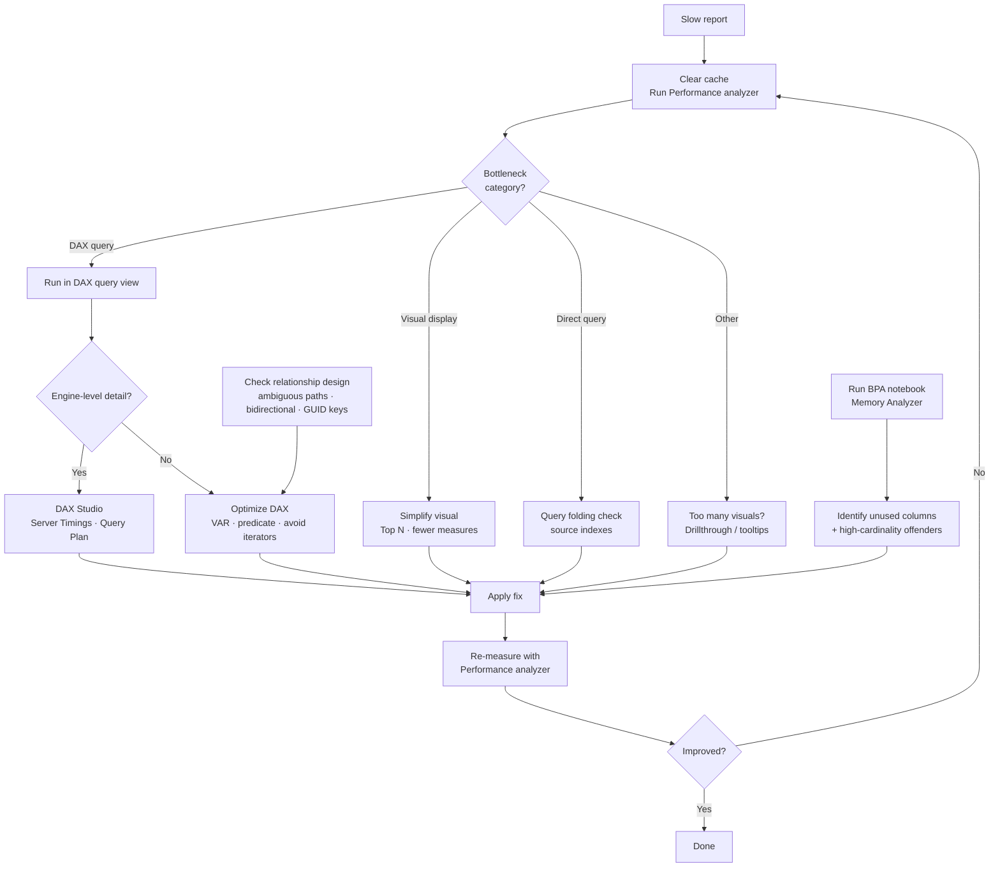

# Unit 6 — Troubleshoot common performance issues

> [!quote] Source
> Microsoft Learn · Path 3 · Module 3 · Unit 6 · "Troubleshoot common performance issues"
> <https://learn.microsoft.com/en-us/training/modules/optimize-semantic-model-performance/6-troubleshoot>

## 🎯 Purpose

Individual optimization techniques are valuable, but real-world performance problems rarely fit neatly into a single category. A slow report might have a **DAX issue**, a **cardinality problem**, and a **visual design issue** all at once. A systematic troubleshooting approach helps you find and fix problems efficiently.

## 🔁 Follow a systematic diagnosis workflow

When a report is slow, use this **three-step approach**:

1. **Is it the visual, the DAX, or the data?** — Open Performance analyzer, clear the cache, refresh all visuals. Compare the **DAX query, visual display, and other timing metrics** to determine where time is spent.
2. **Isolate the root cause** — Copy the slow DAX query and run it in DAX query view. If the query is fast there but slow in the visual, the issue is **rendering**. If the query is slow everywhere, the issue is the **measure or data model**.
3. **Fix and verify** — Apply the appropriate fix, then run Performance analyzer **again** to confirm that performance improved. Don't assume the fix worked — **measure it**.

> [!success] The four-step loop
> This **symptom → diagnosis → fix → verify** workflow prevents you from spending time on the wrong problem and confirms that your changes actually help.

## 🧪 Run Best Practice Analyzer to catch common issues

**Best Practice Analyzer (BPA)** checks your semantic model against a set of **more than 60 rules** that cover performance, DAX expressions, error prevention, and maintenance. Instead of manually inspecting every column and measure, BPA scans the entire model and flags issues like:

- Unused columns
- High-cardinality keys
- Missing descriptions
- Inefficient DAX patterns

### How to run BPA in Microsoft Fabric

In Microsoft Fabric, BPA is available through **sample notebooks** that you can open directly from your semantic model in the Power BI service:

1. Select the semantic model.
2. Choose the BPA notebook from the **Home** ribbon or the **Model health** dropdown.
3. The notebook runs against your model using **semantic link** and returns categorized recommendations.
4. A companion **Memory Analyzer** notebook shows storage statistics for tables, columns, and relationships.

> [!tip] When to run BPA
> Most useful as a **proactive check before performance problems surface**. Run it after building or significantly changing a model, and use the results to guide the optimization techniques covered earlier in this module.

> [!note] Tabular Editor alternative
> If you don't have access to Fabric, [Tabular Editor](https://tabulareditor.com/) — a third-party external tool — includes a BPA feature that runs the same rule set locally against a Power BI Desktop model or a published model via the XMLA endpoint.

## 🖼️ Address complex visuals

Visuals that request too much data are a **common** performance problem. Each visual on a report page sends **separate DAX queries** to the semantic model, and visuals with many measures, data points, or cross-filtering dependencies generate complex queries.

| Issue | Cause | Fix |
|---|---|---|
| **Too many measures on one visual** | Table with 20 measures → large complex query | Reduce measure count or split across multiple visuals |
| **Too many data points** | Scatter chart with 100,000 points; table with 50,000 rows | Apply **Top N** filters to limit rows returned |
| **Too many visuals on one page** | Each visual queries independently (30 visuals = 30 queries on load) | Use **drillthrough pages** and **tooltips** to distribute information |

> [!tip] Page-design guideline
> Aim for **no more than eight visuals per report page**. More than that increases load times and makes the report harder to use.

## 🔗 Fix poorly designed relationships

Relationship design affects how the engine resolves **filter propagation** across tables. Problems to look for:

- **Ambiguous relationship paths** — multiple active paths between two tables force the engine to determine which path to use, which can cause unexpected results and performance overhead. Use **single active relationships** and `USERELATIONSHIP` in measures when you need an alternate path.
- **Bidirectional cross-filtering** — bidirectional relationships propagate filters in **both directions**, increasing the complexity of query evaluation. Use bidirectional filtering **only when necessary**, such as for many-to-many relationships.
- **High-cardinality relationship columns** — relationships on columns with millions of unique values (like GUIDs) are slower to traverse than relationships on columns with lower cardinality. If possible, use **integer surrogate keys** instead.

## 🧹 Resolve filter context issues

Expensive filter propagation can slow queries even when the measure logic itself is simple. Watch for these patterns:

- **`REMOVEFILTERS` or `ALL` on large tables** — these functions remove filter context, which means the engine must evaluate the entire table without any restrictions. Use them **intentionally** and only at the scope needed.
- **Many-to-many relationships with large bridge tables** — each query resolves the mapping through the bridge table. With large data, this is expensive. Consider whether a different modeling approach (role-playing dimensions or consolidated tables) performs better.

## 🌐 Troubleshoot DirectQuery performance

When the semantic model uses **DirectQuery** storage mode, slow performance might come from the **external data source** rather than the DAX engine. DirectQuery-specific issues include:

- **Query folding failures** — Power Query tries to push transformations back to the data source (query folding). When a transformation can't fold, Power BI **downloads the raw data and processes it locally**. This approach is much slower. Review the **native query** in Power Query to verify folding.
- **Slow source queries** — even when query folding works, the source database might execute the query slowly due to **missing indexes, large table scans, or resource contention**. Work with database administrators to optimize source performance.
- **Round-trip latency** — each visual interaction sends a query to the data source and waits for a response. Network latency and source response time add up, especially on pages with many visuals. Consider **mixed storage modes** with Import for summary data and DirectQuery for detail data.

## 🧰 Use DAX Studio for deeper diagnostics

Performance analyzer and DAX query view handle most troubleshooting scenarios. When you need **engine-level detail** (like whether a query is bottlenecked in the formula engine or storage engine), **DAX Studio** fills the gap:

1. Copy a slow DAX query from Performance analyzer.
2. Paste it into DAX Studio.
3. Enable **Server Timings** to see exactly where time is spent.
4. The **Query Plan** view can also reveal inefficient operations that aren't visible from timing data alone.

> [!note] SQL Server Profiler
> **SQL Server Profiler** is another option for capturing a **complete trace** of all DAX and DirectQuery SQL queries during a session. It connects to the local Analysis Services instance that Power BI Desktop runs. Profiler is useful for session-wide analysis, but for most visual-level troubleshooting, Performance analyzer and DAX Studio are more practical.

## ✅ Build a troubleshooting checklist

When investigating a slow report, work through these checks **in order**:

1. **Clear the cache** and run **Performance analyzer**. Identify the slowest visual and its bottleneck category.
2. **If DAX query time is high** — copy and analyze the query in DAX query view or DAX Studio. Look for expensive patterns like `FILTER` on large tables, iterators, or repeated subexpressions.
3. **If visual display time is high** — simplify the visual by reducing the number of measures, data points, or applying filters.
4. **Check cardinality of key columns** — remove or reduce high-cardinality columns that aren't needed.
5. **For DirectQuery models** — verify query folding and source performance.
6. **After each change, measure again** to confirm improvement.

This structured approach ensures you address the most impactful issues first and don't spend time on changes that don't move the needle.

## 🧠 Visual — troubleshooting workflow

## 🧭 Next

→ [[Unit-7-Exercise]]
← [[Unit-5-Implement-Aggregations]]
↑ [[_MOC]]