# Unit 7 — Exercise: Diagnose and fix a slow report

> [!quote] Source
> Microsoft Learn · Path 3 · Module 3 · Unit 7 · "Exercise: Diagnose and fix a slow report"
> <https://learn.microsoft.com/en-us/training/modules/optimize-semantic-model-performance/7-exercise>

## 🎯 Purpose

A **hands-on lab** (~30 minutes) that puts the module's techniques to work on a slow report. The exercise is launched externally from Microsoft Learn — this unit summarizes **what the lab does** so you can decide whether to run it, and which module concepts to focus on while doing so.

## 📋 What the lab does

Semantic models with inefficient DAX measures or high-cardinality columns can cause reports to load slowly and AI experiences like Copilot Q&A to time out. Performance analyzer in Power BI Desktop helps you identify which visuals are slow and why.

In this exercise, you use Performance analyzer to **capture timing data**, **identify an expensive DAX pattern**, **apply an optimization using variables**, **examine column cardinality**, and **verify the improvement**.

> [!note] Prerequisites
> - Access to a **Fabric-enabled workspace**. For information about a trial license, see [Getting started with Fabric](https://learn.microsoft.com/en-us/fabric/get-started/fabric-trial).
> - [Power BI Desktop](https://www.microsoft.com/download/details.aspx?id=58494).
> - This lab takes approximately **30 minutes** to complete.

## 🪜 Lab flow (synthesized from the unit description)

1. **Capture timings** — open Performance analyzer in Power BI Desktop, clear the visual cache, and start recording.
2. **Identify the slow visual** — find the outlier visual whose DAX query time dominates (matches the "product detail table at 4,500 ms" example from [[Unit-2-Performance-Analyzer]]).
3. **Export the DAX query** — copy the slow query from Performance analyzer and open it in DAX query view.
4. **Spot the expensive pattern** — recognize a DAX pattern that re-evaluates an expression repeatedly (or iterates unnecessarily over a large table).
5. **Apply the optimization** — refactor the measure with a `VAR` / `RETURN` pattern (or replace `FILTER` with a Boolean column predicate).
6. **Examine column cardinality** — open Model view (or Power Query Data Preview) and identify a high-cardinality column (millisecond-precision timestamp, unused GUID, free-text column) that can be reduced.
7. **Verify the improvement** — re-run Performance analyzer after each fix and confirm that the visual is faster.

## 🔗 What you practice

| Module concept | Where it lands in the lab |
|---|---|
| [[Unit-2-Performance-Analyzer\|Performance analyzer workflow]] | Steps 1–3 |
| [[Unit-3-Optimize-DAX\|DAX optimization with `VAR`]] | Steps 4–5 |
| [[Unit-4-Reduce-Cardinality\|Cardinality reduction]] | Step 6 |
| Symptom → diagnosis → fix → **verify** loop | Step 7 |

## 🧠 Visual — lab checkpoints

```mermaid
flowchart LR
    A[Open Performance analyzer<br/>clear cache · start recording] --> B[Identify slow visual<br/>bottleneck category]
    B --> C[Copy DAX query<br/>open in DAX query view]
    C --> D[Spot expensive pattern<br/>repeated subexpression]
    D --> E[Refactor with VAR<br/>or Boolean predicate]
    E --> F[Examine cardinality<br/>Model view · Data Preview]
    F --> G[Reduce high-cardinality column<br/>truncate · bucket · remove]
    G --> H[Re-run Performance analyzer<br/>verify improvement]
```

## 🧭 Next

→ [[Unit-8-Knowledge-Check]]
← [[Unit-6-Troubleshoot]]
↑ [[_MOC]]