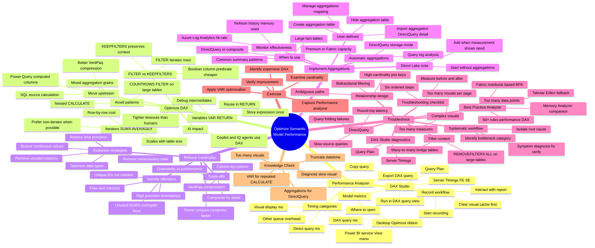

# Module — Optimize semantic model performance

> [!info] Module map
> Path 3 Module 3 in the **Microsoft Fabric Analytics Solution Associate** (DP-600) track. This module is the **semantic-model performance deep-dive**: how to use Performance analyzer to diagnose slow visuals, optimize DAX, reduce cardinality, implement aggregations (user-defined and automatic), and follow a systematic troubleshooting workflow — including Direct Lake considerations.

## 🎯 Learning objectives (synthesized from unit-level goals)

By the end of this module you should be able to:

1. **Diagnose** visual performance issues with **Performance analyzer** and interpret timing categories (DAX query, visual display, Direct query, Other).
2. **Export and analyze** DAX queries generated by visuals, using DAX query view and **DAX Studio** for engine-level diagnostics (formula engine vs. storage engine).
3. **Optimize DAX calculations** by using `VAR` / `RETURN` to eliminate repeated subexpressions, choosing `FILTER` vs. column predicates, understanding `KEEPFILTERS`, managing iterator (`SUMX`/`AVERAGEX`) costs, and avoiding expensive patterns (`COUNTROWS(FILTER(...))`, nested `CALCULATE`, mixed aggregation grains).
4. **Move static calculations upstream** to Power Query computed columns or the SQL source so they compress better in VertiPaq.
5. **Reduce model cardinality** — remove unused columns, reduce time precision, bucket continuous values, filter unnecessary rows, and optimize column data types.
6. **Implement user-defined aggregations** on top of composite models (Import aggregation + DirectQuery detail), configure aggregation mappings, and hide the aggregation table from report authors.
7. **Enable automatic aggregations** that use the query log to build and adapt summaries automatically.
8. **Recognize aggregation behavior in Direct Lake** and start without aggregations, adding them only when measurement shows a clear need.
9. **Apply a systematic troubleshooting workflow** — symptom → diagnosis → fix → verify — and use **Best Practice Analyzer (BPA)**, the Memory Analyzer notebook, and the troubleshooting checklist.
10. **Diagnose DirectQuery-specific problems** — query folding failures, slow source queries, and round-trip latency.

## 🧠 Module mind map

> [!tip] How to use
> The mind map below is duplicated as a standalone Mermaid file (`Module-Mind-Map.md`) you can open in Obsidian's Mermaid preview or the [Mermaid Live Editor](https://mermaid.live). It is the **single-page view** of the entire module.

## 📑 Unit breakdown

| # | Unit | XP | Minutes | Focus |
|---|------|----|---------|-------|
| 1 | [Introduction](./Unit-1-Introduction.md) | 100 | 3 | Scenario framing and module goals |
| 2 | [Use Performance analyzer to diagnose issues](./Unit-2-Performance-Analyzer.md) | 100 | 10 | Open, record, interpret timings, export DAX, DAX Studio |
| 3 | [Optimize DAX calculations](./Unit-3-Optimize-DAX.md) | 100 | 10 | Variables, filter patterns, iterators, expensive patterns |
| 4 | [Reduce cardinality for better performance](./Unit-4-Reduce-Cardinality.md) | 100 | 6 | VertiPaq compression, identify offenders, reduction strategies |
| 5 | [Implement aggregations](./Unit-5-Implement-Aggregations.md) | 100 | 8 | User-defined and automatic aggregations, Direct Lake note |
| 6 | [Troubleshoot common performance issues](./Unit-6-Troubleshoot.md) | 100 | 6 | Systematic workflow, BPA, visuals, relationships, DirectQuery |
| 7 | [Exercise: Diagnose and fix a slow report](./Unit-7-Exercise.md) | 100 | 30 | Hands-on lab |
| 8 | [Knowledge check](./Unit-8-Knowledge-Check.md) | 200 | 3 | 5 multiple-choice questions |
| 9 | [Summary](./Unit-9-Summary.md) | 100 | 2 | Recap + learn-more links |

**Total: 1000 XP · ~78 minutes (~1 hr 18 min)**

## 🔗 Knowledge-check answers (unit 8)

Microsoft Learn does not display the correct answers; the table below is derived from the unit content.

| # | Question topic | Correct answer |
|---|----------------|----------------|
| 1 | Table visual with DAX query 4,200 ms vs visual display 150 ms | **Investigate the measures or filter patterns used by the visual's DAX query** |
| 2 | Same `CALCULATE` expression evaluated three times | **Use a `VAR` to store the `CALCULATE` result and reference it in `RETURN`** |
| 3 | Datetime-to-millisecond column used only at day level | **Truncate the column to date precision in Power Query before loading** |
| 4 | DirectQuery fact table with monthly/regional summary queries | **Implement aggregations that store summarized data at the monthly and regional level** |
| 5 | 25 visuals each under 200 ms DAX but page > 10 s | **The sheer number of visuals is generating too many sequential queries** |

See [[Unit-8-Knowledge-Check]] for full reasoning on each answer.

## 🧭 Downstream links

- [[Unit-1-Introduction]] · [[Unit-2-Performance-Analyzer]] · [[Unit-3-Optimize-DAX]] · [[Unit-4-Reduce-Cardinality]] · [[Unit-5-Implement-Aggregations]] · [[Unit-6-Troubleshoot]] · [[Unit-7-Exercise]] · [[Unit-8-Knowledge-Check]] · [[Unit-9-Summary]]
- [[Module-Mind-Map]]
- Sibling module — `../05-Path3-Module1-DAX-Calculations/` (DAX fundamentals)
- Sibling module — `../05-Path3-Module2-Time-Intelligence/` (DAX time intelligence)
- Parent MOC — `../02-Study-Guide-Index/_MOC.md`

## 📚 External references

- Microsoft Learn module page: <https://learn.microsoft.com/en-us/training/modules/optimize-semantic-model-performance/>
- [Use Performance analyzer to examine report performance](https://learn.microsoft.com/en-us/power-bi/create-reports/desktop-performance-analyzer)
- [Data reduction techniques for Import modeling](https://learn.microsoft.com/en-us/power-bi/guidance/import-modeling-data-reduction)
- [Aggregations in Power BI Premium](https://learn.microsoft.com/en-us/power-bi/enterprise/aggregations-auto)
- [Best Practice Analyzer rules](https://learn.microsoft.com/en-us/power-bi/guidance/powerbi-bpa-rules)