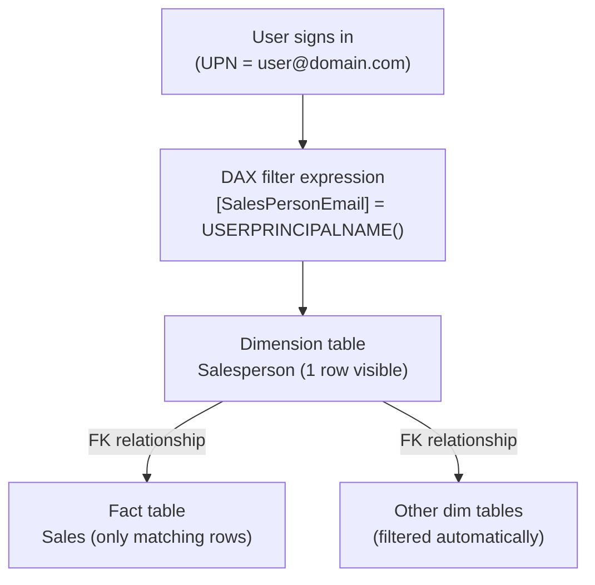
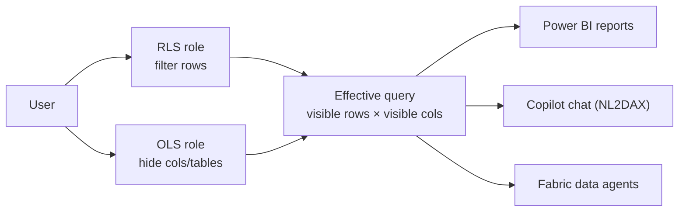

# Module Mind Map — Enforce semantic model security

> [!info] Single-page overview
> This file mirrors the mind map in `[[_MOC]]` as a standalone Mermaid document. Open in Obsidian's Mermaid preview or paste into [Mermaid Live Editor](https://mermaid.live).

## 🗺️ Mind map

```mermaid
mindmap
  root((Semantic Model Security<br/>Module — Path 3 / M4))
    Row-Level Security (RLS)
      Roles in Modeling tab
        Manage roles
        DAX filter expression
        One role can span tables
      Star-schema filter flow
        Filter dim table
        Relationships propagate to fact
        Faster than fact filter
      Static RLS
        Hardcoded values
        [Region] = "Midwest"
        Small fixed scenarios
        Model republish to change
      Dynamic RLS
        USERPRINCIPALNAME()
        Returns user@domain.com
        Preferred over USERNAME()
        Scales without model change
      Security table pattern
        Maps users to partitions
        CONTAINS lookup
        Many-to-many assignments
        Data-driven updates
    Object-Level Security (OLS)
      Defined in Tabular Editor
        External tool, Analysis Services
        Power BI Desktop has no native UI
      None vs Read
        None hides object + metadata
        Read is default
      Hide entire table
        Lookup tables, dev artifacts
      Hide specific column
        Most common pattern
        PII / salary / cost data
      OLS limitations
        Measures not directly hidable
        Workspace Admin/Member bypass
        Relationship chain rule
        No Quick Insights / Smart Narrative
        Errors look like missing fields
      OLS + RLS together
        Different roles per type
        Layered protection
        OLS blocks Copilot too
    Testing & Role Management
      View as in Desktop
        Modeling tab
        Other user email field
        Edge-case users
      Test as role in service
        More options → Security
        Re-validate after publish
        DirectQuery + SSO differences
      Assign role members
        Semantic model owner only
        Users / Entra groups / SPNs
        M365 groups NOT supported
      Entra security groups
        Bulk membership
        Delegated to IT
        One assignment covers many
      Workspace vs RLS
        Workspace roles = access
        RLS = data scope
        Admin/Member/Contributor bypass RLS
      Common mistakes
        Viewer without RLS role
        Bidirectional filter leaks
        Broken relationship chains
        Skipping post-publish test
        Additive multi-role union
    AI Consumption Paths
      Copilot respects RLS
      Data agents use NL2DAX
      OLS hides columns from NL
      User identity flows through
    Knowledge Check
      Q1 Dynamic RLS + security table
      Q2 OLS for column restriction
      Q3 Viewer without role = unfiltered
      Q4 View as in Desktop
      Q5 Entra security groups
```

## 🔁 RLS filter propagation (auxiliary diagram)



## 🛡️ RLS + OLS combined (auxiliary diagram)



## 🧭 Related

- [[_MOC]] — module index
- [[Unit-1-Introduction]] · [[Unit-2-Row-Level-Security]] · [[Unit-3-Object-Level-Security]] · [[Unit-4-Test-Manage-Roles]] · [[Unit-5-Exercise]] · [[Unit-6-Knowledge-Check]] · [[Unit-7-Summary]]