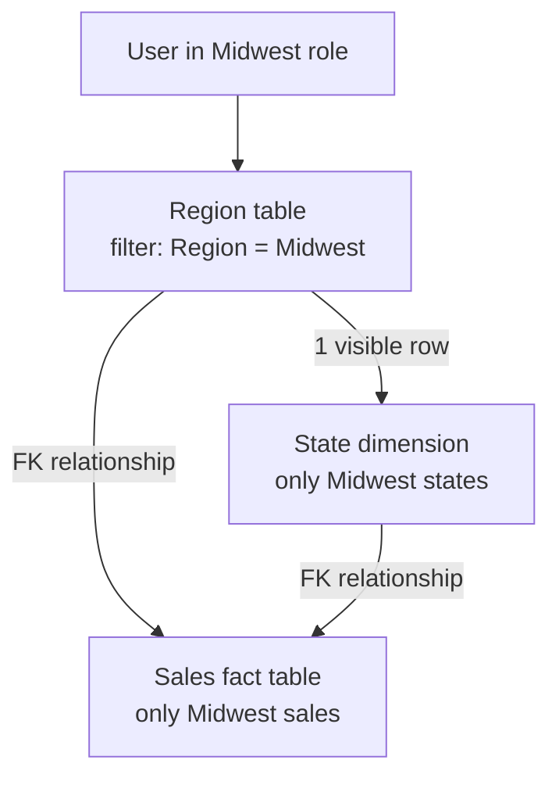
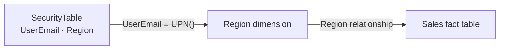
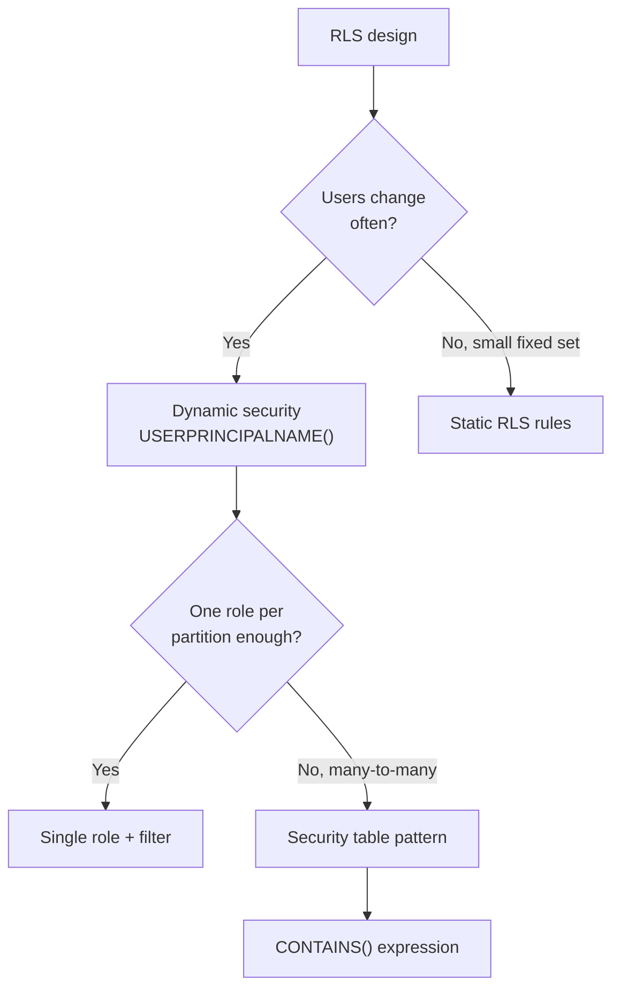

# Unit 2 — Implement row-level security

## 🎯 Why this matters

**Row-level security (RLS)** restricts which rows of data individual users can see when they query a semantic model. You define RLS by creating **roles** that contain **DAX filter expressions**. When a user is assigned to a role, Power BI evaluates the filter expression for each row and returns only the rows where the expression evaluates to `TRUE`.

Without roles, any user with query access to the semantic model sees **all** data. RLS applies to **all consumption paths** — Power BI reports, paginated reports, Copilot chat, and Fabric data agents. Your security configuration protects data consistently regardless of how users access it.

> [!info] One model, one rule, every path
> RLS is enforced at the semantic model layer, so the same filter expression applies to every consumer — visual, DAX, NL2DAX, paginated — without per-surface configuration.

## 🌟 How RLS works with star schemas

RLS works best with **star schema designs** where dimension tables relate to fact tables through model relationships. You create filter expressions on **dimension tables**, and Power BI propagates those filters to fact tables through the relationships. This approach is more efficient than filtering fact tables directly because dimension tables typically contain far fewer rows.

**Example walkthrough** — model with a `Region` dimension table and a `Sales` fact table. When you apply an RLS filter to `Region` for "Midwest", Power BI:

1. Filters the `Region` table → one visible row (Midwest).
2. Uses the model relationship to propagate the filter to related dimensions like `State` → only the states in the Midwest region.
3. Propagates the filter to the `Sales` fact table through its relationships → only the sales records for Midwest states.



> [!tip] Filter dimension tables, not fact tables
> Model relationships propagate dimension filters to fact tables efficiently, which delivers faster query performance.

## 🛠️ Create security roles

You create roles in Power BI Desktop from the **Modeling** tab by selecting **Manage roles**. You can also create and manage roles in the **Fabric web modeling experience**. Each role has a unique name and one or more DAX filter expressions applied to specific tables.

**Steps in Power BI Desktop:**

1. On the **Modeling** tab, select **Manage roles**.
2. Select **New** to create a role.
3. Name the role (e.g., `Regional Sales`).
4. Select the table you want to filter.
5. Enter a DAX filter expression. You can use the default drop-down interface for simple filters or switch to the DAX editor for expressions that use functions like `USERPRINCIPALNAME()`.
6. Select **Save**.

> [!warning] Two edge-case roles you should remember
> - A role with **no rules** provides access to **all** rows in all tables — useful for admin roles.
> - A role with the expression **`FALSE()`** blocks access to **all** rows in a specific table — useful when users should see aggregated measures built from the table but not the rows themselves.

## 🔐 Dynamic security with `USERPRINCIPALNAME()`

Dynamic security is the **recommended approach** for most scenarios. Instead of creating separate roles for each user or group, you create a **single role** with a DAX expression that evaluates the signed-in user's identity.

The `USERPRINCIPALNAME()` function returns the email address of the authenticated user in `user@domain.com` format. You use this function to match the current user against a column in your data model.

```dax
-- Filter the Salesperson table to the current user
[SalesPersonEmail] = USERPRINCIPALNAME()
```

This expression filters the `Salesperson` dimension table to the row that matches the signed-in user. Because `Salesperson` relates to `Sales`, only that user's sales data is visible.

> [!success] Why dynamic scales
> Adding or removing users is a **data change**, not a model change. You don't need to create new roles or republish the semantic model when team members change.

**Scale example:** 50 salespeople across 5 regions.

| Approach | Roles needed | Change model on team change? |
|----------|--------------|------------------------------|
| Static RLS | 5 (one per region) | Yes — new role or rule update |
| Dynamic RLS | 1 | No — just update the data |

## 🧩 Implement the security table pattern

For more complex authorization scenarios, create a **dedicated security table** that maps users to data partitions like regions, departments, or cost centers. The security table joins to a dimension table in your model and the RLS filter references the security table.

```dax
-- Filter through a security table that maps users to regions
CONTAINS(
    SecurityTable,
    SecurityTable[UserEmail], USERPRINCIPALNAME(),
    SecurityTable[Region], [Region]
)
```

This pattern maps each user to one or more regions in the security table. When a user signs in, Power BI evaluates `CONTAINS` against the security table and returns only the rows matching their assigned regions.



**Advantages of the security table pattern:**

- **Centralized management** — all user-to-data mappings live in one table.
- **Multi-value assignments** — a single user can map to multiple regions or departments.
- **Data-driven updates** — changing access requires updating the security table data, not the model definition.

> [!info] Implementation steps
> 1. Add the security table to your model.
> 2. Create a relationship between the security table and the relevant dimension table.
> 3. Create a role with the `CONTAINS` filter expression.
> 4. When you refresh the data, any changes to the security table take effect immediately — no republish required.

## 📏 Static RLS rules

Static rules use DAX expressions that refer to **constant values** rather than user identity.

```dax
-- Static filter: only Midwest data is visible
[Region] = "Midwest"
```

Static rules are simple to create and understand. They work well when you have a **small, fixed** number of data partitions that rarely change. However, they **don't scale**. Each new region or data partition requires a new role or an updated rule, and you need to republish the semantic model for changes to take effect.

> [!warning] Recommendation
> Dynamic rules with `USERPRINCIPALNAME()` are the recommended approach for most production models. Use static rules only for small, fixed scenarios where the number of partitions is unlikely to grow.

## 🔍 `USERNAME()` vs `USERPRINCIPALNAME()`

Both functions return the identity of the signed-in user, but they differ in format:

| Function | Power BI Desktop | Power BI service |
|----------|------------------|------------------|
| `USERNAME()` | `DOMAIN\username` | `user@domain.com` |
| `USERPRINCIPALNAME()` | `user@domain.com` | `user@domain.com` |

`USERNAME()` returns different formats depending on the environment. `USERPRINCIPALNAME()` always returns the user principal name format.

> [!tip] Pick one and stick with it
> Use `USERPRINCIPALNAME()` for consistency when testing in Desktop and deploying to the service.

## 🔗 DirectQuery with single sign-on

When your DirectQuery data source supports single sign-on (SSO), the source database can enforce its **own** row-level security. Power BI passes the user's identity to the data source, and the database evaluates security based on that identity. In this case, you don't need to define RLS roles in the semantic model.

> [!info] See also
> [Row-level security with Power BI](https://learn.microsoft.com/en-us/power-bi/enterprise/service-admin-rls) for source-side RLS patterns.

## ⚡ Optimize RLS performance

Complex DAX filter expressions can affect query speed. Follow these practices to keep queries fast:

- **Filter dimension tables.** Relationships propagate filters to fact tables more efficiently than direct fact table filtering.
- **Avoid `LOOKUPVALUE`.** Use model relationships to propagate filters instead.
- **Test with realistic data.** A filter that performs well on a small dataset might slow down with production-scale data.
- **Measure RLS impact.** Use **Performance Analyzer** in Power BI Desktop to compare query durations with and without RLS enforced.

> [!tip] Copilot for DAX
> Use Copilot to generate DAX filter expressions for RLS roles. For example, ask Copilot to create a security table filter using `USERPRINCIPALNAME()` for your specific data model.

## 🧭 RLS design checklist



## 🔑 Key terms (flashcards)

- **Role** — named container for DAX filter expressions and (later) OLS rules.
- **DAX filter expression** — a Boolean expression that Power BI evaluates per row to decide visibility.
- **`USERPRINCIPALNAME()`** — returns the signed-in user as `user@domain.com` in both Desktop and service.
- **`USERNAME()`** — returns the signed-in user but with format that differs between Desktop and service.
- **Security table** — a dimension-like table that maps users to data partitions; enables many-to-many RLS assignments.
- **`CONTAINS()`** — DAX function used to check membership of the current user in the security table.

## 🧭 Next

→ [Unit 3 — Apply object-level security](./Unit-3-Object-Level-Security.md)
← [Unit 1 — Introduction](./Unit-1-Introduction.md)
↑ [_MOC](./_MOC.md)