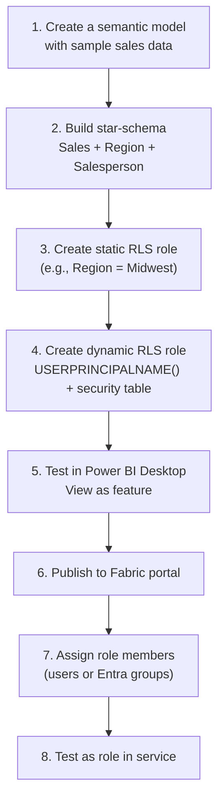

# Unit 5 — Exercise: Implement RLS for a semantic model

## 🎯 Lab summary

> [!warning] This unit requires a VM to complete
> VM Mode provides a free, web-based virtual machine environment to complete the steps in this unit. Microsoft provides this lab experience and related content for educational purposes. All presented information is owned by Microsoft and intended solely for learning about the covered products and services.

> [!info] What you'll do
> In this exercise, you create a semantic model with sample sales data, configure row-level security roles using **static** and **dynamic** DAX filters, test security enforcement, and manage role membership in the Fabric portal.

**Duration:** ≈ 30 minutes

> [!important] Prerequisites
> You need access to a **Fabric-enabled workspace** to complete this exercise. For information about a trial license, see [Getting started with Fabric](https://learn.microsoft.com/en-us/fabric/get-started/fabric-trial).

## 🧭 Lab flow (what the lab walks you through)

## 📚 Skills you'll exercise

| Skill | Where it appears |
|-------|------------------|
| Build a star-schema model | Step 1–2 — dimensions + fact tables |
| Write static RLS DAX | Step 3 — `[Region] = "Midwest"` pattern |
| Write dynamic RLS DAX | Step 4 — `[Email] = USERPRINCIPALNAME()` pattern |
| Build a security table | Step 4 — user-to-region mapping |
| Test with View as | Step 5 — Desktop validation |
| Manage role membership | Step 7 — Fabric portal Security page |
| Test as role in service | Step 8 — production validation |

> [!tip] How to get the most from this lab
> - **Read each step's narrative**, not just the actions — the lab calls out *why* a step matters (e.g., why filter dimension, not fact).
> - **Test edge cases** — try an email not in the security table to confirm the user sees zero rows.
> - **Compare static vs dynamic** — note that static needs a model republish to change regions; dynamic needs only a data refresh.

## 🔗 Launch

- Launch the exercise from the Microsoft Learn page: <https://learn.microsoft.com/en-us/training/modules/enforce-semantic-model-security/5-exercise>
- VM Mode (sign-in required): <https://learn.microsoft.com/en-us/training/modules/enforce-semantic-model-security/5-exercise?launch-lab=true>
- Direct lab link: <https://go.microsoft.com/fwlink/?linkid=2259796>

> [!quote] From the source
> "Microsoft provides this lab experience and related content for educational purposes. All presented information is owned by Microsoft and intended solely for learning about the covered products and services in this Microsoft Learn module."

## 🧭 Next

→ [Unit 6 — Knowledge check](./Unit-6-Knowledge-Check.md)
← [Unit 4 — Test security and manage roles](./Unit-4-Test-Manage-Roles.md)
↑ [_MOC](./_MOC.md)