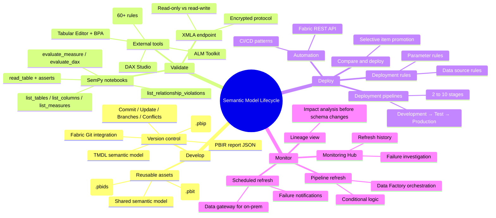

# Module Mind Map

## Stage-to-unit map

| Stage | Unit | Output |
|---|---|---|
| Develop | [[Unit-2-Reusable-Assets]], [[Unit-3-Power-BI-Projects]] | Reusable assets under version control |
| Validate | [[Unit-4-XMLA]] | Programmatic checks via XMLA / SemPy |
| Deploy | [[Unit-5-Deploy-Stages]] | Promoted content with stage rules |
| Monitor | [[Unit-6-Maintain-Monitor]] | Reliable, refreshed, observable models |

See also: [[_MOC]] · [[Unit-9-Summary]]
