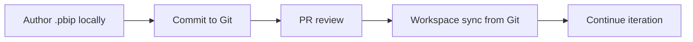

# Manage Power BI content in version control

Version control tracks what changed, who changed it, and when. Two tools work together: Power BI Desktop projects and Fabric Git integration.

## Power BI Desktop projects (`.pbip`)

A `.pbip` saves a report and its semantic model as text files in a folder:

```
MyProject/
├── MyModel.SemanticModel/   # Tabular Model Definition Language (TMDL)
├── MyReport.Report/         # Power BI Report (.pbir) JSON
└── .gitignore               # excludes caches and local settings
```

> [!info] Why text files matter
> `.pbix` is binary; you cannot diff it. TMDL stores each table, measure, and relationship as readable text, so changes are visible in standard diff tools and reviewable in pull requests.

Save as a project from **File → Save as → Power BI Project (.pbip)**.

> [!warning] Preview feature
> Enable `.pbip` under **File → Options → Options → Preview features**.

Because TMDL is text, you can run scripts to batch-edit model definitions (for example, adding descriptions to every measure) and commit the result through Git.

## Fabric Git integration

Connect a Fabric workspace to a repository in Azure DevOps or GitHub. Items sync bidirectionally.

Steps:

1. Open the workspace in the Fabric portal.
2. **Workspace settings → Git integration**.
3. Connect the provider, pick the repository, branch, and folder.
4. Run the initial sync.

After connection, items show Git status icons (changed, synced).

> [!tip] Whole-workspace scope
> Git integration covers notebooks, pipelines, lakehouses, warehouses, and other Fabric items in addition to Power BI content.

## Daily workflow



- **Commit:** Source control → choose items, write a message, save.
- **Update:** Update all pulls the latest from the repository.
- **Branches:** Switch the workspace to a feature branch for isolated work.
- **Conflicts:** If both sides changed, resolve by choosing a version or merging.

| Step | Tool | Purpose |
|---|---|---|
| Author | Power BI Desktop (`.pbip`) | Local iteration on text files |
| Track | Git (Azure DevOps / GitHub) | History, branching, PRs |
| Publish | Fabric workspace sync | Move commits to the service |

> [!success] Use PRs as quality gates
> Require reviewer approval before merging to main. This catches issues before they reach the workspace.

The **Develop** stage is complete. Next: [[Unit-4-XMLA]].
