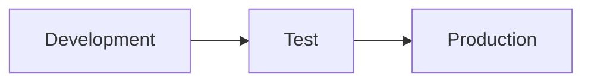

# Deploy content through stages

Deployment pipelines in Fabric promote content across environments so untested changes never reach end users.

## Pipeline structure

Each stage maps to a workspace. Deploying from one stage to the next copies selected items to the target workspace. The default is three stages: **Development → Test → Production**. You can configure two to ten.

- **Development** — frequent, individual changes.
- **Test** — validate with larger data, verify end-user experience.
- **Production** — only validated content for business users.

## Create a pipeline

1. **Workspaces → Deployment pipelines → Create pipeline**.
2. Name the pipeline and choose the number of stages.
3. Assign a workspace to each stage (must be Fabric or Premium capacity).

> [!info] Beyond Power BI
> Pipelines also promote notebooks, lakehouses, warehouses, and Data Factory pipelines.

## Deployment rules

Deployment rules substitute configuration per stage at deploy time.

- **Data source rules** — change server, database, or connection path (dev → test DB, prod → live DB).
- **Parameter rules** — override Power BI parameters per stage (`MaxRows=1000` in dev, unlimited in prod).

> [!important] Configure rules before the first deploy
> Rules only apply during pipeline deployment; they do not edit the source item. Modifying a rule requires a redeploy.

## Compare and deploy

Open the pipeline and select the source stage. Status icons show:

- 🟠 Orange — items differ between stages.
- 🟢 Green — items are identical.
- **New** — items that exist only in the source.

Select the items, then **Deploy** to push them to the next stage. Selective deploys let one item advance while another stays behind.

The view also surfaces deletes and renames so you act on them intentionally.

## Automation

The Fabric REST API lets you trigger deployments programmatically, enabling CI/CD patterns:

- Deploy after a successful PR merge.
- Nightly development → test promotion.
- Run validation scripts before promoting test → production.

## Git vs. pipelines

| Capability | Git integration | Deployment pipelines |
|---|---|---|
| Primary purpose | Source control / collaboration | Stage promotion |
| Tracks | Change history, branches, PRs | Movement between environments |
| Configuration | Same across branches | Per-stage rules |
| Typical users | Developers | Team leads |

> [!quote] Two questions
> Git answers: *what changed and who approved it?* Pipelines answer: *is the right content in the right environment with the right configuration?*

A common combined workflow: commit to Git → PR review → workspace sync → pipeline promotion through Test → Production.

The **Deploy** stage is complete. Next: [[Unit-6-Maintain-Monitor]].
