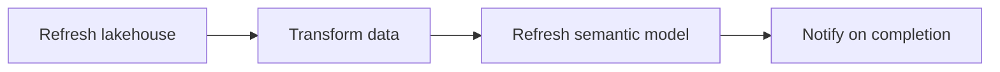

# Maintain and monitor semantic models

Deployment is not the end. Models degrade without scheduled refresh and monitoring.

## Scheduled refresh

Configure under semantic model settings:

1. Turn on the schedule.
2. Set frequency (daily or weekly) and times.
3. Configure failure notifications.

On-premises sources need a **data gateway** to bridge authentication and transfer; cloud sources connect directly.

> [!tip] Refresh cadence
> Match frequency to how often source data changes and how quickly users need updates. Run refreshes during off-peak hours to avoid competing with query workloads.

## Refresh with Data Factory pipelines

For complex dependencies, a pipeline orchestrates the sequence:

Conditional logic can skip the model refresh and alert if upstream steps fail — preventing the model from refreshing against incomplete or corrupt data.

## Monitor refresh operations

The **Monitoring Hub** shows running and recent activities, including semantic model refreshes. Use it to:

- Verify scheduled refreshes succeeded.
- Investigate failures (error details, duration, timing).
- Spot performance trends over time.

Per-model **Refresh history** in the model settings shows status, duration, and type (scheduled, on-demand, or pipeline-triggered).

> [!warning] Resolve failures quickly
> A failed refresh means users see stale data. Common causes: expired credentials, source timeouts, or upstream schema changes.

## Troubleshoot with lineage view

Lineage view maps data flow from sources through semantic models to reports. When a report shows stale data, trace upstream to the model, check its last refresh time, and identify the bottleneck.

> [!important] Pre-change discipline
> Before changing a deployed model's schema, run **impact analysis** to identify downstream consumers that might break. After deployment, use **lineage view** to investigate data-freshness issues.

The **Monitor** stage closes the **Develop → Validate → Deploy → Monitor** cycle.

Next: [[Unit-7-Exercise]].
