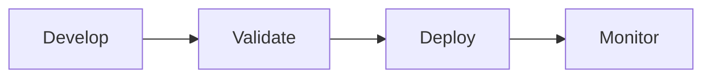

# Summary

This module built an enterprise lifecycle for semantic models: **Develop → Validate → Deploy → Monitor**.

- **Develop** — created reusable Power BI assets (shared semantic models, `.pbit` templates, `.pbids` files) and put them under version control with `.pbip` projects and Git integration.
- **Validate** — used the XMLA endpoint, SemPy notebooks, and external tools (Tabular Editor, DAX Studio, ALM Toolkit) to inspect structure, relationships, measures, and data quality.
- **Deploy** — used deployment pipelines with environment-specific rules to promote validated content.
- **Monitor** — applied scheduled refresh, Data Factory pipelines for orchestrated refresh, and the Monitoring Hub for ongoing operations; used lineage view and impact analysis as operational checkpoints.

> [!success] Outcome
> Version-controlled, validated semantic models become reliable data sources for both human consumers and AI agents.

## Learn more

- [Power BI Desktop projects overview](https://learn.microsoft.com/en-us/power-bi/developer/projects/projects-overview)
- [Introduction to Git integration in Microsoft Fabric](https://learn.microsoft.com/en-us/fabric/cicd/git-integration/intro-to-git-integration)
- [Semantic model connectivity with the XMLA endpoint](https://learn.microsoft.com/en-us/fabric/enterprise/powerbi/service-premium-connect-tools)
