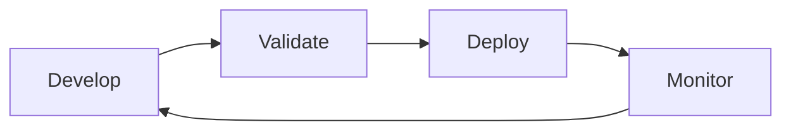

# Manage the Semantic Model Development Lifecycle

> [!info] Module metadata
> **Path:** DP-600, Path 3 · **XP:** 1,000 · **Estimated time:** 86 minutes

This module establishes an enterprise lifecycle for semantic models and reports:

## Units

1. [[Unit-1-Introduction|Introduction]] — 2 min · 100 XP
2. [[Unit-2-Reusable-Assets|Create reusable Power BI assets]] — 5 min · 100 XP
3. [[Unit-3-Power-BI-Projects|Manage Power BI content in version control]] — 7 min · 100 XP
4. [[Unit-4-XMLA|Manage semantic models with the XMLA endpoint]] — 9 min · 100 XP
5. [[Unit-5-Deploy-Stages|Deploy content through stages]] — 7 min · 100 XP
6. [[Unit-6-Maintain-Monitor|Maintain and monitor semantic models]] — 6 min · 100 XP
7. [[Unit-7-Exercise|Exercise: Manage semantic models through their lifecycle]] — 45 min · 100 XP
8. [[Unit-8-Knowledge-Check|Module assessment]] — 3 min · 200 XP
9. [[Unit-9-Summary|Summary]] — 2 min · 100 XP

> [!success] Outcome
> Build a repeatable **Develop → Validate → Deploy → Monitor** process using shared semantic models, `.pbit`/`.pbids` assets, `.pbip` projects, Git, XMLA/SemPy, deployment pipelines, refresh orchestration, and monitoring.

## Related notes

- [[Module-Mind-Map]]
