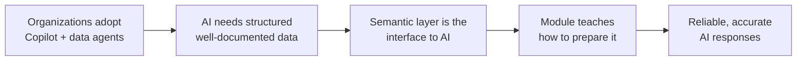

# Unit 1 — Introduction

## 🎯 Why this matters

Organizations are rapidly adopting AI tools like **Copilot in Power BI** and **Fabric data agents** to help business users get answers from data using natural language. These AI tools depend on **structured, well-documented data** to produce accurate answers. The quality of AI output is **directly tied to the quality of the semantic models and metadata** behind it.

> [!quote] From the module
> "The quality of AI output is directly tied to the quality of the semantic models and metadata behind it. As an analytics professional, the semantic layer you build is the interface between your organization's data and AI."

The work you already do to create effective semantic layers — clear naming, thorough documentation, well-defined relationships — applies **directly** to AI preparation. AI tools use the same metadata structures to interpret questions and generate responses.

## 🛒 The retail scenario

The module opens with a concrete scenario: a retail analytics organization deploying **Copilot for Power BI**. Leadership expects Copilot to answer questions like:

- *"What were total sales last quarter?"*
- *"Which product category is trending in the Western region?"*

The semantic models are already in production and well-designed for **reporting**, but Copilot struggles with:

- Ambiguous field names
- Missing descriptions
- Hidden business logic

> [!warning] The gap
> The models are well-designed for reporting — but they **haven't been optimized for AI consumption**. Closing that gap is what this module is about.

## 🧠 What you will learn

By the end of this module you should be able to:

1. **Understand how AI consumes your data** — the RAG (retrieval-augmented generation) process, grounding, schema reduction.
2. **Design gold layers with AI in mind** — entity-oriented tables, business-friendly names, rich descriptions, linguistic modeling.
3. **Configure Prep for AI features in Power BI** — AI data schema, verified answers, AI instructions, Approved for Copilot.
4. **Connect semantic models to enterprise ontology** — Fabric IQ, entity types/properties/relationships, Direct Lake bindings.
5. **Validate AI readiness** — Copilot pane testing, HCAAT diagnostics, the AI-readiness checklist, iteration loop.

## 🔑 Key terms (flashcards)

- **Semantic model** — Tables, columns, measures, relationships, and metadata that present curated data to consumers (Power BI, Excel, Copilot, data agents).
- **Copilot in Power BI** — Microsoft AI assistant that turns natural-language questions into DAX, visuals, and summaries.
- **Data agent (Fabric)** — NL2DAX / NL2SQL / NL2KQL conversational interface against Fabric data.
- **Grounding data** — The schema, names, descriptions, and metadata that AI tools use to interpret a user's question.
- **RAG (retrieval-augmented generation)** — Two-step pattern: retrieve relevant context, then generate a response.
- **AI preparation** — The intentional extension of good model design that makes the semantic layer consumable by AI.

## 🧭 Module roadmap

| # | Unit | What you learn |
|---|------|----------------|
| 2 | [[Unit-2-Understand-AI-Needs]] | RAG, grounding, schema reduction, what AI consumes |
| 3 | [[Unit-3-Design-Gold-Layers]] | Entity-oriented tables, naming, descriptions, linguistic modeling |
| 4 | [[Unit-4-Prepare-Semantic-Model]] | Prep for AI: AI data schema, verified answers, AI instructions |
| 5 | [[Unit-5-Enterprise-Ontology]] | Fabric IQ, Generate Ontology, entity types, Direct Lake bindings |
| 6 | [[Unit-6-Validate-Readiness]] | Copilot pane testing, HCAAT, AI-readiness checklist, iteration |
| 7 | [[Unit-7-Exercise]] | Hands-on lab: simplify schema, verified answers, AI instructions |
| 8 | [[Unit-8-Knowledge-Check]] | 5 knowledge-check questions |
| 9 | [[Unit-9-Summary]] | Recap + further reading |

## 🧭 Next

→ [[Unit-2-Understand-AI-Needs]]
↑ [[_MOC]]
