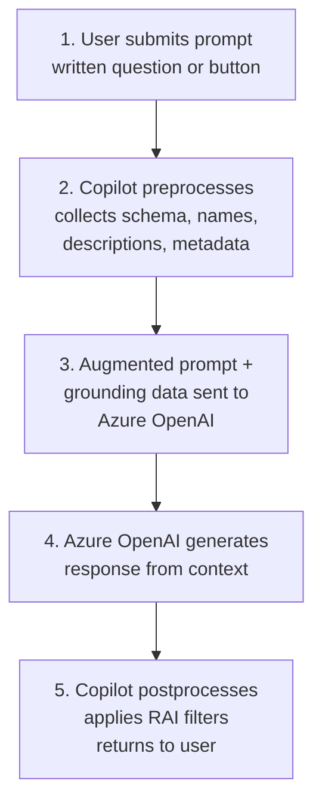
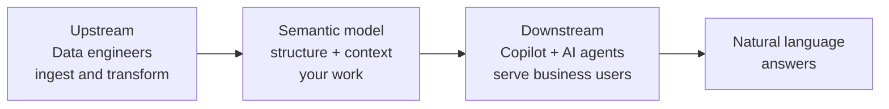

# Unit 2 — Understand what AI needs from your data

## 🎯 Why this matters

Copilot in Power BI and Fabric data agents don't have **inherent knowledge** of your business. They rely entirely on the **structure, metadata, and context** you provide in your semantic models and data layers. Before you can prepare data for AI, you need to understand *how* AI tools actually consume it.

## 🧠 How AI tools consume your data — RAG

When a user asks Copilot *"What were total sales last quarter?"*, it doesn't query your data the way a SQL developer would. Instead, Copilot follows a process called **retrieval-augmented generation (RAG)**:

1. **Retrieve** — Collect relevant context from your data environment.
2. **Generate** — Produce a natural-language response based on that context.

During the **retrieval** step, Copilot collects **grounding data** from your semantic model. **Grounding data** is the contextual information that helps the AI interpret the user's question and map it to the right tables, columns, and measures. Without good grounding data, Copilot **guesses** — and guesses lead to **inaccurate answers**.

> [!quote] From the module
> "Without good grounding data, Copilot guesses, and guesses lead to inaccurate answers."

## 🔁 The grounding process — 5 steps

| Step | What happens |
|------|--------------|
| 1 | User submits a prompt (written question or button selection). |
| 2 | Copilot **preprocesses** by collecting grounding data: semantic-model schema, linguistic schema, descriptions, other metadata. |
| 3 | Copilot sends the augmented prompt + grounding data to **Azure OpenAI**. |
| 4 | Azure OpenAI generates a response based on the provided context. |
| 5 | Copilot postprocesses, applies **responsible-AI filters**, returns the output. |

> [!warning] Nondeterminism
> Copilot in Fabric is **nondeterministic** — it doesn't always produce the exact same response, even with the same input or prompt. Preparing your data reduces ambiguity but **cannot guarantee a specific output** every time.

## 📥 What AI consumes from your semantic model

During the grounding step, Copilot and other AI tools collect specific elements from your semantic model. Knowing what gets consumed helps you **prioritize what to improve**.

| Element | What AI uses it for |
|---------|---------------------|
| **Table names** | Identifies which business entities are available (Customers, Products, Sales). |
| **Column names** | Maps user questions to specific data fields. |
| **Relationships** | Understands how tables connect so it can join data correctly. |
| **Measure definitions** | Identifies calculated metrics like Total Sales or Profit Margin. |
| **Descriptions** | Gains business context for tables, columns, and measures. |
| **Data types and format strings** | Understands how to display and interpret values. |
| **Linguistic schema** | Uses synonyms and relationships to interpret varied user terminology. |
| **Data category** | Identifies geographic, URL, or image data for appropriate handling. |

> [!important] Hidden fields are invisible to AI
> **Hidden columns and measures are excluded** from what Copilot sees. Tables marked as **private** are also excluded. Hiding a field removes it from AI consideration **entirely**.

## 🪒 Schema reduction

Copilot also performs **schema reduction** during preprocessing. When a model has many tables and columns, Copilot tries to **restrict the context** to what's most relevant to the user's question.

- **A model with fewer, well-organized tables** and clearly named fields → schema reduction is more effective.
- **A cluttered model** with dozens of technical columns → Copilot is forced to make more assumptions about which fields matter.

> [!tip] Takeaway
> Simpler, well-named schemas **amplify** the accuracy of AI responses. Hiding noise isn't just hygiene — it's a direct lever on Copilot quality.

## ⚠️ How model complexity affects AI

The more complex your model, the more likely Copilot experiences **difficulties**. Common complexity issues:

- **Duplicate field names** — If `Name` exists in both `Customer` and `Store`, Copilot might pick the wrong one. **Always qualify field names** to avoid ambiguity.
- **Complex DAX patterns** — Measures with deeply nested calculations or uncommon patterns are harder for AI to interpret and explain correctly.
- **Implicit measures** — Copilot might create its own aggregations when a user asks about a column that doesn't have an explicit measure. These implicit calculations might **not match your business logic**.

> [!warning] Test high-complexity models thoroughly
> For complex models, test thoroughly with Copilot to identify specific areas where AI responses are inconsistent. You may need to simplify patterns or add **AI instructions** to guide interpretation.

## 🏷️ Why metadata matters for AI

AI doesn't "know" your business — it can only work with what you **explicitly provide**. Compare two measure names:

| Name | AI's view |
|------|-----------|
| `SM_Rev_Q` | Cryptic — the AI cannot tell this means "Sales Margin Revenue Quarterly." |
| `Sales margin (quarterly)` | Clear, self-describing, immediately interpretable. |

The same applies to descriptions:

- `Total Sales` with **no description** → AI infers meaning from the name alone.
- `Total Sales` with description *"Sum of all completed transactions in USD, excluding returns and refunds"* → AI has **precise business context**.

> [!tip] The grounding surface
> Every piece of metadata you add reduces ambiguity for the AI. **Naming conventions, descriptions, and relationships together** form the **grounding surface** that AI tools use to interpret questions and generate accurate answers.

## 🔗 Where your work fits in the AI value chain

Your semantic model sits at a **critical point** in the AI value chain:

- **Upstream** — data engineers ingest and transform raw data.
- **You** — provide the structure and context that connects layers.
- **Downstream** — Copilot and AI agents serve business users with natural-language answers.

> [!success] Design once, serve everywhere
> Clear table structures, descriptive measure definitions, and consistent naming improve the quality of AI interactions. **Effective semantic model design supports both traditional reporting and AI consumption patterns** — same model, two audiences.

## 🔑 Key terms (flashcards)

- **RAG (retrieval-augmented generation)** — Retrieve grounding context, then generate a response.
- **Grounding data** — The schema, names, descriptions, and metadata AI uses to interpret a question.
- **Schema reduction** — Copilot preprocessing that restricts context to fields relevant to the question.
- **Grounding surface** — The combined metadata (names, descriptions, relationships) that AI tools consume.
- **Implicit measure** — Auto-aggregated column (sigma symbol); Copilot may invent one if no explicit measure exists.
- **Nondeterministic** — Copilot doesn't always produce the same response even with identical input.

## 🧭 Next

→ [[Unit-3-Design-Gold-Layers]]
← [[Unit-1-Introduction]]
↑ [[_MOC]]
