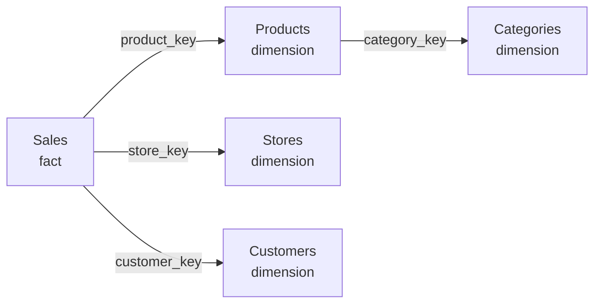

# Unit 3 — Design gold layers with AI in mind

## 🎯 Why this matters

The **gold layer** is the final, curated layer of your data that business users and AI tools consume. Whether you design this layer in a **lakehouse** or a **data warehouse**, the structure and naming conventions you choose directly affect how well Copilot and data agents interpret your data. Good AI preparation starts **upstream** — at the gold layer, before the semantic model is even built.

## 🏛️ Design with entities in mind

AI tools work best when your tables represent **clear business entities**. A table called `Customers` with columns like `Customer Name`, `Email`, and `Region` maps directly to how a business user thinks — and how an AI interprets a question about customers.

### Three principles

| Principle | What it means |
|-----------|---------------|
| **One entity per table** | Each table represents a single business concept: Customers, Products, Sales, Stores. |
| **Star schema structure** | Dimension tables describe entities (who, what, where). Fact tables capture events (transactions, orders, shipments). Star schemas map **naturally** to how AI tools navigate relationships. |
| **Business-friendly table names** | Use `Sales Transactions` instead of `fact_sales_v2` or `dbo_FactSales`. AI uses table names to determine which entity a user is asking about. |

> [!info] Storage-agnostic
> These principles apply whether you build your gold layer in a **Fabric lakehouse** (Delta tables), a **Fabric warehouse** (SQL tables), or any other structured storage. The semantic model you build on top of these tables **inherits** the structure and naming you establish here.

### Why star schema matters for AI

When tables represent clear entities with well-defined relationships, AI tools can **traverse** your model to answer multistep questions.

> [!example] Multistep question
> User: *"What was the top product category by revenue?"*
>
> Copilot can follow a relationship: `Sales` → `Products` → `Categories` → answer.

## 🏷️ Name for clarity

Copilot uses table names, column names, and measure names as **primary signals** when interpreting user prompts. Clear, consistent names reduce misinterpretation.

### Column naming best practices

| Guideline | Good | Bad |
|-----------|------|-----|
| Use full words | `Customer Name` | `CustNm`, `cust_name` |
| Be specific | `Order Date` | `Date` (when multiple date columns exist) |
| Include units | `Revenue (USD)`, `Weight (kg)` | `Revenue`, `Weight` |
| Avoid technical prefixes | `Sales Amount` | `dim_` / `fact_` prefixes meaningful only to developers |
| Be consistent across tables | `Product Name` everywhere | `Product Name` in one, `ProductTitle` in another |

### Measure naming best practices

- **Describe the calculation** — `Total Sales` is clear; `TS` is not.
- **Include scope when helpful** — `YTD Revenue`, `Sales (last 12 months)`.
- **Avoid duplicate names** — using the same name for a measure and a column confuses both users and AI.

> [!tip] Disambiguate similar fields with descriptions
> When similar fields exist across tables (e.g. `Name` in both `Customer` and `Store`), add **concise descriptions** to distinguish them. Copilot uses descriptions to disambiguate fields with similar names.

## 📝 Document for AI consumption

Descriptions are the **primary way** you provide business context to AI tools. Write descriptions as if you're explaining the field to a **new team member** who doesn't know your data.

| Layer | What to describe | Example |
|-------|------------------|---------|
| **Table** | What the table represents and what kind of records it contains. | *"Contains one row per completed sales transaction, including the product sold, the store location, and the transaction amount in USD."* |
| **Column** | What values the column holds and any business rules. | *"The unique identifier for each customer account. Assigned at account creation and doesn't change."* |
| **Measure** (in semantic model) | Business logic, including what's included and excluded. | *"Sum of all completed transaction amounts in USD. Excludes returns, refunds, and canceled orders. Uses the transaction date for time filtering."* |

> [!tip] Auto-generate, then review
> You can use **Copilot in Power BI Desktop** to generate measure descriptions automatically. Then **review and revise** the generated descriptions to verify accuracy and maintain consistency across your model.

> [!warning] 200-character truncation
> Descriptions are **truncated after the first 200 characters** when used as grounding data in the DAX query view experience. **Keep the most important business context at the beginning** of each description.

## 🧹 Simplify for AI consumption

Not everything in your model should be visible to AI tools. Technical columns, internal IDs, and ETL artifacts add **noise** to the grounding surface and increase the chance of misinterpretation.

### Hide these from AI

- **Surrogate key columns** (`ProductKey`, `CustomerID`) when a natural key or name column exists.
- **ETL metadata columns** (`LoadDate`, `BatchID`, `SourceSystem`).
- **Deprecated or unused columns** kept for backward compatibility.

### Keep visible

- **Business-facing columns** that users reference in questions.
- **Measures** that represent key business metrics.
- **Date table columns** used for time intelligence.

> [!important] Hiding removes from AI
> Hiding a field in the semantic model removes it from Copilot's consideration **entirely**. Hidden fields reduce the number of schema elements Copilot processes during the grounding step.

## 🗣️ Set up linguistic modeling in Power BI

**Linguistic modeling** is a Power BI feature that enhances how Copilot and Q&A interpret natural-language queries against your semantic model. You configure it through the **Q&A setup** in Power BI Desktop.

Linguistic modeling has two components:

| Component | What it does | Example |
|-----------|--------------|---------|
| **Synonyms** | Map alternate terms to field names. | `Revenue` ← `Sales`, `Turnover`, `Income` |
| **Linguistic relationships** | Define verbs that connect entities. | "Customers **buy** Products" / "Stores **are located in** Regions" |

> [!quote] From the module
> "When a user asks about 'sales' and your model has a measure called 'Revenue,' Copilot uses the synonym mapping to identify the correct field."

### Where to configure

- **Modeling ribbon → Q&A Setup** in Power BI Desktop.
- Copilot can suggest synonyms **automatically** — review suggestions and add domain-specific terms your users actually use.

> [!warning] Q&A must be enabled
> Linguistic modeling applies to semantic models in Power BI. Q&A must be enabled on your semantic model for linguistic modeling to take effect: **File → Options and settings → Options → Data Load → Turn on Q&A**.

> [!tip] Maintenance
> Linguistic modeling requires **ongoing maintenance**. As your model evolves and business terminology changes, update synonyms and relationships to keep them current.

## 🔑 Key terms (flashcards)

- **Gold layer** — The final, curated layer of data consumed by users and AI tools.
- **Entity-oriented table** — A table that represents one business concept (Customer, Product, Sale).
- **Star schema** — Dimensions + fact tables; the structure AI tools navigate naturally.
- **Grounding surface** — Combined metadata that AI tools consume (names + descriptions + relationships).
- **Linguistic modeling** — Synonyms + verb relationships that map user language to model fields.
- **Linguistic relationship** — A verb that connects entities in natural-language queries.

## 🧭 Next

→ [[Unit-4-Prepare-Semantic-Model]]
← [[Unit-2-Understand-AI-Needs]]
↑ [[_MOC]]
