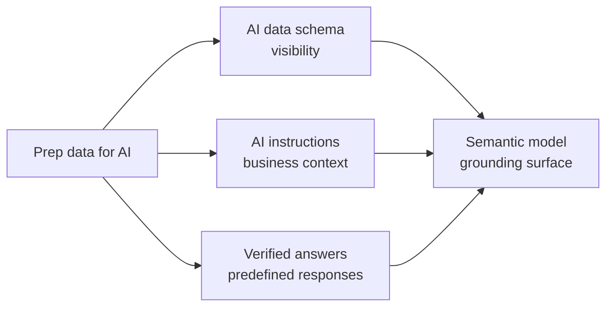
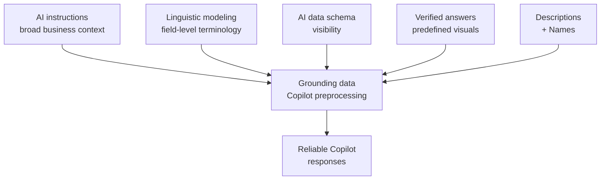

# Unit 4 — Prepare a semantic model for AI

## 🎯 Why this matters

Once your gold layer is designed with AI in mind, the next step is configuring your **semantic model specifically for Copilot**. Power BI provides a set of features called **Prep for AI** that let you add business context, simplify the schema for AI, and **predefine answers** to common questions. These tools give you **direct control** over how Copilot interprets and responds to user queries.

## 🧰 Access the Prep for AI features

The **Prep for AI** features are available in both Power BI Desktop and the Power BI service.

| Where | How to open |
|-------|-------------|
| **Power BI Desktop** | Home ribbon → **Prep data for AI** button. |
| **Power BI service** | Open the semantic model → **Prep data for AI** from the ribbon. |

The Prep for AI experience opens a unified pane with **three configuration tools**:

> [!info] Saved to the semantic model
> All updates you make through these features save to the **semantic model**, not to individual reports. This means your AI preparation applies **everywhere** the semantic model is used.

> [!note] Authoring vs consuming
> You can author Prep for AI features in both Power BI Desktop and the Power BI service. Users consume these features **everywhere** that Copilot in Power BI is available.

## 👁️ Configure the AI data schema

The **Simplify data schema** section controls which parts of your semantic model Copilot can see in the Prep for AI feature. When you open this feature, you see a list of your model's tables and columns. You can:

- **Hide tables and columns from AI** — technical fields like surrogate keys, ETL columns, and internal identifiers should be hidden so Copilot focuses on business-relevant data.
- **Review field visibility** — confirm that all important business fields remain visible.
- **Simplify the schema** — reduce the number of fields Copilot needs to process, which improves response accuracy.

> [!tip] Layered hiding
> This **complements** the hiding you do in the model itself. Fields hidden in the model are already excluded from Copilot. The AI data schema provides an **additional layer of control** specifically for AI consumption.

## ✅ Create verified answers

**Verified answers** are predefined responses to specific business questions. When a user asks a question that matches a verified answer's **trigger phrases**, Copilot returns the **predefined visual and data** instead of generating a response from scratch.

### How to create a verified answer

1. Build a report visual that answers a specific business question (e.g. a card showing total sales for the current quarter).
2. Select the visual.
3. Select the **...** menu, then:
   - **Set verified answer** in Power BI Desktop, or
   - **Set up a verified answer** in the Power BI service.
4. Add **trigger phrases** that describe how users might ask this question. Examples: *"What were total sales last quarter?"* / *"Show me quarterly sales."*

### When to create verified answers

- **High-frequency business questions** that executives or analysts ask regularly.
- **Questions where accuracy is critical** and the correct answer involves specific measures and filters.
- **Questions where Copilot's generated responses have been inconsistent or inaccurate**.

> [!tip] Start small
> Start by identifying the **5 to 10 most common questions** your business users ask. Create verified answers for these first, then expand based on user feedback.

## 📜 Write AI instructions

**AI instructions** provide Copilot with **written business context** about your semantic model. They help Copilot understand terminology, business rules, and data interpretation guidelines that **aren't captured** in table names or descriptions alone.

AI instructions are free-form text where you explain:

| What to document | Example |
|------------------|---------|
| **Business terminology** | *"In this model, 'active customer' means a customer with at least one transaction in the last 12 months."* |
| **Business rules and exceptions** | *"When calculating year-over-year growth, exclude the first quarter of 2022 because it was a partial reporting period."* |
| **Data scope and limitations** | *"This model contains sales data for North America only. European and Asian markets are in separate models."* |
| **Preferred measures** | *"When users ask about revenue, use the 'Revenue (USD)' measure, not the 'Revenue (local currency)' measure."* |

> [!quote] From the module
> "AI instructions help bridge the gap between what your model contains and what your business users expect when they interact with Copilot."

### Tips for writing effective AI instructions

- Keep instructions **factual and specific** — avoid vague guidance like *"use common sense."*
- **Update instructions** when business rules or data scope changes.
- Focus on areas where Copilot has produced incorrect or inconsistent answers.
- **Don't repeat** information already captured in measure descriptions or column names.

> [!info] Lifecycle
> AI instructions and AI data schemas save to the semantic model alongside your other metadata. You can also manage them through **Git integration** or **deployment pipelines**. After deploying changes through these channels, **refresh the model** in the Power BI service to sync updates.

## 🛡️ Mark your model as Approved for Copilot

After you configure the Prep for AI features and test the results, mark your semantic model as **Approved for Copilot** in the Power BI service. This designation signals that the model has been **reviewed and prepared for AI consumption**.

### How to mark a model as Approved for Copilot

1. Go to the Power BI service and find your semantic model.
2. Select the **Settings** icon.
3. Expand the **Approved for Copilot** section.
4. Select the **Approved for Copilot** checkbox, then select **Apply**.

> [!success] What you get
> When a model is marked as Approved for Copilot, the **standalone Copilot experience removes friction treatments** (warning banners) from answers generated using that model. Reports built on an Approved-for-Copilot model also **inherit this status**.

> [!important] This is a commitment
> Marking a model as Approved for Copilot is a **commitment**. It tells your organization that the model has been deliberately prepared and that AI responses from this model are expected to be reliable. **Prepare and test thoroughly** before applying this designation.

## 🗣️ Understand linguistic modeling (in this context)

Linguistic modeling enhances how Copilot interprets natural language by **mapping user terminology to your model structure**. It works **alongside** the Prep for AI features to improve response accuracy.

You set up linguistic modeling through **Q&A setup** in Power BI Desktop. Key capabilities include:

| Capability | Description |
|------------|-------------|
| **Synonyms** | Map alternate terms to fields. E.g. map *"turnover"* and *"income"* to a measure called *"Revenue."* |
| **Linguistic relationships** | Define verbs that connect entities: *"Customers **purchase** Products"* or *"Employees **work in** Departments."* |
| **Field exclusion** | Disable specific fields from Q&A and Copilot by deselecting **Include in Q&A** in the Synonyms view. |

> [!tip] Curate, don't accept
> Copilot can suggest synonyms automatically. Start with these suggestions, then **curate them** to match the terminology your users actually use. Share useful synonyms with your organization for reuse across models.

## 🔑 Key terms (flashcards)

- **Prep for AI** — Set of Power BI features for configuring semantic models for Copilot (AI data schema, AI instructions, verified answers).
- **AI data schema** — A subset of the model that defines which tables/columns Copilot can see.
- **Verified answer** — A predefined visual + trigger phrases that Copilot returns verbatim when a user prompt matches.
- **AI instructions** — Free-form text that documents business terminology, rules, and scope for Copilot.
- **Approved for Copilot** — A designation in the Power BI service that signals the model is reviewed and AI-ready (removes friction banners).
- **Trigger phrase** — A natural-language string that, when matched, causes Copilot to return a specific verified answer.

## 🧭 Next

→ [[Unit-5-Enterprise-Ontology]]
← [[Unit-3-Design-Gold-Layers]]
↑ [[_MOC]]
