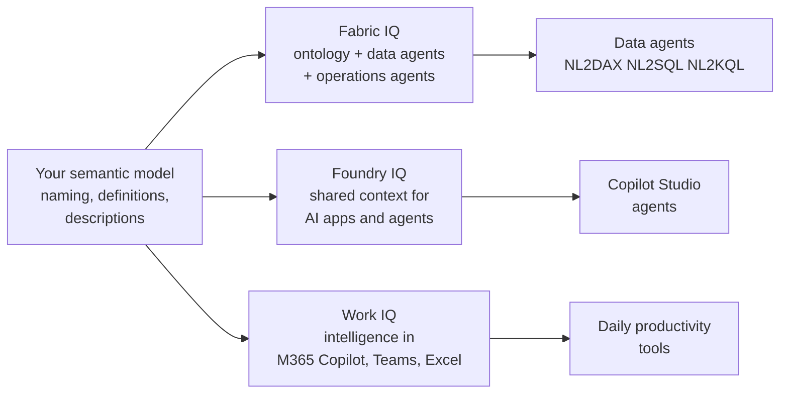

# Unit 5 — From semantic models to enterprise ontology

## 🎯 Why this matters

The semantic model you build **doesn't exist in isolation**. In organizations that adopt AI at scale, individual semantic models connect to a broader business context layer called an **ontology**. This unit introduces how your semantic model work feeds into the bigger picture through **Fabric IQ** and the ontology workload.

## 📚 What is an ontology?

An **ontology** is an organization-wide, **machine-understandable vocabulary** of your business. It defines:

- **Things** in your environment — represented as **entity types** (Customer, Product, Store).
- **Facts** about those things — represented as **properties** (a customer's name, email).
- **Connections** between them — represented as **relationships** (*"Customer places Order"*).

Unlike a semantic model that serves a specific reporting domain, an ontology **standardizes business concepts once** and reuses them **everywhere**. When a term like *"Customer"* means the same thing across all teams, tools, and AI agents, the entire organization communicates more consistently.

> [!info] Where ontology lives
> In Microsoft Fabric, the ontology is part of the **IQ workload**. Ontology provides a shared context layer that downstream tools and AI agents consume for consistent reasoning and actions.

> [!warning] Preview
> Ontology in Fabric is currently in **preview**. See the [What is ontology?](https://learn.microsoft.com/en-us/fabric/iq/ontology/overview) documentation for the latest capabilities.

## 🌐 How semantic models connect to the intelligent data platform

Your semantic model work connects to **three intelligence layers** across the Microsoft ecosystem. Together, these form the **intelligent data platform** that enables AI across the organization.

| Layer | What it does | How your semantic model work connects |
|-------|--------------|---------------------------------------|
| **Fabric IQ** | Unifies business semantics within Fabric. Provides ontology, data agents, and operations agents. | Your semantic models, naming conventions, and business definitions feed the ontology. Data agents query your models using natural language (NL2DAX, NL2SQL, NL2KQL). |
| **Foundry IQ** | Powers AI apps and agents in Microsoft Foundry. Provides shared context and knowledge endpoints. | Well-structured Fabric data with clear semantics improves Foundry agent quality. Copilot Studio agents access your models through Foundry IQ. |
| **Work IQ** | Delivers intelligence into Microsoft 365 experiences (Copilot, Teams, Excel). | Curated semantic models flow into Microsoft 365 Copilot, enabling natural language insights in the productivity tools people use daily. |

> [!quote] From the module
> "Every skill practiced in this course, from curating gold layers to naming measures clearly, directly improves how AI performs across all three layers. The semantic model is the **shared language between humans and AI**."

## ⚙️ Generate an ontology from a semantic model

Fabric provides a direct path from semantic model to ontology through the **Generate Ontology** button on the semantic model ribbon. This workflow is the primary entry point for analytics professionals who want to connect their model to the broader enterprise context.

### The generation process

1. Open a **published** semantic model in Fabric.
2. Select **Generate Ontology** from the ribbon.
3. Choose the target workspace and enter a name for the ontology.
4. Select **Create**.

### What ontology generation creates

| Artifact | Created from |
|----------|--------------|
| **Entity types** | Tables in your semantic model. |
| **Properties** (on each entity type) | Columns — with data bindings that link to source data. |
| **Relationship types** | Relationships defined in your semantic model. |

> [!success] Upstream work pays off
> This is where your upstream work pays off directly. **Clear table names** become **clear entity type names**. **Well-defined relationships** become **well-defined relationship types**. **Descriptive column names** become **descriptive properties**.

> [!important] Storage-mode requirement
> For ontology generation to create **data bindings**, your semantic model must use **Direct Lake mode** with **inbound public access** enabled on the workspace. Import mode and DirectQuery mode support entity type and relationship generation but **don't generate data bindings**.

### Semantic-model mode support

| Feature | Import | Direct Lake | DirectQuery |
|---------|--------|-------------|-------------|
| Entity type definitions | ✅ | ✅ | ✅ |
| Property definitions | ✅ | ✅ | ✅ |
| Relationship definitions | ✅ | ✅ | ✅ |
| Data bindings to sources | ❌ | ✅ (with inbound public access) | ❌ |
| Querying bound data | ❌ | ✅ (without measures and calculated columns) | ❌ |

> [!tip] Production recommendation
> For most production scenarios, **Direct Lake mode** provides the fullest ontology generation experience.

## ✅ Verify and complete the generated ontology

Ontology generation provides a strong starting point, but you need to **review and complete** the results.

### What to verify after generation

1. **Entity types** — rename technical table names to business-friendly names. E.g. `factsales` → `SaleEvent`, `dimstore` → `Store`.
2. **Properties** — confirm that columns mapped correctly as properties on each entity type.
3. **Entity type keys** — each entity type needs a unique identifier. Some keys might not import automatically and need to be added manually.
4. **Data bindings** — confirm that entity types are bound to the correct source tables.
5. **Relationship types** — name the relationships, bind them to source data columns, configure source and target columns.

### What requires manual configuration

- **Time series data bindings** — properties for time-series data aren't created automatically.
- **Multi-key scenarios** — entity types with composite keys may need manual key configuration.
- **Relationship bindings** — while relationship types are created, their data bindings may need manual configuration.

> [!quote] From the module
> "The quality of your naming, documentation, and relationship design in the previous units directly reduces the verification work here. A well-designed semantic model generates a cleaner ontology that requires less manual adjustment."

## 🧠 How ontology enables AI across the organization

Once your ontology is defined and bound to data, it becomes a **shared context layer** for AI tools across Fabric. The ontology provides:

| Capability | What it does |
|------------|--------------|
| **Query surface for business questions** | Query the ontology using entity types and properties instead of table and column names. The ontology converts natural-language questions into structured queries. |
| **Grounding for data agents** | Data agents in Fabric connect to the ontology as a data source. They use entity types, properties, and relationships to understand business concepts and generate accurate responses. |
| **Graph representation** | The ontology graph links related concepts in a visual, navigable structure. Enables traversal queries like *"Find all sales events related to stores in the Western region"* using graph-native query patterns. |

> [!success] Same investment, broader payoff
> These capabilities extend the value of your semantic model work **far beyond reporting**. The same clear naming and documentation that helps Copilot answer questions in Power BI also helps data agents reason across domains in broader enterprise scenarios.

## 🧑‍💻 The analytics professional's role in ontology

Your role in ontology is primarily at the **semantic model level**. The work you do to prepare models for AI creates the foundation that ontology builds on.

| Your contribution | How it lands in ontology |
|------------------|--------------------------|
| **Define entities clearly** | Your tables become entity types in the ontology. |
| **Use consistent naming** | The ontology inherits your naming — consistent naming across models → consistent terminology in the ontology. |
| **Document business definitions** | Your descriptions ground agents in shared business semantics. |
| **Maintain relationships** | Star-schema relationships in your model map naturally to ontology relationship types. Dimensions → entity types. Fact tables → event entity types. Measures → trusted metrics that agents and Copilot surface. |

> [!info] Where to go next for ontology
> For advanced ontology design, manual OneLake-based ontology creation, graph queries, and agent configuration, see the [Fabric IQ documentation](https://learn.microsoft.com/en-us/fabric/iq/overview). Full ontology creation is covered in a **separate module**.

## 🔑 Key terms (flashcards)

- **Ontology** — An organization-wide, machine-understandable vocabulary of business concepts.
- **Entity type** — A class of business thing (Customer, Product, Store) in the ontology.
- **Property** — A fact about an entity type (name, email).
- **Relationship type** — A connection between entity types (Customer *places* Order).
- **Fabric IQ** — The Fabric workload that unifies business semantics, including ontology, data agents, and operations agents.
- **Foundry IQ** — Intelligence layer powering AI apps and agents in Microsoft Foundry.
- **Work IQ** — Intelligence layer for M365 experiences (Copilot, Teams, Excel).
- **Direct Lake** — Storage mode required for ontology generation to create data bindings.
- **Inbound public access** — Workspace setting that must be enabled for Direct Lake data bindings.

## 🧭 Next

→ [[Unit-6-Validate-Readiness]]
← [[Unit-4-Prepare-Semantic-Model]]
↑ [[_MOC]]
