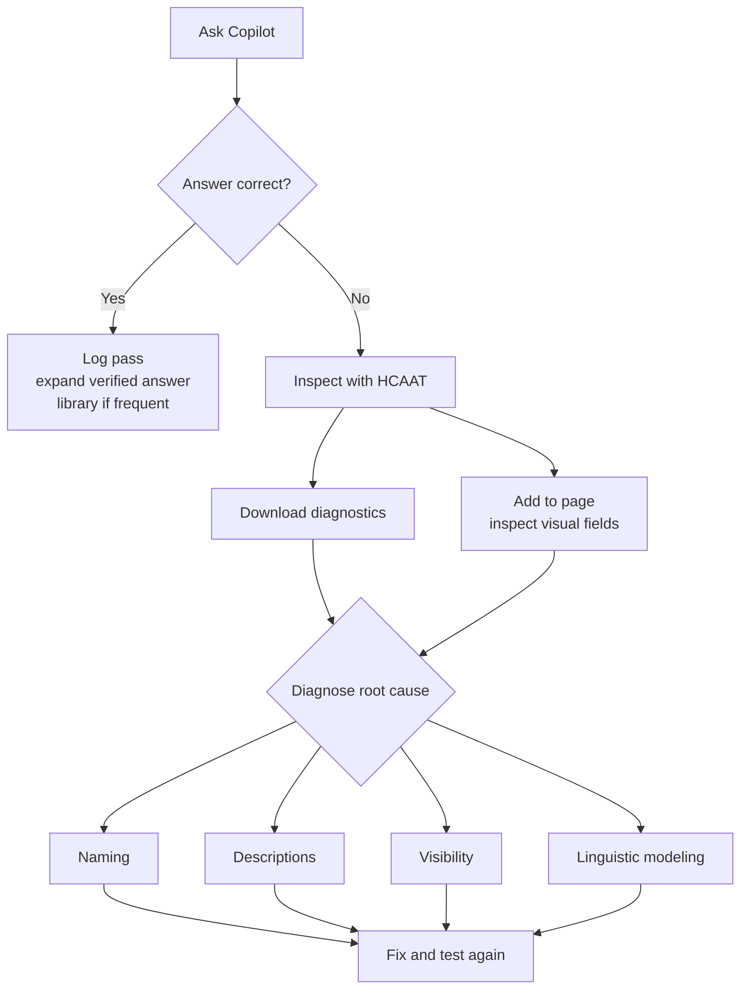
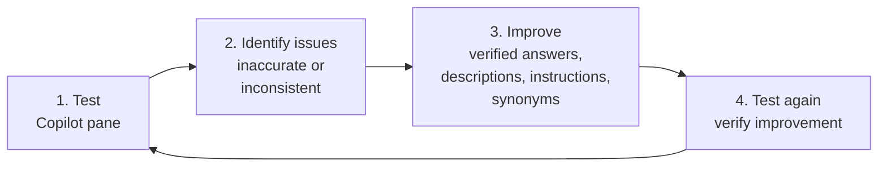

# Unit 6 — Validate AI readiness

## 🎯 Why this matters

After you configure your semantic model with **Prep for AI** features, naming improvements, and documentation, you need to **verify that these changes actually improve AI responses**. Validation is an **iterative process**: test, identify gaps, improve, and test again.

## 🧪 Test AI responses with the Copilot pane

The primary way to test your AI preparation is through the **Copilot report pane** in Power BI Desktop. Open the Copilot pane and ask questions as your business users would. Compare the answers against what you know to be **correct**.

### The Copilot skill picker

The Copilot pane includes a **skill picker** that lets you control which capabilities are active during testing:

| Skill | What it does |
|-------|--------------|
| **Answer questions about the data** | Uses Copilot to respond based on the semantic model. |
| **Analyze report visuals** | Enables Copilot to interpret visuals on the report page. |
| **Create new report pages** | Lets Copilot generate report pages from prompts. |

> [!tip] Match the test to the audience
> - To simulate the **standalone Copilot experience** (where business users search from the Power BI home), enable only **Answer questions about the data**.
> - To test the **full report editing experience**, enable all three capabilities.

> [!important] Reopen the pane after every change
> Each time you make an update through Prep for AI, **close and reopen the Copilot pane** to see the latest changes reflected.

## 🔍 Use diagnostics to troubleshoot

When Copilot produces an unexpected answer, use the built-in diagnostic tools to understand why:

| Tool | What it does |
|------|--------------|
| **How Copilot arrived at this (HCAAT)** | Included in answers from your semantic model — shows what fields and filters Copilot used. Helps you identify whether Copilot selected the wrong measure, used an incorrect filter, or referenced the wrong table. |
| **Download diagnostics** | Available from the **...** menu on the Copilot pane — provides detailed information about the grounding data and processing steps. |
| **Add to page** | Select this button on a Copilot-generated visual to add it to your report canvas. You can then **inspect the visual's fields and filters directly**. |

> [!quote] From the module
> "These tools help you trace the path from user question to AI response. If the answer is wrong, you can identify whether the issue is in naming, descriptions, field visibility, or linguistic modeling."

## ✅ AI readiness checklist

Use the following checklist to assess whether your semantic model is ready for AI consumption:

> [!success] AI readiness checklist
> - [ ] Tables have **clear, business-friendly names** that represent entities.
> - [ ] Columns have **descriptive names** using full words (no abbreviations).
> - [ ] Key measures have **descriptions** that explain business logic, inclusions, and exclusions.
> - [ ] Technical fields (surrogate keys, ETL columns) are **hidden** from the model.
> - [ ] **Verified answers** are created for the most common business questions.
> - [ ] **AI instructions** document business context, terminology, and data scope.
> - [ ] **Linguistic modeling** includes relevant synonyms and relationships.
> - [ ] The model is **tested with Copilot** and produces accurate, consistent responses.
> - [ ] The model is marked as **Approved for Copilot** in the Power BI service.

> [!warning] Ongoing, not one-time
> This checklist **isn't a one-time exercise**. Review it each time you make significant changes to your model.

## 🔁 Iterate based on results

AI preparation is an **ongoing process**. As your organization uses Copilot, new gaps emerge. Users ask questions you didn't anticipate, or business terminology shifts. Build an **iteration cycle**:

Over time, your verified answers library grows, your AI instructions become more comprehensive, and your model's grounding surface improves. **Each iteration makes AI more reliable** for your users.

> [!tip] Keep a log
> Keep a **log of questions that produce incorrect answers**. This log helps you prioritize which verified answers to create and which descriptions or instructions to update.

## 🔑 Key terms (flashcards)

- **HCAAT (How Copilot arrived at this)** — A diagnostic feature that shows the fields and filters Copilot used for an answer.
- **Skill picker** — The Copilot pane control that switches on/off specific Copilot capabilities during testing.
- **AI readiness checklist** — The 9-item pre-flight list to confirm a semantic model is fit for AI consumption.
- **Iteration cycle** — Test → identify issues → improve → test again. AI preparation is **never one-and-done**.
- **Diagnostics download** — A detailed report (from the **...** menu) of the grounding data and processing steps for a Copilot response.

## 🧭 Next

→ [[Unit-7-Exercise]]
← [[Unit-5-Enterprise-Ontology]]
↑ [[_MOC]]
