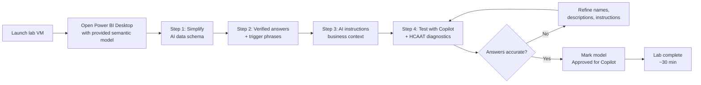

# Unit 7 — Exercise: Prepare a semantic model for AI

> [!warning] Interactive lab — not performed here
> This unit is an **interactive Microsoft Learn lab** that runs in a hosted sandbox. It is **not** executed by these notes. The summary below describes what the lab does so you know what to expect when you click the launch button.

## 🧪 Lab summary

> [!quote] Module description
> "In this exercise, you use the Prep for AI features in Power BI Desktop to prepare a semantic model for Copilot. You simplify the data schema, create verified answers for common business questions, write AI instructions with business context, and test the model with Copilot."

This lab takes approximately **30 minutes** to complete.

## 🛠️ Prerequisites

> [!warning] Workspace requirement
> You need access to a **Microsoft Fabric-enabled workspace** to complete this exercise. For more information, see [**Getting started with Fabric**](https://learn.microsoft.com/en-us/fabric/get-started/fabric-trial) to enable a Fabric trial license.

> [!note] Lab environment
> "A virtual machine containing the client tools you need is provided, along with the exercise instructions. Use the **Launch lab** button to launch the virtual machine. A limited number of concurrent sessions are available. If the hosted environment is unavailable, please try again later."

> [!tip] Working with the lab VM
> To dock the lab environment so that it fills the window, select the **PC** icon at the top and then select **Fit Window to Machine**.

You are automatically logged in to your lab environment as `data-ai\student`.

## 🚀 Launch

Open the lab at: <https://go.microsoft.com/fwlink/?linkid=2360611>

Alternatively, you can [open the instructions in a separate window](https://go.microsoft.com/fwlink/?linkid=2360611).

## 🧭 What you'll do (inferred from module objectives)

| # | Step | What you do | What it teaches |
|---|------|-------------|-----------------|
| 1 | **Simplify the data schema** | Open the AI data schema section of Prep for AI; hide surrogate keys, ETL columns, and internal identifiers. | How to control which fields Copilot sees during grounding. |
| 2 | **Create verified answers** | Build report visuals for common business questions; set them as verified answers and add trigger phrases. | How to predefine consistent responses for the questions users ask most often. |
| 3 | **Write AI instructions** | Document business terminology, rules, scope, and preferred measures in the AI instructions pane. | How to provide business context that names and descriptions alone can't capture. |
| 4 | **Test with Copilot** | Open the Copilot pane, ask questions, use the skill picker and HCAAT to verify accuracy. | How to validate the preparation and iterate when answers are wrong. |

## 🎯 Skills practiced

> [!success] Skills this lab reinforces
> - **Simplifying the AI data schema** in Power BI Desktop so Copilot focuses on business-relevant fields.
> - **Creating verified answers** from report visuals and authoring trigger phrases for common business questions.
> - **Writing effective AI instructions** that document business terminology, rules, scope, and preferred measures.
> - **Testing AI responses with the Copilot pane**, using the skill picker and HCAAT to diagnose wrong answers.
> - Applying the **AI readiness checklist** to confirm a model is fit for production Copilot consumption.

## 🔗 Concepts to revisit before the lab

> [!tip] Pre-lab review
> - [[Unit-2-Understand-AI-Needs]] — RAG, grounding, schema reduction, what AI consumes.
> - [[Unit-3-Design-Gold-Layers]] — Entity-oriented tables, naming, descriptions, linguistic modeling.
> - [[Unit-4-Prepare-Semantic-Model]] — AI data schema, verified answers, AI instructions, Approved for Copilot.
> - [[Unit-6-Validate-Readiness]] — HCAAT, skill picker, AI readiness checklist, iteration cycle.

## 🔑 Key terms (flashcards)

- **Prep for AI** — Set of Power BI features for configuring semantic models for Copilot.
- **AI data schema** — The subset of model fields that Copilot can see.
- **Verified answer** — A predefined visual + trigger phrases that Copilot returns verbatim on match.
- **AI instructions** — Free-form business context for Copilot (terminology, rules, scope, preferred measures).
- **Trigger phrase** — A natural-language string that activates a verified answer.
- **Skill picker** — The Copilot pane control that switches on/off specific Copilot capabilities during testing.
- **HCAAT (How Copilot arrived at this)** — Diagnostic that reveals the fields and filters Copilot used.
- **Approved for Copilot** — A designation in the Power BI service that signals the model is reviewed and AI-ready.

## 🧭 Next

→ [[Unit-8-Knowledge-Check]]
← [[Unit-6-Validate-Readiness]]
↑ [[_MOC]]
