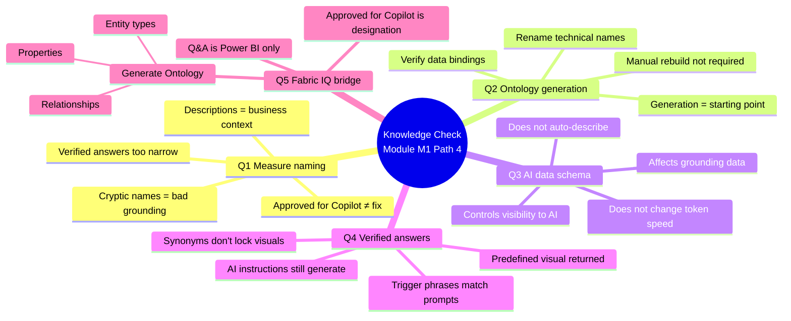

# Unit 8 — Module assessment

> [!warning] Answer provenance
> Microsoft Learn intentionally does **not** publish the correct answers for knowledge-check questions. The answers below are **derived from the unit content** and the wording of each question. Treat them as best-effort study notes — verify against the live module if you fail the check.

## 📋 Questions

### Question 1

> An analytics team notices that **Copilot in Power BI** frequently returns incorrect answers when users ask about revenue. The semantic model has a measure called `Rev` with no description. **What should the team do first** to improve Copilot's accuracy for revenue-related questions?

- Create a verified answer for every possible revenue question.
- **Rename the measure to a descriptive name like "Revenue (USD)" and add a description that explains the business logic.**
- Mark the semantic model as **Approved for Copilot** to enable enhanced AI features.

### Question 2

> A data team **generates an ontology** from a published semantic model in Fabric. After generation, several entity types have names like `factsales` and `dimstore`. **What is the recommended next step?**

- Delete the generated ontology and rebuild it manually from OneLake tables.
- **Rename the entity types to business-friendly names like "SaleEvent" and "Store" and verify data bindings.**
- Publish the ontology as-is since the entity types automatically update when the semantic model changes.

### Question 3

> A developer configures the **AI data schema** in the Prep for AI dialog. They hide several surrogate key columns and ETL metadata fields. **Which Copilot behavior does this action directly affect?**

- **Copilot no longer includes those fields in its grounding data during preprocessing.**
- Copilot generates faster responses because it processes fewer tokens.
- Copilot automatically creates descriptions for the remaining visible fields.

### Question 4

> An organization wants Copilot to **consistently return the same visual** when users ask *"What were total sales last quarter?"* **Which Prep for AI feature should the team configure?**

- AI instructions that define the preferred measure and time filter for sales questions.
- **Verified answers with trigger phrases that match common ways users ask this question.**
- Linguistic modeling with synonyms for "total sales" and "last quarter."

### Question 5

> An analytics professional builds a well-designed semantic model with clear names, descriptions, and star schema relationships. They want their work to support **AI agents beyond Power BI Copilot**. **Which Fabric IQ capability connects their semantic model to broader enterprise AI?**

- **The Generate Ontology feature that creates entity types, properties, and relationships from the semantic model.**
- The Approved for Copilot designation that certifies the model for AI consumption.
- The Q&A setup that configures synonyms and linguistic relationships for the model.

## ✅ Answer key (derived)

| # | Correct answer | Why the others are wrong | Source unit |
|---|----------------|--------------------------|-------------|
| 1 | **Rename the measure and add a description.** | Per [[Unit-2-Understand-AI-Needs]], metadata (names + descriptions) forms the **grounding surface** that AI uses to interpret questions — a cryptic abbreviation and missing description are the root cause. **Verified answers** are for the most common, specific questions, not "every possible" revenue question. **Approved for Copilot** doesn't fix bad metadata — it just signals that the model is *supposed* to be ready. | [[Unit-2-Understand-AI-Needs]] · [[Unit-3-Design-Gold-Layers]] |
| 2 | **Rename entity types and verify data bindings.** | Per [[Unit-5-Enterprise-Ontology]], generation is a *starting point* — entity types like `factsales` and `dimstore` are technical names that should be renamed. You should **not** delete and rebuild manually (the manual path is for advanced scenarios). The ontology does **not** auto-update from semantic model changes — verification is required. | [[Unit-5-Enterprise-Ontology]] |
| 3 | **Copilot no longer includes those fields in its grounding data during preprocessing.** | Per [[Unit-4-Prepare-Semantic-Model]], the AI data schema controls **which tables and columns Copilot can see**. The other options are reasonable-sounding but **not** the *direct* effect — the schema doesn't change tokenization speed and doesn't auto-generate descriptions. | [[Unit-4-Prepare-Semantic-Model]] |
| 4 | **Verified answers with trigger phrases.** | Per [[Unit-4-Prepare-Semantic-Model]], **verified answers** are the only Prep for AI feature that *predefines a specific visual* and *returns it consistently* when a trigger phrase matches. AI instructions provide context (Copilot still generates). Linguistic modeling adds synonyms but doesn't lock in a specific visual. | [[Unit-4-Prepare-Semantic-Model]] |
| 5 | **The Generate Ontology feature.** | Per [[Unit-5-Enterprise-Ontology]], Generate Ontology is the Fabric IQ capability that creates **entity types, properties, and relationships** from the semantic model — and is the bridge to data agents, Foundry IQ, and Work IQ. Approved for Copilot is a service-level *designation*; Q&A setup is for Power BI only. | [[Unit-5-Enterprise-Ontology]] |

## 🧠 Why these answers (linking back to the module)

## 🎯 Re-study pointers

> [!tip] If you missed a question, re-read:
> - **Q1** → "Why metadata matters for AI" + "Name for clarity" in [[Unit-2-Understand-AI-Needs]] and [[Unit-3-Design-Gold-Layers]].
> - **Q2** → "Verify and complete the generated ontology" in [[Unit-5-Enterprise-Ontology]].
> - **Q3** → "Configure the AI data schema" in [[Unit-4-Prepare-Semantic-Model]].
> - **Q4** → "Create verified answers" in [[Unit-4-Prepare-Semantic-Model]].
> - **Q5** → "Generate an ontology from a semantic model" + the Fabric IQ / Foundry IQ / Work IQ table in [[Unit-5-Enterprise-Ontology]].

## 🔑 Key terms (flashcards)

- **Verified answer** — A predefined visual + trigger phrases that Copilot returns verbatim on match.
- **AI data schema** — The subset of model fields that Copilot can see (visibility control).
- **AI instructions** — Free-form business context for Copilot (terminology, rules, scope, preferred measures).
- **Generate Ontology** — Fabric IQ feature that creates entity types, properties, and relationships from a published semantic model.
- **Approved for Copilot** — A Power BI service designation that signals a model is reviewed and AI-ready.
- **Trigger phrase** — A natural-language string that activates a verified answer.
- **Grounding data** — The schema, names, descriptions, and metadata AI uses to interpret a question.

## 🧭 Next

→ [[Unit-9-Summary]]
← [[Unit-7-Exercise]]
↑ [[_MOC]]
