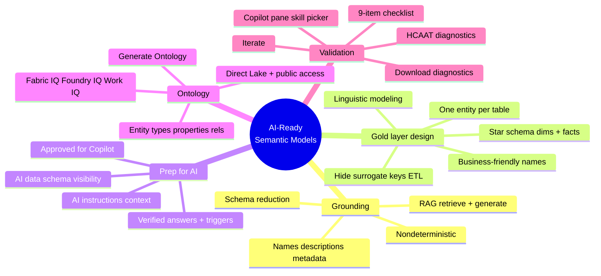

# Unit 9 — Summary

## 📌 Module recap

> [!quote] Microsoft Learn summary
> "In this module, you learned that preparing semantic models for AI isn't a separate task from good model design. It's an intentional extension of the work you already do.
>
> You started by understanding how Copilot and AI tools consume your data through the grounding process. You learned that AI relies on table names, column names, measure descriptions, relationships, and linguistic schemas to interpret user questions. You then applied this understanding to gold layer design, where entity-oriented tables, clear naming conventions, and thorough documentation form the foundation of AI-readable data.
>
> You explored the Prep for AI features in Power BI, including the AI data schema for controlling field visibility, verified answers for predefining responses to common questions, and AI instructions for communicating business context. You also saw how your semantic model work connects to the broader intelligent data platform through Fabric IQ and enterprise ontology, where your tables become entity types and your definitions ground AI agents in shared business language.
>
> Finally, you practiced validating AI readiness through testing, diagnostics, and iteration. You have a checklist and a repeatable process for ensuring your models produce accurate AI responses over time.
>
> The semantic model you build is the shared interface between your organization's data and every AI tool that consumes it. By being intentional about naming, documentation, and configuration, you ensure that Copilot, data agents, and enterprise AI deliver reliable, business-relevant insights."

## 🧠 What you now know

> [!success] Skills earned
> - **How AI consumes your data** — Copilot and Fabric data agents use **RAG (retrieval-augmented generation)**: retrieve grounding data, then generate. Grounding data = schema + names + descriptions + relationships + linguistic schema. **Schema reduction** focuses Copilot on relevant fields. AI is **nondeterministic** — preparation reduces ambiguity but doesn't guarantee identical responses.
> - **Gold-layer design for AI** — **One entity per table**, **star schema** (dimensions + facts), **business-friendly table/column/measure names**, **descriptions** truncated at 200 chars, **hide technical fields** (surrogate keys, ETL columns), and **linguistic modeling** (synonyms + verb relationships) in the Q&A setup.
> - **Prep for AI features in Power BI** — **AI data schema** (visibility), **verified answers** (predefined visuals + trigger phrases), **AI instructions** (free-form business context), and the **Approved for Copilot** designation that removes friction banners. All saved to the semantic model so they apply everywhere.
> - **Semantic model → enterprise ontology** — **Generate Ontology** creates entity types, properties, and relationship types from a published model. **Direct Lake mode + inbound public access** is required for data bindings. Fabric IQ / Foundry IQ / Work IQ carry the same semantics to data agents, Foundry apps, and M365 Copilot.
> - **Validating AI readiness** — Test in the Copilot pane with the **skill picker**, use **HCAAT** to trace which fields and filters Copilot used, **download diagnostics** for grounding data detail, and iterate against the **9-item AI readiness checklist** before marking Approved for Copilot.

## 🔑 Key terms (flashcards)

- **RAG (retrieval-augmented generation)** — Retrieve grounding context, then generate a response.
- **Grounding data / grounding surface** — Schema, names, descriptions, and metadata AI uses to interpret a question.
- **Schema reduction** — Copilot preprocessing that restricts context to fields relevant to the question.
- **Gold layer** — The final, curated layer of data consumed by users and AI tools.
- **Star schema** — Dimensions + fact tables; the structure AI tools navigate naturally.
- **Linguistic modeling** — Synonyms + verb relationships that map user language to model fields.
- **Prep for AI** — AI data schema, verified answers, and AI instructions in Power BI.
- **Verified answer** — A predefined visual + trigger phrases that Copilot returns verbatim on match.
- **AI instructions** — Free-form business context for Copilot (terminology, rules, scope, preferred measures).
- **Approved for Copilot** — A Power BI service designation that signals a model is reviewed and AI-ready.
- **Ontology** — An organization-wide, machine-understandable vocabulary of business concepts.
- **Entity type / property / relationship** — The three artifacts an ontology defines.
- **Direct Lake** — Storage mode required for ontology generation to create data bindings.
- **HCAAT (How Copilot arrived at this)** — A diagnostic that reveals the fields and filters Copilot used.

## 📚 Further learning

> [!tip] External resources
> - [Prepare your data for AI in Power BI](https://learn.microsoft.com/en-us/power-bi/create-reports/copilot-prepare-data-ai)
> - [Use Copilot with semantic models](https://learn.microsoft.com/en-us/power-bi/create-reports/copilot-semantic-models)
> - [What is Fabric IQ?](https://learn.microsoft.com/en-us/fabric/iq/overview)
> - [What is ontology?](https://learn.microsoft.com/en-us/fabric/iq/ontology/overview)
> - [DP-600 learning path](https://learn.microsoft.com/en-us/training/paths/dax-power-bi/)

## 🧭 Next

← [[Unit-8-Knowledge-Check]]
↑ [[_MOC]]
