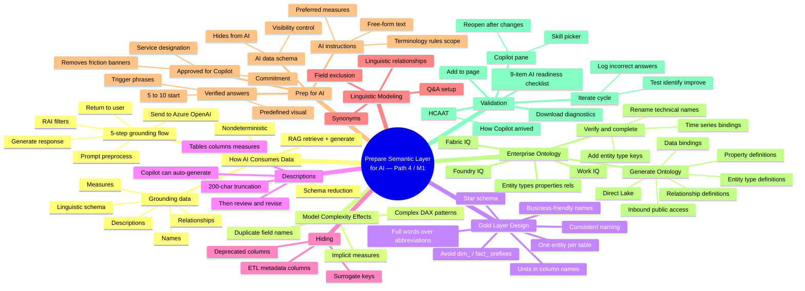

# Module — Prepare the semantic layer for AI in Microsoft Fabric

> [!info] Module map
> This is the **bridge from "good semantic model" to "AI-ready semantic model"** in the DP-600 track. It treats AI preparation not as a separate task, but as the **intentional extension** of the model design work you already do — clear names, thorough descriptions, star-schema relationships — repurposed as **grounding data** for Copilot and Fabric data agents. You learn the **RAG** consumption model, the **Prep for AI** feature set (AI data schema, verified answers, AI instructions, Approved for Copilot), and how your model connects to the broader enterprise via **Fabric IQ** and the **Generate Ontology** workflow.

## 🎯 Learning objectives (from Microsoft Learn)

By the end of this module you should be able to:

1. **Explain how AI consumes your data** — RAG, grounding data, schema reduction, the elements Copilot reads (names, descriptions, relationships, measures, linguistic schema).
2. **Design gold layers with AI in mind** — entity-oriented tables, business-friendly naming, descriptions, hiding technical fields, and linguistic modeling.
3. **Configure Prep for AI features** — AI data schema, verified answers with trigger phrases, AI instructions, and the Approved for Copilot designation.
4. **Connect semantic models to enterprise ontology** — Fabric IQ, Foundry IQ, Work IQ, Generate Ontology, entity types/properties/relationships, Direct Lake data bindings.
5. **Validate AI readiness** — Copilot pane + skill picker, HCAAT diagnostics, download diagnostics, the 9-item AI readiness checklist, and the iterate cycle.

## 🧠 Module mind map

> [!tip] How to use
> The mind map below is duplicated as a standalone Mermaid file (`Module-Mind-Map.md`) you can open in Obsidian's Mermaid preview or the [Mermaid Live Editor](https://mermaid.live). It is the **single-page view** of the entire module.

## 📑 Unit breakdown

| # | Unit | XP | Minutes | Focus |
|---|------|----|---------|-------|
| 1 | [Introduction](./Unit-1-Introduction.md) | 100 | 3 | Why AI preparation is the next step beyond good model design |
| 2 | [Understand what AI needs from your data](./Unit-2-Understand-AI-Needs.md) | 100 | 8 | RAG, grounding, schema reduction, what AI consumes |
| 3 | [Design gold layers with AI in mind](./Unit-3-Design-Gold-Layers.md) | 100 | 8 | Entity-oriented tables, naming, descriptions, linguistic modeling |
| 4 | [Prepare a semantic model for AI](./Unit-4-Prepare-Semantic-Model.md) | 100 | 10 | AI data schema, verified answers, AI instructions, Approved for Copilot |
| 5 | [From semantic models to enterprise ontology](./Unit-5-Enterprise-Ontology.md) | 100 | 10 | Fabric IQ, Generate Ontology, Direct Lake data bindings |
| 6 | [Validate AI readiness](./Unit-6-Validate-Readiness.md) | 100 | 5 | Copilot pane, HCAAT, 9-item checklist, iteration cycle |
| 7 | [Exercise — Prepare a semantic model for AI](./Unit-7-Exercise.md) | 100 | 30 | Hands-on lab: simplify schema, verified answers, AI instructions |
| 8 | [Module assessment](./Unit-8-Knowledge-Check.md) | 200 | 3 | 5 knowledge-check questions |
| 9 | [Summary](./Unit-9-Summary.md) | 100 | 2 | Recap + further reading |

**Total: 1000 XP · 79 minutes (1 hr 19 min)**

## 🔗 Knowledge-check answers (unit 8)

> [!warning] Answer provenance
> Microsoft Learn intentionally does not publish the correct answers for knowledge-check questions. The answers below are **derived from the unit content** for this module and the wording of each question. Treat them as best-effort study notes — verify against the live module if you fail the check.

| Q | Question | Correct answer |
|---|----------|----------------|
| 1 | Copilot returns wrong answers about revenue; the measure is `Rev` with no description. What first? | **Rename the measure to "Revenue (USD)" and add a description explaining the business logic.** (Metadata forms the grounding surface; verified answers are too narrow and Approved for Copilot doesn't fix bad metadata.) |
| 2 | After Generate Ontology, entity types are named `factsales` and `dimstore`. What next? | **Rename the entity types to business-friendly names like "SaleEvent" and "Store" and verify data bindings.** (Generation is a starting point, not the finished article. The ontology doesn't auto-update from the semantic model.) |
| 3 | Hiding surrogate keys and ETL columns in the AI data schema — which Copilot behavior changes? | **Copilot no longer includes those fields in its grounding data during preprocessing.** (That's exactly what the AI data schema controls. The other options are plausible-sounding but not the *direct* effect.) |
| 4 | Want Copilot to consistently return the same visual for "What were total sales last quarter?" | **Verified answers with trigger phrases that match common ways users ask this question.** (Verified answers are the only Prep for AI feature that *locks in* a specific visual. AI instructions still generate; synonyms don't lock visuals.) |
| 5 | Which Fabric IQ capability connects a well-designed model to enterprise AI beyond Power BI Copilot? | **The Generate Ontology feature that creates entity types, properties, and relationships from the semantic model.** (This is the bridge to Fabric IQ data agents, Foundry IQ, and Work IQ. Approved for Copilot is a service-level designation; Q&A is Power BI only.) |

## 🧭 Downstream links

- [[Unit-1-Introduction]] · [[Unit-2-Understand-AI-Needs]] · [[Unit-3-Design-Gold-Layers]] · [[Unit-4-Prepare-Semantic-Model]] · [[Unit-5-Enterprise-Ontology]] · [[Unit-6-Validate-Readiness]] · [[Unit-7-Exercise]] · [[Unit-8-Knowledge-Check]] · [[Unit-9-Summary]]
- [[Module-Mind-Map]]
- Sister module: [Module — Create DAX calculations in semantic models](../05-Path3-Module1-DAX-Calculations/_MOC.md)

## 📚 External references

- Microsoft Learn module page: <https://learn.microsoft.com/en-us/training/modules/fabric-prepare-semantic-layer/>
- [Prepare your data for AI in Power BI](https://learn.microsoft.com/en-us/power-bi/create-reports/copilot-prepare-data-ai)
- [Use Copilot with semantic models](https://learn.microsoft.com/en-us/power-bi/create-reports/copilot-semantic-models)
- [What is Fabric IQ?](https://learn.microsoft.com/en-us/fabric/iq/overview)
- [What is ontology?](https://learn.microsoft.com/en-us/fabric/iq/ontology/overview)
- [Getting started with Fabric (trial)](https://learn.microsoft.com/en-us/fabric/get-started/fabric-trial)
- DP-600 learning path: <https://learn.microsoft.com/en-us/training/paths/dax-power-bi/>
