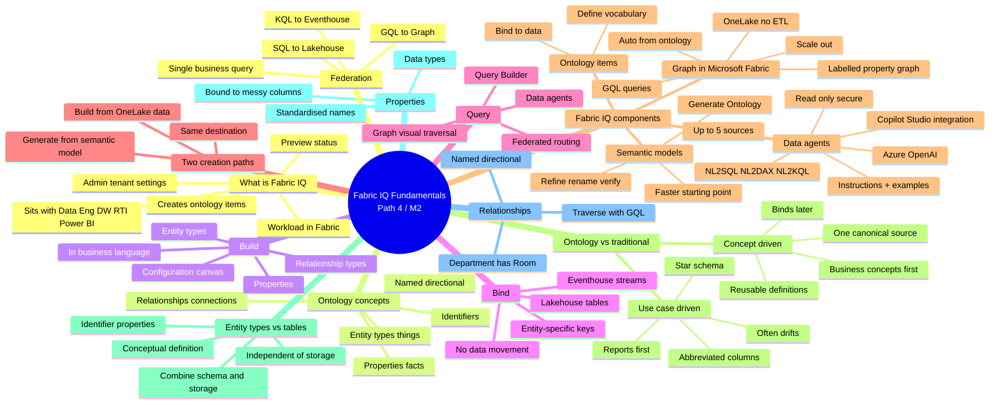

# Module — Understand Microsoft Fabric IQ fundamentals · Mind Map

## 🧭 How to view

- **Obsidian**: open this file, Obsidian will render the Mermaid block natively.
- **Web**: paste into <https://mermaid.live> for an editable SVG.
- **Export**: use the Mermaid CLI (`mmdc`) to render PNG/SVG.

## 🔗 Related

- [[_MOC]] — full module index
- [[Unit-1-Introduction]] · [[Unit-2-Get-Started-Fabric-IQ]] · [[Unit-3-Explore-Fabric-IQ-Components]] · [[Unit-4-Understand-Ontology-Modeling-Paradigm]] · [[Unit-5-Module-Assessment]] · [[Unit-6-Summary]]
