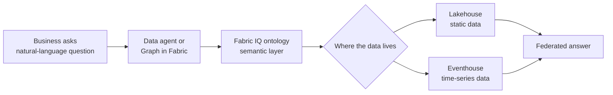

# Unit 1 — Introduction

## 🎯 Why this matters

> [!quote] From the module
> "Fabric IQ solves this challenge by letting you define business vocabulary in an ontology, then bind those concepts to your data sources in OneLake."

Imagine you're a data analyst at **Lamna Healthcare**, responsible for helping clinical operations teams understand patient care patterns across your facility. Patient records sit in lakehouse tables while vital signs stream continuously from ICU monitoring equipment into an eventhouse. When hospital administrators ask questions like:

- *Which patients in the ICU have elevated vital signs?*
- *How many beds are occupied on the surgical floor?*

…you need to manually join lakehouse tables with eventhouse streams, translate business terms into technical column names, and write complex queries. **Business users can't explore the data themselves** — they depend on you to write queries each time. By the time you deliver answers, clinical conditions may have already changed.

Fabric IQ fixes this by introducing an **ontology layer** that decouples business meaning from physical storage.

## 🏥 The Lamna Healthcare scenario

| Element | Today | With Fabric IQ |
|---------|-------|----------------|
| Patient records | Lakehouse tables | Bound to `Patient` entity type |
| Vital signs | Eventhouse stream | Bound to `VitalSign` entity type |
| Floor occupancy | Manual join + SQL | Traverse `Department` → `Room` → `Patient` |
| Ad-hoc questions | Analyst writes queries each time | Data agents answer in natural language |
| Time-to-insight | Hours to days | Seconds |

> [!warning] The bottleneck
> Business users depend on a human analyst for every question. Clinical decisions are time-sensitive, but answers arrive late. **The semantic layer is missing** — column names don't reflect business vocabulary, and there is no entity-aware query surface.

## 🧠 What Fabric IQ provides

Fabric IQ lets you **define business vocabulary once** in an ontology, then bind those concepts to your data sources in OneLake. You define concepts like **Patient**, **Department**, and **Room** with their properties and relationships — creating a semantic layer. Business users can then:

- Ask questions in natural language through **data agents**
- Visually explore relationships through **Graph in Microsoft Fabric**
- Explore data themselves without needing a developer to write queries

## 📌 What you will learn in this module

By the end of this module you should be able to:

1. **Explain what Fabric IQ is** — a workload in Microsoft Fabric for creating ontologies that bind business vocabulary to data.
2. **Describe the role of ontology items** — entity types, properties, and relationships.
3. **Distinguish the four Fabric IQ components** — ontology items, data agents, Graph in Microsoft Fabric, and Power BI semantic models.
4. **Compare ontology modeling to traditional modeling** — concept-driven vs. use-case-driven approaches.

> [!important] Preview status
> Fabric IQ is currently in **preview**. Tenant settings must be enabled by your Fabric administrator before you can create ontology items — see [Ontology (preview) required tenant settings](https://learn.microsoft.com/en-us/fabric/iq/ontology/overview-tenant-settings) for details.

## 🔑 Key terms (flashcards)

- **Fabric IQ** — A workload in Microsoft Fabric for creating ontologies that bind business vocabulary to data sources.
- **Ontology** — A shared vocabulary of your business: entity types (things), properties (facts), and relationships (connections).
- **Semantic layer** — A queryable abstraction that maps business concepts to physical data without moving or duplicating it.
- **Data agent (Fabric)** — A conversational Q&A system that uses generative AI to answer natural-language questions grounded in your ontology.
- **Graph in Microsoft Fabric** — Native graph storage and compute that visualises and traverses the relationships declared in your ontology.

## 🧭 Module roadmap

| # | Unit | What you learn |
|---|------|----------------|
| 2 | [[Unit-2-Get-Started-Fabric-IQ]] | Where Fabric IQ fits, build-bind-query workflow, two creation paths |
| 3 | [[Unit-3-Explore-Fabric-IQ-Components]] | Ontology items, data agents, Graph, semantic models |
| 4 | [[Unit-4-Understand-Ontology-Modeling-Paradigm]] | Concept-driven vs. use-case-driven modeling |
| 5 | [[Unit-5-Module-Assessment]] | 5 knowledge-check questions |
| 6 | [[Unit-6-Summary]] | Recap + downstream links |

## 🧭 Next

→ [[Unit-2-Get-Started-Fabric-IQ]]
↑ [[_MOC]]
