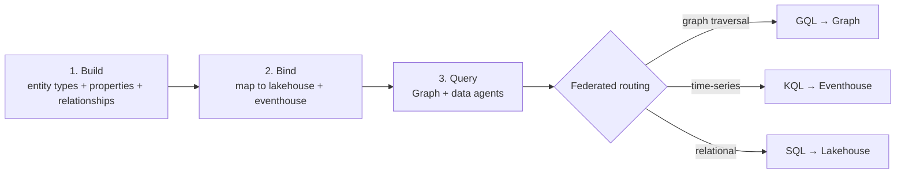

# Unit 2 — Get started with Fabric IQ

## 🎯 Why this matters

Fabric IQ is a **workload** in Microsoft Fabric — it sits alongside Data Engineering, Data Factory, Data Science, Data Warehouse, Real-Time Intelligence, and Power BI. Within the IQ workload you create **ontology items**: Fabric artifacts that contain your ontology definitions and data bindings. This unit shows you *where* Fabric IQ sits in the data platform, *what* an ontology contains, and *how* you build one.

> [!quote] From the module
> "An ontology is a shared vocabulary of your business. It's made up of the things in your environment (represented as entity types), their facts (represented as properties of entity types), and the ways they connect (represented as relationships)."

## 📐 What is an ontology?

Think of an ontology as a **business context layer** that contains:

- A **catalog of concepts** (like Hospital, Patient, Department) with their properties and relationships.
- **Data bindings** to your lakehouse tables and eventhouse streams.
- A **graphical representation** that links related concepts for navigation and analysis.
- A **query surface** for asking questions about concepts (not just tables), supporting federated queries across sources.

Instead of forcing data experts to translate business questions into SQL, you model data with business concepts that everyone understands. The ontology provides a single definition of each concept that can be used by data agents and Graph in Microsoft Fabric.

## 🏗️ Where Fabric IQ fits in the data platform

Fabric IQ doesn't replace ingestion or storage — it builds **on top of** Microsoft Fabric's unified data platform.

| Layer | What happens | Fabric IQ role |
|-------|--------------|----------------|
| **Ingest & store** | Data lands in lakehouse tables and eventhouse streams | *No data movement* — IQ references existing data |
| **Model & represent semantics** | Define entity types, properties, relationships | **Fabric IQ's core** — ontology items |
| **Analyze & visualize** | Query, traverse, and reason over concepts | Graph in Fabric, data agents, semantic models |

> [!tip] Generate from an existing Power BI model
> You can generate an ontology structure from an existing Power BI semantic model, or build one from scratch. Either way, the ontology binds to your OneLake data, and a navigable graph builds automatically.

## ➕ Access Fabric IQ in your workspace

You create ontology items the same way you create any other Fabric item:

1. Navigate to your Fabric workspace.
2. Select **+ New item**.
3. Search for and select **Ontology (preview)**.
4. Enter a name for your ontology (use numbers, letters, and underscores — **no spaces or dashes**).
5. Select **Create**.

The ontology opens when it's ready. You'll see two main areas:

- **Configuration canvas** — where you define entity types and relationships.
- **Preview experience** — where you explore your data.

> [!important] Admin prerequisite
> Your Fabric administrator needs to enable specific tenant settings before anyone can create ontology items. See [Ontology (preview) required tenant settings](https://learn.microsoft.com/en-us/fabric/iq/ontology/overview-tenant-settings).

## 🖼️ Explore the ontology interface

### Configuration canvas

This is **where you build your ontology**. You create entity types (like `Hospital`, `Department`, `Room`, `Patient`), define properties on those entities (`FirstName`, `DateOfBirth`, `AdmissionDate`), and establish relationship types between entities (`contains`, `assigned to`).

### Preview experience

This view shows your **instantiated ontology**. You see entity instances (specific rooms, departments, patients), explore relationships in a graph visualisation, and query your data using **business language instead of SQL**. The preview experience integrates with Graph in Microsoft Fabric for rich visual exploration.

## 🔁 The build-bind-query workflow

Creating an ontology in Fabric IQ follows **three main steps**:

| Step | What you do |
|------|-------------|
| **Build** | Define your business vocabulary — entity types, properties, relationship types. For healthcare: define `Patient`, with `Name`, `DateOfBirth`, `AdmissionDate`, and how patients relate to rooms and departments. |
| **Bind** | Connect ontology definitions to data sources. Lakehouse tables for static data (patient records, room assignments). Eventhouse streams for time-series (vital signs). |
| **Query** | Query using business concepts instead of database tables. Graph visualises and traverses. Query Builder filters entity instances without SQL. AI agents answer natural-language questions. |

> [!success] Separation of concerns
> This workflow **separates business meaning from physical data structures**. The ontology can evolve without touching tables, and tables can evolve without breaking the ontology — as long as bindings are updated.

## 🔗 How Fabric IQ connects to OneLake

Fabric IQ **doesn't move or duplicate data**. Instead it creates a semantic layer that references existing sources.

- **Lakehouse tables** — static data (patient records, hospital information, room assignments).
- **Eventhouse streams** — time-series data (continuous vital signs from monitors).

When you query the ontology, Fabric IQ automatically routes your query to the most efficient system:

| Query shape | Query language | Target system |
|-------------|----------------|---------------|
| Graph traversal | GQL | Graph in Microsoft Fabric |
| Time-series | KQL | Eventhouse |
| Relational | SQL | Lakehouse |

This **federated query** capability means you can ask business-level questions that span multiple data sources without knowing the technical details of where data lives.

## 🛣️ Two paths to create an ontology

Fabric IQ offers two approaches:

### Path A — Generate from a Power BI semantic model

If you already have a well-structured semantic model, Fabric IQ **automatically** generates an initial ontology structure:

- Entity types matching your tables.
- Properties matching your columns.
- Relationship types following your model relationships.

You then **refine** by renaming entity types, verifying keys and bindings, and enhancing with additional sources (e.g., time-series eventhouse streams).

### Path B — Build from OneLake data

If you don't have a semantic model — or want full control — you build directly from lakehouse and eventhouse data. You manually create entity types, define properties, and establish relationships. This is the path for **complete control** over the business vocabulary.

> [!tip] Both paths lead to the same result
> A complete ontology that defines your business concepts. Path A is faster; Path B is more flexible.

## 🔑 Key terms (flashcards)

- **Ontology item** — The Fabric artifact that contains ontology definitions and data bindings.
- **Entity type** — A conceptual class representing a thing in your business (Patient, Department).
- **Property** — A named, typed fact about an entity type (DateOfBirth on Patient).
- **Relationship type** — A named, directional connection between entity types (`Department` contains `Room`).
- **Binding** — The mapping of an entity type property to a physical column in OneLake data.
- **Federated query** — A query that dispatches sub-queries to multiple storage systems and unifies the result.
- **Configuration canvas** — Where you build ontology definitions.
- **Preview experience** — Where you explore instantiated data via graph and query builder.

## 🧭 Next

→ [[Unit-3-Explore-Fabric-IQ-Components]]
← [[Unit-1-Introduction]]
↑ [[_MOC]]
