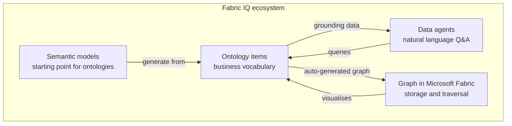
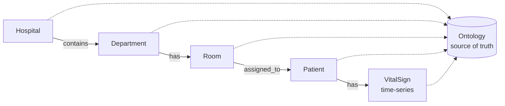
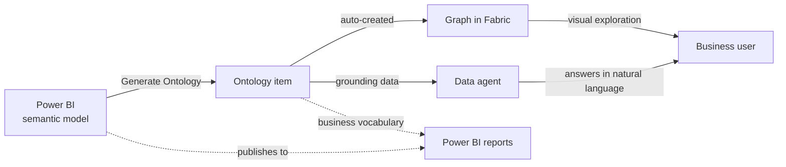

# Unit 3 — Explore Microsoft Fabric IQ components

## 🎯 Why this matters

Fabric IQ is **not a single product** — it's an integrated ecosystem of four components that each serve a specific role in how you define, query, analyse, and visualise your business data. Understanding them helps you choose the right tool for each task and leverage their combined strengths.

> [!quote] From the module
> "Each component serves a specific role in how you define, query, analyze, and visualize your business data."

## 🧩 The four components at a glance

| Component | Role |
|-----------|------|
| **Ontology items** | Define your business vocabulary and bind concepts to data sources |
| **Data agents** | Answer natural-language questions across multiple data sources |
| **Graph in Microsoft Fabric** | Stores and queries connected data using relationships |
| **Semantic models** | Provide a starting point for generating ontologies from existing Power BI models |

## 🏷️ Ontology items — Define your business vocabulary

An **ontology item** is where you build your shared business vocabulary. You define the business concepts that matter to your organisation, then bind them to actual data sources in OneLake.

**Healthcare example:** bind a `Patient` concept to a lakehouse table of patient records, and a `VitalSign` concept to an eventhouse stream of real-time monitoring data.

A healthcare data team defines:

- **Entity types** — `Hospital`, `Department`, `Room`, `Patient`, `VitalSign`.
- **Properties** — `HospitalId`, `DepartmentName`, `RoomNumber`, `HeartRate`, `OxygenSaturation`.
- **Relationships** — `Department` *contains* `Room`; `Patient` *occupies* `Room`.

The ontology then provides definitions that can be used by **Graph** for visualisation and traversal, and by **data agents** for natural-language Q&A.

## 🤖 Data agents — Query data with natural language

A **Fabric data agent** is a conversational Q&A system powered by generative AI. You configure it with up to **five data sources** in any combination:

- Lakehouses
- Warehouses
- KQL databases
- Power BI semantic models
- Ontologies

It uses **Azure OpenAI Assistant APIs** to process natural-language questions.

### Query dispatch by source type

| Source type | Generated query language |
|-------------|-------------------------|
| Lakehouses / warehouses | SQL |
| Power BI semantic models | DAX |
| KQL databases | KQL |
| Ontologies | Business-vocabulary reasoning |

**Healthcare example:** a nurse asks *"Which patients in cardiology have elevated heart rates right now?"* The data agent understands "cardiology" from the ontology, queries the lakehouse for patient assignments, and queries the eventhouse for current vital sign readings — **all without writing SQL or KQL**.

### Improving accuracy

You enhance accuracy by providing:

- **Data agent instructions** — guidance on which data source to use for which question type.
- **Example queries** — sample question-query pairs that illustrate expected responses.

> [!important] Access controls still apply
> Data agents enforce **read-only access** and apply your existing security protocols — users only see data they have permission to access. You can publish data agents to **Microsoft 365 Copilot** or integrate with **Microsoft Copilot Studio** to extend their reach beyond Fabric.

## 🕸️ Graph in Microsoft Fabric — Visualise and traverse relationships

**Graph in Microsoft Fabric** offers native graph storage and compute for connected data. Unlike relational databases that require complex joins to navigate relationships, Graph uses a **labelled property graph model**:

- **Nodes (entities)** carry labels and properties.
- **Edges (relationships)** carry labels and properties.

Connections are explicit and easy to traverse.

> [!info] Auto-generated graph
> When you create an ontology item, a **managed graph is automatically created** from the ontology's entity types and relationships. You don't build the graph separately — the ontology is the source of truth.

You query Graph using **GQL (Graph Query Language)** — an international standard for graph queries. Graph excels at relationship-heavy questions like:

- *Which patients are assigned to surgical floor rooms?*
- *Show me the department hierarchy for a specific hospital.*

**Healthcare example:** traverse `Hospital` → `Department` → `Room` → currently assigned patients to investigate patient-flow patterns.

### Key properties of Graph in Fabric

- Operates **directly on OneLake** — no duplication, no ETL.
- **Scale-out** architecture handles large graphs with many relationships.
- **Visual exploration** through the graph interface, or programmatic **GQL** queries.

## 🧱 Semantic models — Generate ontologies from existing data models

A **Power BI semantic model** provides a structured representation of your data with tables, columns, relationships, and business logic already defined. In Fabric IQ, semantic models are an **excellent starting point** for ontologies.

When you generate an ontology from an existing semantic model, Fabric IQ automatically creates:

- **Entity types** matching your tables (`Hospital`, `Department`, `Room`, `Patient`).
- **Properties** matching your columns (`HospitalId`, `DepartmentName`, `Floor`).
- **Relationship types** based on your model relationships (`Hospital` *contains* `Department`, `Room` *assigned to* `Patient`).
- **Keys** identifying unique instances of each entity type.

> [!tip] Why generate?
> Generation is **significantly faster** than building from scratch. Instead of manually creating each entity type and defining every property, you start with a complete structure that reflects your existing data model. Then enhance with additional sources (e.g., eventhouse time-series).

### Refining a generated ontology

| Refinement step | Why it matters |
|-----------------|----------------|
| Verify entity type keys | Ensure each instance is uniquely identified |
| Confirm data bindings map to the right source columns | Bad bindings produce wrong answers |
| Add entity types from other sources | Bring in time-series data, etc. |
| Enhance relationships with binding information | Link relationships to actual data |

This workflow lets you **leverage existing modelling work** while extending it with Fabric IQ's cross-domain reasoning and graph capabilities.

## 🔁 How the four components work together

## 🔑 Key terms (flashcards)

- **Data agent** — A Fabric conversational Q&A system over up to five data sources (including ontologies), powered by Azure OpenAI.
- **Graph in Microsoft Fabric** — Native labelled-property-graph storage and compute, auto-created from an ontology.
- **GQL** — Graph Query Language, the international standard for graph queries.
- **Labelled property graph** — Nodes and edges with labels and properties; the model used by Graph in Fabric.
- **Labelled property graph model** — A graph model where nodes and edges carry key/value properties and a label that defines type.
- **Semantic model → ontology** — The Generate Ontology path that lifts tables/columns/relationships to entity types/properties/relationships.
- **Copilot Studio** — A Microsoft platform where Fabric data agents can be integrated for broader reach.

## 🧭 Next

→ [[Unit-4-Understand-Ontology-Modeling-Paradigm]]
← [[Unit-2-Get-Started-Fabric-IQ]]
↑ [[_MOC]]
