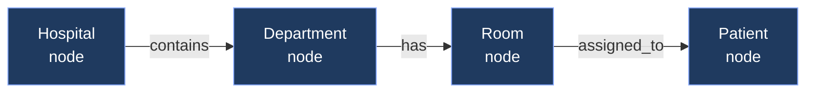
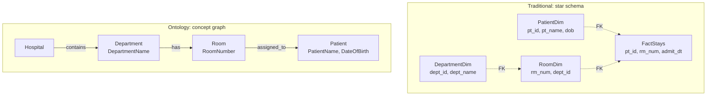

# Unit 4 — Understand the ontology modeling paradigm

## 🎯 Why this matters

Ontology modeling in Fabric IQ defines business concepts **independent** of specific analytical use cases. This is a genuine paradigm shift from how most data teams have worked for 20 years. Once you grasp the inversion, everything else about Fabric IQ clicks into place.

> [!quote] From the module
> "Ontology modeling inverts this. You start by asking: 'What are the core concepts in our business? How do they relate? What facts matter about each concept?' Analytical considerations come after you've captured business meaning."

## 🔄 The inversion — Use-case-driven vs. concept-driven

| Dimension | Traditional analytical modeling | Ontology modeling |
|-----------|--------------------------------|------------------|
| Starting question | *"What reports do we need?"* | *"What concepts exist in our business?"* |
| Output | Tables, columns, FK joins | Entity types, properties, relationships |
| Naming | Abbreviated, technical (`pt_id`, `rm_num`) | Business language (`PatientName`, `RoomNumber`) |
| Optimised for | Specific queries | Cross-use-case reuse |
| Cross-team consistency | Often diverges | One canonical definition |

### Healthcare example

**Traditional approach:**

- `PatientDim`, `RoomDim`, `DepartmentDim` tables.
- Abbreviated columns: `pt_id`, `rm_num`, `dept_id`.
- Different teams build separate data marts with overlapping but inconsistent definitions of "patient" or "department."

**Ontology approach:**

- Entity types `Patient`, `Room`, `Department` in business language.
- Properties: `PatientName`, `DateOfBirth`, `RoomNumber`, `DepartmentName`.
- Named relationships: `Department` *has* `Room`, `Room` *assigned to* `Patient`.
- One canonical definition reused by AI agents and graph queries.

> [!tip] Foreign keys become first-class relationships
> Unlike foreign keys that require `JOIN` statements and are **implicit**, ontology relationships are **explicit concepts** with names. Tools can query them directly: traverse `Department` *has* `Room` followed by `Room` *assigned to* `Patient`.

## 🧱 Model entity types as reusable concepts

**Entity types** are **conceptual definitions** that you create **before** binding them to data — unlike database tables, which combine schema definition with data storage.

An entity type standardises:

- Name
- Description
- Identifiers
- Properties

By defining what "patient" means **at the entity type level** — including which properties exist and what the identifier is — you create a definition that can be bound to **any** data source. This **separates the conceptual model from the underlying table structure**.

> [!success] One definition, many sources
> The same `Patient` entity type could be bound to a lakehouse today and a warehouse tomorrow. Consumers (data agents, Graph, Power BI) continue using the same vocabulary without change.

## 🏷️ Define properties with semantic meaning

**Properties** standardise names and data types at the conceptual level. During data binding, you map them to actual columns.

### The problem with traditional columns

The same concept often appears under different column names across tables:

| Source table | Column |
|--------------|--------|
| Vitals A | `temp` |
| Vitals B | `temperature` |
| Vitals C | `temp_reading` |
| Vitals D | `body_temp` |

Each table defines its own column names **independently** — chaos for AI and humans alike.

### The ontology approach

In ontology modeling, you define a **standard property name** like `Temperature` at the entity type level. When you bind to data, you map this property to whatever column name exists in your table — `temp`, `temperature`, or `body_temp`. Tools querying the ontology **always see** `Temperature`, regardless of the underlying column name.

**VitalSign example** — standardised property names:

- `HeartRate`
- `OxygenSaturation`
- `RespiratoryRate`
- `Timestamp`

When bound to data, these properties map to actual column names in the source. Clean vocabulary on the outside, messy reality hidden inside.

> [!info] Identifier properties
> Properties can be marked as **identifiers** to signal which values uniquely identify entity instances. Marking `PatientID` as an identifier establishes that this value **uniquely represents each patient**, ensuring consistent entity resolution across data sources.

## 🔗 Establish relationships between concepts

**Relationships** in ontology modeling are **named, directional connections** between entity types. Unlike foreign keys that are implicit until you write `JOIN`, these are **explicit concepts** that tools can query and visualise.

| Relationship | Direction |
|--------------|-----------|
| `Department` *has* `Room` | Department → Room |
| `Room` *assigned to* `Patient` | Room → Patient |

You can traverse these relationships in the **graph interface** or query them using **GQL** to perform dependency analysis — find all patients in a specific department via `Department` *has* `Room` → `Room` *assigned to* `Patient`.

## 🪢 Bind concepts to data without duplication

**Data binding** connects entity types to actual data sources **without copying or moving data**. The data stays where it is — in lakehouse tables or eventhouse streams in OneLake. The ontology creates a semantic layer that references this data.

**Federated example:**

- `Patient` entity type → lakehouse table (demographic info).
- `VitalSign` entity type → eventhouse stream (real-time vital signs).
- Each entity type binds to its appropriate data source using entity-specific keys.

When you query across these concepts, the ontology **federates** queries across the lakehouse and eventhouse, returning **integrated results without having moved any data**.

### VitalSign binding example

| Standardised property | Source column (eventhouse) |
|-----------------------|----------------------------|
| `HeartRate` | `HeartRate` |
| `OxygenSaturation` | `OxygenSaturation` |
| `RespiratoryRate` | `RespiratoryRate` |

> [!success] No-copy semantic layer
> Data binding creates a semantic layer over existing data sources **without duplication**, enabling AI agents to query using business terminology instead of table-specific column names.

## 📊 Side-by-side comparison — Star schema vs. ontology model

| Aspect | Star schema | Ontology model |
|--------|-------------|----------------|
| Optimised for | A specific report or query | Cross-use-case reuse |
| Naming | Technical abbreviations | Business language |
| Joins | Explicit FKs + `JOIN` statements | Named, directional relationships |
| Consistency across teams | Often drifts | One canonical definition |
| AI consumption | Difficult (cryptic) | Direct (vocabulary-aware) |

## 🔑 Key terms (flashcards)

- **Entity type** — A reusable conceptual definition of a business concept (Patient, Room), independent of any storage system.
- **Property** — A named, typed attribute of an entity type (PatientName, DateOfBirth).
- **Identifier property** — A property marked as the unique key for instances of an entity type.
- **Relationship** — A named, directional connection between two entity types (Department has Room).
- **Data binding** — The mapping of entity type properties to physical columns in OneLake data, with no data movement.
- **Semantic layer** — The ontology-driven abstraction that lets business concepts be queried without knowing physical storage details.
- **Federated query** — Automatic dispatch of sub-queries to multiple storage systems (lakehouse, eventhouse) unified by the ontology.
- **Concept-driven modeling** — Starting with business concepts and relationships before any analytical considerations.

## 🧭 Next

→ [[Unit-5-Module-Assessment]]
← [[Unit-3-Explore-Fabric-IQ-Components]]
↑ [[_MOC]]
