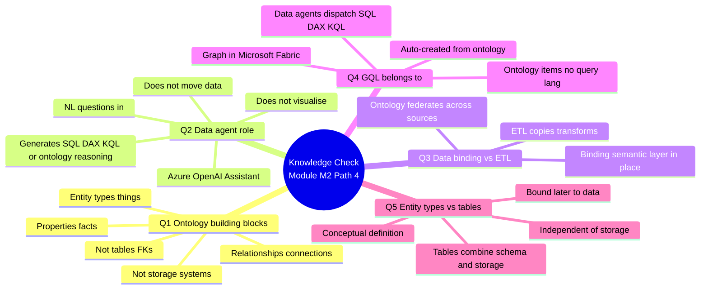

# Unit 5 — Module assessment

> [!warning] Answer provenance
> Microsoft Learn intentionally does **not** publish the correct answers for knowledge-check questions. The answers below are **derived from the unit content** and the wording of each question. Treat them as best-effort study notes — verify against the live module if you fail the check.

## 📋 Questions

### Question 1

> What are the three core concepts that make up an ontology in Fabric IQ?

- Tables, columns, and foreign keys.
- **Things (entity types), facts (properties), and connections (relationships).**
- Lakehouses, warehouses, and semantic models.

### Question 2

> What is the primary role of a Fabric data agent?

- To move data from lakehouses to warehouses.
- To visualize relationships between entities in a graph.
- **To process natural language questions and generate queries grounded in ontology definitions.**

### Question 3

> How does data binding in ontology modeling differ from traditional ETL processes?

- Data binding copies data into a centralized warehouse, while ETL leaves data in place.
- **Data binding creates a semantic layer that references data in place, while ETL copies and transforms data into a warehouse.**
- Data binding and ETL are the same process with different names.

### Question 4

> Which Fabric IQ component uses GQL (Graph Query Language) for querying?

- Ontology items.
- Data agents.
- **Graph in Microsoft Fabric.**

### Question 5

> What makes entity types different from traditional database tables?

- Entity types are tied to specific databases and schemas.
- **Entity types are reusable logical models that exist independently of any storage system.**
- Entity types can only contain static data, not time-series data.

## ✅ Answer key (derived)

| # | Correct answer | Why the others are wrong | Source unit |
|---|----------------|--------------------------|-------------|
| 1 | **Things (entity types), facts (properties), and connections (relationships).** | Per [[Unit-2-Get-Started-Fabric-IQ]], an ontology is *"a shared vocabulary of your business. It's made up of the things in your environment (represented as entity types), their facts (represented as properties of entity types), and the ways they connect (represented as relationships)."* Tables/columns/foreign keys are the traditional relational vocabulary, not the ontology vocabulary. Lakehouses/warehouses/semantic models are storage systems, not ontology building blocks. | [[Unit-2-Get-Started-Fabric-IQ]] |
| 2 | **Process natural-language questions and generate queries grounded in ontology definitions.** | Per [[Unit-3-Explore-Fabric-IQ-Components]], data agents *"use Azure OpenAI Assistant APIs to process natural language questions"* and dispatch to the right backend (SQL / DAX / KQL / ontology reasoning). They do not move data (that's ingestion). They do not visualise relationships (that's Graph). | [[Unit-3-Explore-Fabric-IQ-Components]] |
| 3 | **Data binding creates a semantic layer that references data in place; ETL copies and transforms data into a warehouse.** | Per [[Unit-2-Get-Started-Fabric-IQ]] and [[Unit-4-Understand-Ontology-Modeling-Paradigm]], *"Fabric IQ doesn't move or duplicate your data. Instead, it creates a semantic layer that references existing data sources."* The first option inverts reality (ETL copies; binding doesn't). The third conflates two distinct processes. | [[Unit-2-Get-Started-Fabric-IQ]] · [[Unit-4-Understand-Ontology-Modeling-Paradigm]] |
| 4 | **Graph in Microsoft Fabric.** | Per [[Unit-3-Explore-Fabric-IQ-Components]], *"You query it using GQL (Graph Query Language), an international standard for graph queries."* Ontology items don't have their own query language; data agents generate SQL/DAX/KQL depending on the source. | [[Unit-3-Explore-Fabric-IQ-Components]] |
| 5 | **Entity types are reusable logical models that exist independently of any storage system.** | Per [[Unit-4-Understand-Ontology-Modeling-Paradigm]], *"Entity types are conceptual definitions that you create before binding them to data — unlike database tables, which combine schema definition with data storage."* Entity types can bind to static *or* time-series data — the last option is just wrong. | [[Unit-4-Understand-Ontology-Modeling-Paradigm]] |

## 🧠 Why these answers (linking back to the module)

## 🎯 Re-study pointers

> [!tip] If you missed a question, re-read:
> - **Q1** → *What is an ontology?* in [[Unit-2-Get-Started-Fabric-IQ]].
> - **Q2** → *Data agents — Query data with natural language* in [[Unit-3-Explore-Fabric-IQ-Components]].
> - **Q3** → *How Fabric IQ connects to OneLake* in [[Unit-2-Get-Started-Fabric-IQ]] and *Bind concepts to data without duplication* in [[Unit-4-Understand-Ontology-Modeling-Paradigm]].
> - **Q4** → *Graph in Microsoft Fabric — Visualise and traverse relationships* in [[Unit-3-Explore-Fabric-IQ-Components]].
> - **Q5** → *Model entity types as reusable concepts* in [[Unit-4-Understand-Ontology-Modeling-Paradigm]].

## 🔑 Key terms (flashcards)

- **Entity type** — A reusable conceptual definition (the "thing") — independent of storage.
- **Property** — A named, typed fact (the "fact") — bound to a physical column at binding time.
- **Relationship** — A named, directional connection (the "connection") — explicit, not a foreign key.
- **Data agent** — A Fabric conversational Q&A system over up to 5 sources, powered by Azure OpenAI.
- **Data binding** — The mapping of entity type properties to physical columns without moving data.
- **ETL** — Extract-Transform-Load: the traditional process that **copies and transforms** data into a warehouse.
- **Semantic layer** — A queryable abstraction that references data in place — built by Fabric IQ.
- **GQL (Graph Query Language)** — ISO-standard graph query language used by Graph in Microsoft Fabric.
- **Graph in Microsoft Fabric** — Native labelled-property-graph storage and compute, auto-created from an ontology.

## 🧭 Next

→ [[Unit-6-Summary]]
← [[Unit-4-Understand-Ontology-Modeling-Paradigm]]
↑ [[_MOC]]
