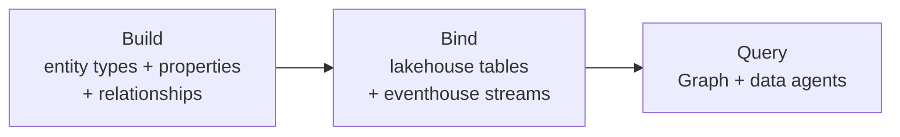

# Unit 6 — Summary

## 🎯 Recap of the module

Microsoft Fabric IQ lets you **define business vocabulary once** in ontologies, enabling natural-language queries and graph visualisation of your data. In this module you learned what Fabric IQ is, how to access it, and how it fits within Microsoft Fabric's data platform.

## 🔁 The build-bind-query workflow

You explored the **build-bind-query** workflow for creating ontologies:

1. **Build** — Define entity types and relationships (the business vocabulary).
2. **Bind** — Connect them to data sources in OneLake (no movement, no duplication).
3. **Query** — Ask questions through Graph or data agents using business concepts.

You also saw the two creation paths:

- **Generate from existing Power BI semantic models** — automatic structure from tables/columns/relationships.
- **Build from OneLake data** — full control, no model prerequisite.

## 🧩 The four components

You examined four components that work together:

| Component | Role |
|-----------|------|
| **Ontology items** | Define your business vocabulary and bind it to data sources |
| **Data agents** | Answer natural-language questions across multiple data sources (SQL / DAX / KQL / ontology reasoning) |
| **Graph in Microsoft Fabric** | Visualise and analyse relationships; queried with **GQL** |
| **Power BI semantic models** | Provide a starting point — generate ontology structures from existing models |

## 🔄 The paradigm shift

Finally, you learned how ontology modeling differs from traditional analytical modeling:

> [!quote] From the module
> "Instead of starting with specific reporting needs and designing tables optimized for queries, ontology modeling starts with core business concepts and their relationships. This concept-driven approach creates reusable definitions that both data agents and Graph can use, enabling business users to explore data using familiar terminology."

| Aspect | Traditional | Ontology |
|--------|-------------|----------|
| Starting point | Use cases & reports | Business concepts |
| Naming | Abbreviated, technical | Business language |
| Reuse across teams | Often drifts | One canonical definition |
| AI consumption | Indirect | Direct (vocabulary-aware) |

## 🔑 Key takeaways

> [!success] What to remember
> 1. **Fabric IQ** is a Fabric workload for creating **ontology items** — shared business vocabularies bound to OneLake data.
> 2. An ontology = **entity types** (things) + **properties** (facts) + **relationships** (connections).
> 3. **Data agents** answer NL questions across up to 5 sources; **Graph in Fabric** queries with **GQL**; **semantic models** generate starting ontologies.
> 4. **Data binding** is a no-copy semantic layer — nothing is moved or duplicated.
> 5. Ontology modeling is **concept-driven**, not use-case-driven — definitions are reusable, not optimised for one report.

## 📚 External references

- [What is Fabric IQ?](https://learn.microsoft.com/en-us/fabric/iq/overview)
- [What is ontology?](https://learn.microsoft.com/en-us/fabric/iq/ontology/overview)
- [Ontology (preview) required tenant settings](https://learn.microsoft.com/en-us/fabric/iq/ontology/overview-tenant-settings)
- [Microsoft Fabric IQ fundamentals — module page](https://learn.microsoft.com/en-us/training/modules/understand-fabric-iq-fundamentals/)
- [Get started with Fabric IQ — learning path](https://learn.microsoft.com/training/paths/get-started-fabric-iq/)

## 🧭 Downstream links

- Downstream Path 4 modules continue to specialise semantic models, data agents, and AI-ready analytics.

## 🧭 Next

↑ [[_MOC]]
← [[Unit-5-Module-Assessment]]
