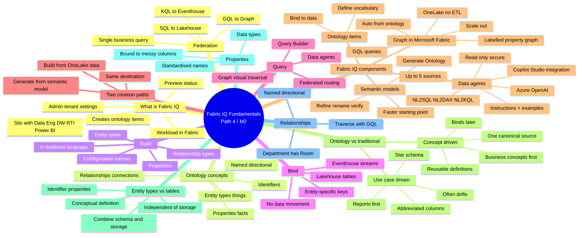

# Module — Understand Microsoft Fabric IQ fundamentals

> [!info] Module map
> This is the **second module of Path 4** in the DP-600 track. It introduces **Microsoft Fabric IQ**, the workload for building **ontologies** — shared business vocabularies bound to OneLake data — that power **data agents**, **Graph in Microsoft Fabric**, and **ontology-aware** semantic models. You learn the **build-bind-query** workflow, the **four components** that work together, and how **ontology modeling** inverts the traditional use-case-driven approach into a **concept-driven** one.

## 🎯 Learning objectives (from Microsoft Learn)

By the end of this module, you'll be able to:

1. **Explain what Fabric IQ is** and how ontologies define business vocabulary.
2. **Describe the role of ontology items** — entity types, properties, and relationships.
3. **Distinguish the four Fabric IQ components** — ontology items, data agents, Graph, Power BI semantic models.
4. **Compare ontology modeling** (concept-driven) with traditional modeling (use-case-driven).

## 🧠 Module mind map

> [!tip] How to use
> The mind map below is duplicated as a standalone Mermaid file (`Module-Mind-Map.md`) you can open in Obsidian's Mermaid preview or the [Mermaid Live Editor](https://mermaid.live). It is the **single-page view** of the entire module.

## 📑 Unit breakdown

| # | Unit | XP | Minutes | Focus |
|---|------|----|---------|-------|
| 1 | [Introduction](./Unit-1-Introduction.md) | 100 | 3 | Lamna Healthcare scenario — why Fabric IQ exists |
| 2 | [Get started with Fabric IQ](./Unit-2-Get-Started-Fabric-IQ.md) | 100 | 8 | Ontology concepts, build-bind-query, two creation paths |
| 3 | [Explore Microsoft Fabric IQ components](./Unit-3-Explore-Fabric-IQ-Components.md) | 100 | 8 | Ontology items, data agents, Graph, semantic models |
| 4 | [Understand the ontology modeling paradigm](./Unit-4-Understand-Ontology-Modeling-Paradigm.md) | 100 | 10 | Concept-driven vs. use-case-driven modeling |
| 5 | [Module assessment](./Unit-5-Module-Assessment.md) | 200 | 5 | 5 knowledge-check questions |
| 6 | [Summary](./Unit-6-Summary.md) | 100 | 3 | Recap + further reading |

**Total: 700 XP · 37 minutes**

## 🔗 Knowledge-check answers (unit 5)

> [!warning] Answer provenance
> Microsoft Learn intentionally does not publish the correct answers for knowledge-check questions. The answers below are **derived from the unit content** for this module and the wording of each question. Treat them as best-effort study notes — verify against the live module if you fail the check.

| Q | Question | Correct answer |
|---|----------|----------------|
| 1 | Three core concepts that make up an ontology? | **Things (entity types), facts (properties), and connections (relationships).** (Per [[Unit-2-Get-Started-Fabric-IQ]]: *"It's made up of the things in your environment (represented as entity types), their facts (represented as properties of entity types), and the ways they connect (represented as relationships)."*) |
| 2 | Primary role of a Fabric data agent? | **Process natural-language questions and generate queries grounded in ontology definitions.** (Data agents do *not* move data; that's ingestion. They do *not* visualise relationships; that's Graph.) |
| 3 | How does data binding differ from ETL? | **Data binding creates a semantic layer that references data in place; ETL copies and transforms data into a warehouse.** (Ontology binding is no-copy by design.) |
| 4 | Which component uses GQL? | **Graph in Microsoft Fabric.** (Ontology items have no query language of their own; data agents generate SQL/DAX/KQL depending on source.) |
| 5 | What makes entity types different from DB tables? | **Entity types are reusable logical models that exist independently of any storage system.** (DB tables combine schema + storage; entity types separate concept from storage and can hold either static or time-series data.) |

## 🧭 Downstream links

- [[Unit-1-Introduction]] · [[Unit-2-Get-Started-Fabric-IQ]] · [[Unit-3-Explore-Fabric-IQ-Components]] · [[Unit-4-Understand-Ontology-Modeling-Paradigm]] · [[Unit-5-Module-Assessment]] · [[Unit-6-Summary]]
- [[Module-Mind-Map]]
- Sister module: [Module — Prepare the semantic layer for AI in Microsoft Fabric](../06-Path4-Module1-Prepare-Semantic-Layer/_MOC.md)
- DP-600 learning path: <https://learn.microsoft.com/en-us/training/paths/dax-power-bi/>
- Fabric IQ learning path: <https://learn.microsoft.com/training/paths/get-started-fabric-iq/>

## 📚 External references

- Microsoft Learn module page: <https://learn.microsoft.com/en-us/training/modules/understand-fabric-iq-fundamentals/>
- [What is Fabric IQ?](https://learn.microsoft.com/en-us/fabric/iq/overview)
- [What is ontology?](https://learn.microsoft.com/en-us/fabric/iq/ontology/overview)
- [Ontology (preview) required tenant settings](https://learn.microsoft.com/en-us/fabric/iq/ontology/overview-tenant-settings)
