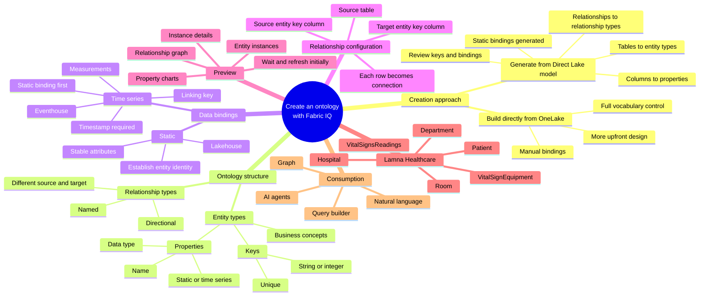

# Create an ontology with Fabric IQ — Mind Map

```mermaid
mindmap
  root((Create an ontology<br/>with Fabric IQ))
    Creation approach
      Generate from Direct Lake model
        Tables to entity types
        Columns to properties
        Relationships to relationship types
        Static bindings generated
        Review keys and bindings
      Build directly from OneLake
        Full vocabulary control
        More upfront design
        Manual bindings
    Ontology structure
      Entity types
        Business concepts
        Properties
          Name
          Data type
          Static or time series
        Keys
          Unique
          String or integer
      Relationship types
        Named
        Directional
        Different source and target
    Data bindings
      Static
        Lakehouse
        Stable attributes
        Establish entity identity
      Time series
        Eventhouse
        Timestamp required
        Measurements
        Linking key
        Static binding first
    Relationship configuration
      Source table
      Source entity key column
      Target entity key column
      Each row becomes connection
    Preview
      Relationship graph
      Property charts
      Entity instances
      Instance details
      Wait and refresh initially
    Lamna Healthcare
      Hospital
      Department
      Room
      Patient
      VitalSignEquipment
      VitalSignsReadings
    Consumption
      Natural language
      AI agents
      Graph
      Query builder
```

## Navigation

↑ [[_MOC]] · Start [[Unit-1-Introduction]] · Review [[Unit-11-Summary]]
