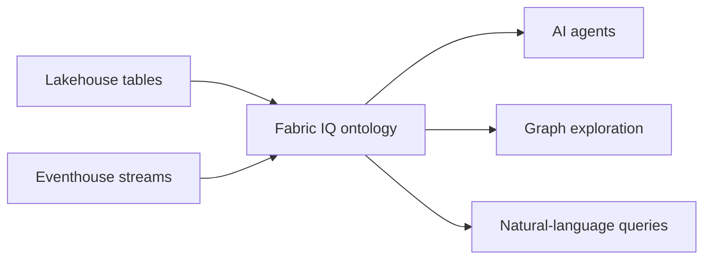

# Introduction

> [!quote] Scenario
> Lamna Healthcare stores hospitals, departments, rooms, and patients in lakehouse tables, while ICU equipment sends continuous vital signs to an eventhouse.

## Core idea

An ontology creates a shared business vocabulary over heterogeneous data. It defines:

- **Entity types**: Hospital, Department, Room, Patient.
- **Properties**: names, identifiers, locations, measurements.
- **Relationship types**: Department *located in* Hospital; Patient *assigned to* Room.
- **Bindings**: mappings from ontology definitions to physical tables, streams, and columns.

> [!success] Outcome
> Users explore connected business concepts instead of manually writing SQL joins across lakehouse and eventhouse data.

> [!important] An ontology is not another data copy
> It is a semantic graph layer whose definitions and bindings make source data queryable through consistent business concepts.

## Navigation

← [[_MOC]] · → [[Unit-2-Choose-Creation-Approach]] · ↑ [[_MOC]]
