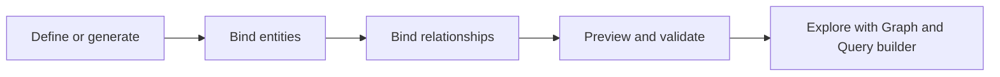

# Summary

## What you learned

- Build an ontology manually to learn and control its business vocabulary.
- Generate from a Direct Lake Power BI semantic model to automate initial entities, properties, keys, and structure.
- Bind static entity data to lakehouse tables.
- Add eventhouse time-series bindings for timestamped observations.
- Configure relationship bindings from a table containing identifiers for both endpoint entities.
- Preview the ontology to verify instances, distributions, and connections.

> [!success] Final result
> The ontology represents real source data without copying it and gives AI agents and other tools a unified, business-oriented semantic layer.

> [!important] Next capability
> Use Graph visualization and Query builder to explore and query the completed ontology.

## Rapid review

| Concept | Remember |
|---|---|
| Entity type | Business concept |
| Property | Characteristic or observation |
| Entity key | Unique string/integer identifier |
| Relationship type | Named, directional connection |
| Binding | Mapping from ontology definition to source data |
| Static binding | Lakehouse attributes |
| Time-series binding | Eventhouse observations plus timestamp |

## Navigation

← [[Unit-10-Knowledge-Check]] · ↑ [[_MOC]] · 🧠 [[Module-Mind-Map]]
