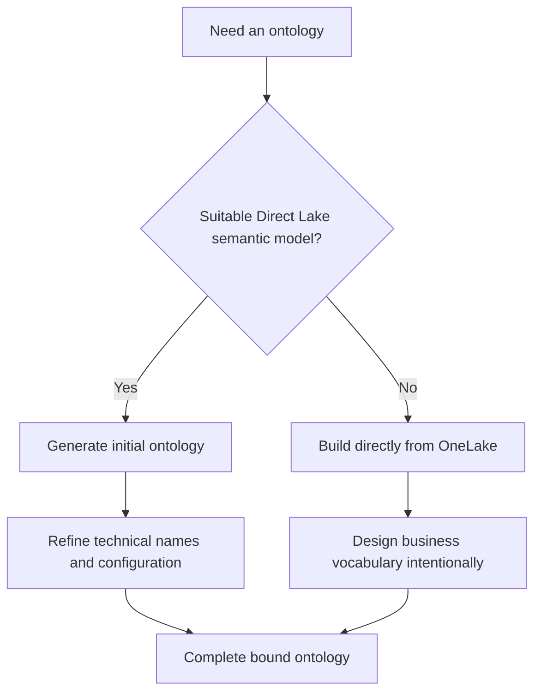

# Choose an ontology creation approach

## The two approaches

| Consideration | Generate from semantic model | Build directly from OneLake |
|---|---|---|
| Starting point | Existing **Direct Lake** Power BI semantic model | Empty ontology plus lakehouse/eventhouse sources |
| Automation | Tables → entities; columns → properties; relationships → relationship types | You define every entity, property, key, and relationship |
| Main benefit | Fast initial structure based on a trusted analytical model | Full vocabulary control from the beginning |
| Follow-up work | Review names, keys, bindings, and generated relationships | Bind every definition and connection manually |
| Best when | Model clearly represents the business domain | No suitable model exists, or reporting structure is a poor ontology |

> [!important] Direct Lake prerequisite
> Ontology generation requires a Power BI semantic model in Direct Lake mode, preserving the connection to OneLake data in place.

> [!tip] Suitability test
> Prefer generation when you can explain every included table as a business concept, relationships reflect real business behavior, and most model content belongs in the desired vocabulary.

> [!warning] Generated does not mean finished
> Technical names such as `hospitals_has_departments` may need conversion into natural business language.

## Navigation

← [[Unit-1-Introduction]] · → [[Unit-3-Build-Ontology-Manually]] · ↑ [[_MOC]]
