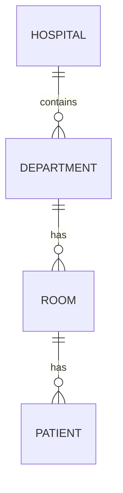

# Build an ontology manually

## Three-step pattern

1. Define entity types, properties, and keys.
2. Define named, directional relationship types.
3. Bind entities and relationships to OneLake data in later configuration.

## Entity types and properties

An entity type represents a business concept. Each property requires:

| Decision | Purpose | Key rule |
|---|---|---|
| Property name | Business meaning | 1–26 characters; alphanumeric, hyphen, underscore; start/end alphanumeric |
| Data type | Allowed values and binding compatibility | Must match source data type |
| Property type | Static attribute or time-series observation | Static changes infrequently; time series arrives continuously |

> [!tip] Prefer specific names
> `HospitalName`, `DepartmentName`, and `PatientName` are clearer than repeating a generic `Name` property.

### Entity type keys

- Uniquely distinguish instances, such as `HospitalId` or `PatientId`.
- Can use one or more **string or integer** properties.
- Must be configured before binding an entity type to data.
- Key values must be unique for the entity instances.

> [!important] Why keys matter
> Without a key, Fabric cannot determine whether data identifies a new instance or an existing one.

## Relationship types

Relationships connect a **source** entity to a different **target** entity and have a natural-language name.

- Direction affects how people navigate and ask questions.
- Read the complete phrase aloud: “Hospital contains Department.”
- At this stage, a relationship is conceptual; the later binding supplies actual instance-to-instance connections.

> [!warning] Definition is not data
> A relationship type can exist on the canvas without being queryable. It still requires a table containing identifiers for both ends.

## Navigation

← [[Unit-2-Choose-Creation-Approach]] · → [[Unit-4-Generate-from-Semantic-Model]] · ↑ [[_MOC]]
