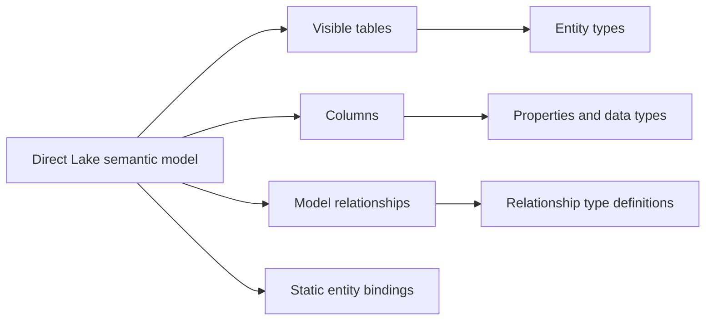

# Generate an ontology from a Power BI semantic model

## Generation workflow

From a Direct Lake semantic model, select **Generate ontology**, choose the destination workspace, and name the ontology.

## What is created

- Visible tables become entity types.
- Columns become properties with preserved data types.
- Direct Lake connections provide static entity bindings.
- Unique identifiers may be inferred as entity type keys.
- Model relationships become relationship type definitions.

## Required review

1. Verify that every entity type has the correct key.
2. Verify relationship types and configure any incomplete relationship bindings.
3. Add time-series bindings for eventhouse streaming data.
4. Refine generated technical names into business vocabulary.

> [!important] Generation accelerates setup; it does not remove design responsibility
> The ontology should express the language and questions of the business, not merely mirror source schemas.

> [!warning] Relationship bindings vary
> Some may be configured from model structure, while others still require manual source-table and key-column mapping.

## Navigation

← [[Unit-3-Build-Ontology-Manually]] · → [[Unit-5-Connect-to-Data]] · ↑ [[_MOC]]
