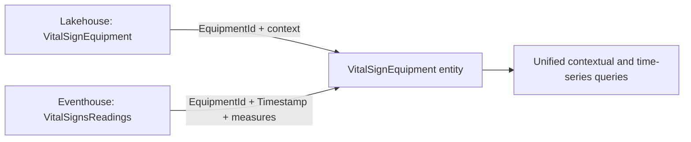

# Connect an ontology to data

## Data bindings

A binding maps an ontology property to a physical source column. Without bindings, the ontology has definitions but cannot return source values.

| Binding | Source | Data shape | Example |
|---|---|---|---|
| Static | Lakehouse table | Slowly changing attributes | Hospital name, room number, equipment type |
| Time series | Eventhouse table/stream | Timestamped observations | Heart rate, oxygen saturation |

## Static binding workflow

1. Select the entity type and open **Bindings**.
2. Select **Add data to entity type**.
3. Choose the lakehouse and source table.
4. Map source columns to properties.
5. Save and configure the entity type key.

## Dual-binding pattern

`VitalSignEquipment` needs stable identity plus continuously arriving readings.

- The static lakehouse table establishes each equipment instance.
- The eventhouse table contributes timestamped measurements.
- `EquipmentId` links each reading to an existing equipment entity.
- A time-series binding requires a timestamp column and separates linking/static properties from measured time-series properties.

> [!important] Ordering rule
> Create the static binding first. Time-series observations need an existing entity instance to attach to.

> [!warning] The “static” field in a time-series binding is the linking key
> It is not a second static entity binding; it maps each observation back to the entity.

## Navigation

← [[Unit-4-Generate-from-Semantic-Model]] · → [[Unit-6-Configure-Relationships]] · ↑ [[_MOC]]
