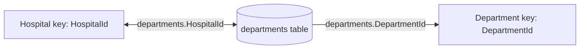

# Configure ontology relationships

## Definition versus configuration

- A **relationship type definition** names a permitted source-to-target connection.
- A **relationship binding** identifies the source table and columns containing actual connections.

> [!important] Every relationship type needs configuration
> Without a binding, the connection exists conceptually but cannot be queried.

## Create a relationship type

1. Choose a business-readable name such as `contains`, `admittedTo`, or `monitoredBy`.
2. Select different source and target entity types.
3. Configure a source table containing identifiers for both ends.
4. Map each identifying column to its corresponding entity key.

### Example: Hospital contains Department

Each `departments` row with both IDs creates one relationship instance.

| Relationship | Binding table | Source column | Target column |
|---|---|---|---|
| Hospital contains Department | departments | HospitalId | DepartmentId |
| Patient assigned to Room | patients | PatientId | CurrentRoomId |
| Equipment monitors Patient | vitalsignequipment | EquipmentId | PatientId |

> [!warning] A table with only one end is insufficient
> The `hospitals` table cannot bind Hospital–Department if it has `HospitalId` but no department identifier.

> [!tip] Reuse is allowed
> A table can bind multiple relationship types when it includes all necessary keys.

## Navigation

← [[Unit-5-Connect-to-Data]] · → [[Unit-7-Preview-Ontology]] · ↑ [[_MOC]]
