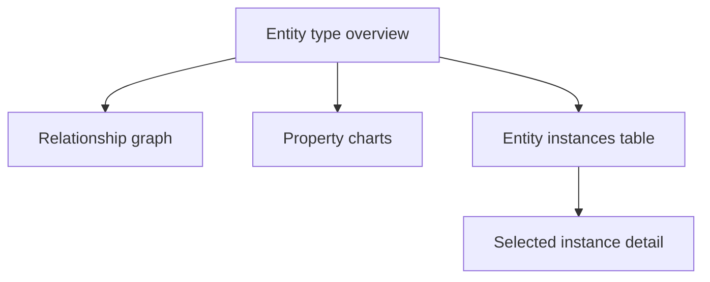

# Preview the ontology

Select an entity type and choose **Entity type overview** to inspect the populated ontology.

## Preview sections

| Section | What it validates |
|---|---|
| Relationship graph | The selected entity connects to expected neighboring types |
| Property charts | Distributions of values across all entity instances |
| Entity instances table | Actual bound records and their properties |
| Instance detail | One entity’s values and connections to other instances |

> [!info] Initial processing delay
> The first preview can show **Updating your ontology**. Wait 1–2 minutes, then refresh the browser.

> [!success] Validation signal
> Expected instances, property distributions, and graph connections confirm that entity and relationship bindings are working.

> [!tip] Preview before querying
> Catch missing keys, incorrect mappings, and broken relationships here before using Query builder, Graph, or an AI agent.

## Navigation

← [[Unit-6-Configure-Relationships]] · → [[Unit-8-Exercise-Manual]] · ↑ [[_MOC]]
