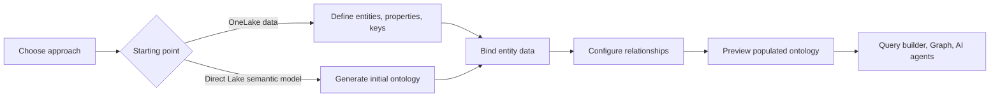
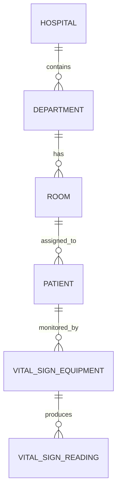

# Create an ontology with Fabric IQ

> [!info] Module overview
> Build a business-oriented semantic graph over OneLake data. You can model it manually or generate its initial structure from a Direct Lake Power BI semantic model, then bind entities and relationships to lakehouse and eventhouse data.

> [!important] Preview status
> Fabric IQ and ontology items are currently in preview. Tenant settings and behavior can change.

## Learning objectives

- Choose between manual creation and semantic-model generation.
- Define entity types, properties, keys, and relationship types.
- Bind static lakehouse data and time-series eventhouse data.
- Configure relationship bindings from source and target keys.
- Preview populated entities, distributions, and connections.

## Unit map

| # | Unit | XP | Minutes |
|---|---|---:|---:|
| 1 | [[Unit-1-Introduction]] | 100 | 3 |
| 2 | [[Unit-2-Choose-Creation-Approach]] | 100 | 7 |
| 3 | [[Unit-3-Build-Ontology-Manually]] | 100 | 10 |
| 4 | [[Unit-4-Generate-from-Semantic-Model]] | 100 | 7 |
| 5 | [[Unit-5-Connect-to-Data]] | 100 | 10 |
| 6 | [[Unit-6-Configure-Relationships]] | 100 | 8 |
| 7 | [[Unit-7-Preview-Ontology]] | 100 | 5 |
| 8 | [[Unit-8-Exercise-Manual]] | 100 | 45 |
| 9 | [[Unit-9-Exercise-Semantic-Model]] | 100 | 40 |
| 10 | [[Unit-10-Knowledge-Check]] | 200 | 5 |
| 11 | [[Unit-11-Summary]] | 100 | 3 |

**Total: 1200 XP · 143 minutes (2 hr 23 min)**

## End-to-end model

## Healthcare example

## Navigation

- [[Module-Mind-Map]]
- Start: [[Unit-1-Introduction]]
- Previous Path 4 module: [[../06-Path4-Module1-Prepare-Semantic-Layer/_MOC|Prepare the semantic layer for AI]]
